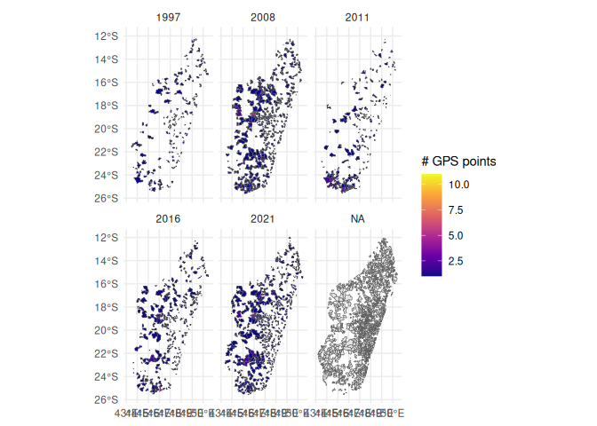

# Geospatial Aggregation Mapping

This notebook extends the pipeline to incorporate a geospatial mapping
of data points. In line with issue
[\#8](https://github.com/GoldenPlanetaryHealthLab/DHSHarmonization/issues/8),
we’ll utilize `sf` to create a geospatial mapping between the DHS data
points and the points covered in our healthshed. This will allow future
researchers to be able to run aggregation statistics of the DHS to the
healthshed level, which is more relevant for public health
decision-making.

``` r

library(sf)
```

    Linking to GEOS 3.12.1, GDAL 3.8.4, PROJ 9.4.0; sf_use_s2() is TRUE

``` r

library(here)
```

    here() starts at /work

``` r

library(dplyr)
```

    Attaching package: 'dplyr'

    The following objects are masked from 'package:stats':

        filter, lag

    The following objects are masked from 'package:base':

        intersect, setdiff, setequal, union

``` r

library(ggplot2)
library(purrr)
library(targets)
library(testthat)

tar_load(gps_data, store = here("_targets"))
```

We’ll start by taking a look at the existing GPS data:

``` r

print(gps_data[[1]])
```

    Simple feature collection with 269 features and 20 fields
    Geometry type: POINT
    Dimension:     XY
    Bounding box:  xmin: 6.661338e-16 ymin: -25.28438 xmax: 50.45773 ymax: 0
    Geodetic CRS:  WGS 84
    First 10 features:
                DHSID DHSCC DHSYEAR DHSCLUST CCFIPS ADM1FIPS ADM1FIPSNA ADM1SALBNA
    1  MD199700000001    MD    1997        1     MA     NULL       NULL       NULL
    2  MD199700000002    MD    1997        2     MA     NULL       NULL       NULL
    3  MD199700000003    MD    1997        3     MA     NULL       NULL       NULL
    4  MD199700000004    MD    1997        4     MA     NULL       NULL       NULL
    5  MD199700000005    MD    1997        5     MA     NULL       NULL       NULL
    6  MD199700000006    MD    1997        6     MA     NULL       NULL       NULL
    7  MD199700000007    MD    1997        7     MA     NULL       NULL       NULL
    8  MD199700000008    MD    1997        8     MA     NULL       NULL       NULL
    9  MD199700000009    MD    1997        9     MA     NULL       NULL       NULL
    10 MD199700000010    MD    1997       10     MA     NULL       NULL       NULL
       ADM1SALBCO ADM1DHS     ADM1NAME DHSREGCO     DHSREGNA SOURCE URBAN_RURA
    1        NULL       1 antananarivo        1 antananarivo    GPS          U
    2        NULL       1 antananarivo        1 antananarivo    GPS          U
    3        NULL       1 antananarivo        1 antananarivo    GPS          U
    4        NULL       1 antananarivo        1 antananarivo    GPS          U
    5        NULL       1 antananarivo        1 antananarivo    GPS          U
    6        NULL       1 antananarivo        1 antananarivo    MIS          U
    7        NULL       1 antananarivo        1 antananarivo    GPS          U
    8        NULL       1 antananarivo        1 antananarivo    GPS          U
    9        NULL       1 antananarivo        1 antananarivo    GPS          U
    10       NULL       1 antananarivo        1 antananarivo    GPS          U
          LATNUM  LONGNUM ALT_GPS ALT_DEM DATUM                   geometry
    1  -18.92010 47.51332    9999    1290 WGS84  POINT (47.51332 -18.9201)
    2  -18.90276 47.50940    9999    1289 WGS84  POINT (47.5094 -18.90276)
    3  -18.90329 47.50141    9999    1290 WGS84 POINT (47.50141 -18.90329)
    4  -18.89096 47.51720    9999    1297 WGS84  POINT (47.5172 -18.89096)
    5  -18.88167 47.54719    9999    1334 WGS84 POINT (47.54719 -18.88167)
    6    0.00000  0.00000    9999    9999 WGS84     POINT (6.661338e-16 0)
    7  -18.88372 47.51306    9999    1301 WGS84 POINT (47.51306 -18.88372)
    8  -18.93616 47.51758    9999    1285 WGS84 POINT (47.51758 -18.93616)
    9  -18.92530 47.52272    9999    1285 WGS84  POINT (47.52272 -18.9253)
    10 -18.93636 47.51839    9999    1277 WGS84 POINT (47.51839 -18.93636)

We have 6 years of GPS data. Each survey is tagged at a location with a
DHSID identifier. What we want to do is overlay these GPS points on the
healthshed polygons, and assign the point to the corresponding
healthshed.

To do this, we’ll first add a target to read in the healthshed
shapefile:

``` r

mdg_healthshed_raw <- here("data", "inputs", "01_gold_mine", "mdg_healthsheds", "mdg_healthsheds2022.zip")
```

``` r

mdg_healthsheds <- {
  
  tmp <- tempfile()
  unzip(mdg_healthshed_raw, exdir = tmp)
  shp_file <- list.files(tmp, pattern = "\\.shp$", full.names = TRUE, recursive = TRUE)
  st_read(shp_file)
  
}
```

    Reading layer `healthsheds2022' from data source 
      `/tmp/Rtmp5A6aeP/file7715445e5be7c/mdg_healthsheds2022/healthsheds2022.shp' 
      using driver `ESRI Shapefile'
    Simple feature collection with 2773 features and 13 fields (with 7 geometries empty)
    Geometry type: MULTIPOLYGON
    Dimension:     XY
    Bounding box:  xmin: 43.17692 ymin: -25.60575 xmax: 50.48485 ymax: -11.95139
    Geodetic CRS:  WGS 84

Ensure both datasets use the same coordinate reference system (CRS):

``` r

map(
  gps_data,
  ~ .x %>%
    st_crs()
)
```

    $gps_data_8298b5191d2ae010
    Coordinate Reference System:
      User input: WGS 84 
      wkt:
    GEOGCRS["WGS 84",
        DATUM["World Geodetic System 1984",
            ELLIPSOID["WGS 84",6378137,298.257223563,
                LENGTHUNIT["metre",1]]],
        PRIMEM["Greenwich",0,
            ANGLEUNIT["degree",0.0174532925199433]],
        CS[ellipsoidal,2],
            AXIS["latitude",north,
                ORDER[1],
                ANGLEUNIT["degree",0.0174532925199433]],
            AXIS["longitude",east,
                ORDER[2],
                ANGLEUNIT["degree",0.0174532925199433]],
        ID["EPSG",4326]]

    $gps_data_f50ff43195c3431a
    Coordinate Reference System:
      User input: WGS 84 
      wkt:
    GEOGCRS["WGS 84",
        DATUM["World Geodetic System 1984",
            ELLIPSOID["WGS 84",6378137,298.257223563,
                LENGTHUNIT["metre",1]]],
        PRIMEM["Greenwich",0,
            ANGLEUNIT["degree",0.0174532925199433]],
        CS[ellipsoidal,2],
            AXIS["latitude",north,
                ORDER[1],
                ANGLEUNIT["degree",0.0174532925199433]],
            AXIS["longitude",east,
                ORDER[2],
                ANGLEUNIT["degree",0.0174532925199433]],
        ID["EPSG",4326]]

    $gps_data_ae75628c32935f2f
    Coordinate Reference System:
      User input: WGS 84 
      wkt:
    GEOGCRS["WGS 84",
        DATUM["World Geodetic System 1984",
            ELLIPSOID["WGS 84",6378137,298.257223563,
                LENGTHUNIT["metre",1]]],
        PRIMEM["Greenwich",0,
            ANGLEUNIT["degree",0.0174532925199433]],
        CS[ellipsoidal,2],
            AXIS["latitude",north,
                ORDER[1],
                ANGLEUNIT["degree",0.0174532925199433]],
            AXIS["longitude",east,
                ORDER[2],
                ANGLEUNIT["degree",0.0174532925199433]],
        ID["EPSG",4326]]

    $gps_data_b505060d1bee8a8f
    Coordinate Reference System:
      User input: WGS 84 
      wkt:
    GEOGCRS["WGS 84",
        DATUM["World Geodetic System 1984",
            ELLIPSOID["WGS 84",6378137,298.257223563,
                LENGTHUNIT["metre",1]]],
        PRIMEM["Greenwich",0,
            ANGLEUNIT["degree",0.0174532925199433]],
        CS[ellipsoidal,2],
            AXIS["latitude",north,
                ORDER[1],
                ANGLEUNIT["degree",0.0174532925199433]],
            AXIS["longitude",east,
                ORDER[2],
                ANGLEUNIT["degree",0.0174532925199433]],
        ID["EPSG",4326]]

    $gps_data_b28c64131ce2bbdc
    Coordinate Reference System:
      User input: WGS 84 
      wkt:
    GEOGCRS["WGS 84",
        DATUM["World Geodetic System 1984",
            ELLIPSOID["WGS 84",6378137,298.257223563,
                LENGTHUNIT["metre",1]]],
        PRIMEM["Greenwich",0,
            ANGLEUNIT["degree",0.0174532925199433]],
        CS[ellipsoidal,2],
            AXIS["latitude",north,
                ORDER[1],
                ANGLEUNIT["degree",0.0174532925199433]],
            AXIS["longitude",east,
                ORDER[2],
                ANGLEUNIT["degree",0.0174532925199433]],
        ID["EPSG",4326]]

    $gps_data_64ab67e0f91b63ce
    Coordinate Reference System:
      User input: WGS 84 
      wkt:
    GEOGCRS["WGS 84",
        DATUM["World Geodetic System 1984",
            ELLIPSOID["WGS 84",6378137,298.257223563,
                LENGTHUNIT["metre",1]]],
        PRIMEM["Greenwich",0,
            ANGLEUNIT["degree",0.0174532925199433]],
        CS[ellipsoidal,2],
            AXIS["latitude",north,
                ORDER[1],
                ANGLEUNIT["degree",0.0174532925199433]],
            AXIS["longitude",east,
                ORDER[2],
                ANGLEUNIT["degree",0.0174532925199433]],
        ID["EPSG",4326]]

Add this as a test:

``` r

test_that("CRS of healthsheds and DHS GPS data match", {

  hlthshds <- tar_read(mdg_healthsheds, store = here("_targets"))
  gps <- tar_read(gps_data, store = here("_targets"), branches = 1)[[1]]

  expect_true(st_crs(hlthshds) == st_crs(gps))

})
```

    Test passed with 1 success 🥳.

Now we can perform a spatial join to map the GPS points to the
healthshed polygons. We’re using the `st_intersects` algorithm for this
join:

``` r

{
  joined <- st_join(gps_data[[1]], mdg_healthsheds, left = TRUE, join = st_intersects)

  print(joined %>% filter(!is.na(fs_uid)))
}
```

    Simple feature collection with 266 features and 33 fields
    Geometry type: POINT
    Dimension:     XY
    Bounding box:  xmin: 43.58841 ymin: -25.28438 xmax: 50.45773 ymax: -12.28749
    Geodetic CRS:  WGS 84
    First 10 features:
                DHSID DHSCC DHSYEAR DHSCLUST CCFIPS ADM1FIPS ADM1FIPSNA ADM1SALBNA
    1  MD199700000001    MD    1997        1     MA     NULL       NULL       NULL
    2  MD199700000002    MD    1997        2     MA     NULL       NULL       NULL
    3  MD199700000003    MD    1997        3     MA     NULL       NULL       NULL
    4  MD199700000004    MD    1997        4     MA     NULL       NULL       NULL
    5  MD199700000005    MD    1997        5     MA     NULL       NULL       NULL
    6  MD199700000007    MD    1997        7     MA     NULL       NULL       NULL
    7  MD199700000008    MD    1997        8     MA     NULL       NULL       NULL
    8  MD199700000009    MD    1997        9     MA     NULL       NULL       NULL
    9  MD199700000010    MD    1997       10     MA     NULL       NULL       NULL
    10 MD199700000011    MD    1997       11     MA     NULL       NULL       NULL
       ADM1SALBCO ADM1DHS     ADM1NAME DHSREGCO     DHSREGNA SOURCE URBAN_RURA
    1        NULL       1 antananarivo        1 antananarivo    GPS          U
    2        NULL       1 antananarivo        1 antananarivo    GPS          U
    3        NULL       1 antananarivo        1 antananarivo    GPS          U
    4        NULL       1 antananarivo        1 antananarivo    GPS          U
    5        NULL       1 antananarivo        1 antananarivo    GPS          U
    6        NULL       1 antananarivo        1 antananarivo    GPS          U
    7        NULL       1 antananarivo        1 antananarivo    GPS          U
    8        NULL       1 antananarivo        1 antananarivo    GPS          U
    9        NULL       1 antananarivo        1 antananarivo    GPS          U
    10       NULL       1 antananarivo        1 antananarivo    GPS          U
          LATNUM  LONGNUM ALT_GPS ALT_DEM DATUM      fs_uid fs_pop n_uid n_instat
    1  -18.92010 47.51332    9999    1290 WGS84 gJnQmgrHMaW  73151    14       14
    2  -18.90276 47.50940    9999    1289 WGS84 p1FaH8uyiOZ  54862     6        6
    3  -18.90329 47.50141    9999    1290 WGS84 BTovhI5myb3 102878    12       11
    4  -18.89096 47.51720    9999    1297 WGS84 oygtFHNhk38 194782    34       34
    5  -18.88167 47.54719    9999    1334 WGS84 KT2sin05gaq 193449    15       15
    6  -18.88372 47.51306    9999    1301 WGS84 oygtFHNhk38 194782    34       34
    7  -18.93616 47.51758    9999    1285 WGS84 PfP0yq3CnQt 150584    22       22
    8  -18.92530 47.52272    9999    1285 WGS84 PfP0yq3CnQt 150584    22       22
    9  -18.93636 47.51839    9999    1277 WGS84 PfP0yq3CnQt 150584    22       22
    10 -18.86668 47.51750    9999    1305 WGS84 tkZkvk8tLGj  59412     5        5
           reg_uid   reg_name    dist_uid                dist_name fs_type
    1  I9lEj4mALls Analamanga FAuW9yTuH1C Antananarivo Renivohitra    CSB2
    2  I9lEj4mALls Analamanga FAuW9yTuH1C Antananarivo Renivohitra    CSB2
    3  I9lEj4mALls Analamanga FAuW9yTuH1C Antananarivo Renivohitra    CSB2
    4  I9lEj4mALls Analamanga FAuW9yTuH1C Antananarivo Renivohitra    CSB2
    5  I9lEj4mALls Analamanga FAuW9yTuH1C Antananarivo Renivohitra    CSB2
    6  I9lEj4mALls Analamanga FAuW9yTuH1C Antananarivo Renivohitra    CSB2
    7  I9lEj4mALls Analamanga FAuW9yTuH1C Antananarivo Renivohitra    CSB2
    8  I9lEj4mALls Analamanga FAuW9yTuH1C Antananarivo Renivohitra    CSB2
    9  I9lEj4mALls Analamanga FAuW9yTuH1C Antananarivo Renivohitra    CSB2
    10 I9lEj4mALls Analamanga FAuW9yTuH1C Antananarivo Renivohitra    CSB2
                    fs_name                        fs_ll n_comp n_shape
    1   CSB2 Isotry Central  POINT (47.51662 -18.909161)      1       1
    2  CSB2 Tsaralalana CSS                         <NA>      1       1
    3    CSB2 Isotry Annexe POINT (47.510897 -18.907813)      1       1
    4       CSB2 Antanimena POINT (47.521059 -18.897863)      1       1
    5     CSB2 Analamahitsy POINT (47.546481 -18.871202)      1       1
    6       CSB2 Antanimena POINT (47.521059 -18.897863)      1       1
    7       CSB2 Mahamasina POINT (47.526198 -18.922298)      1       1
    8       CSB2 Mahamasina POINT (47.526198 -18.922298)      1       1
    9       CSB2 Mahamasina POINT (47.526198 -18.922298)      1       1
    10      CSB2 Amboniloha  POINT (47.521194 -18.87129)      1       1
                         geometry
    1   POINT (47.51332 -18.9201)
    2   POINT (47.5094 -18.90276)
    3  POINT (47.50141 -18.90329)
    4   POINT (47.5172 -18.89096)
    5  POINT (47.54719 -18.88167)
    6  POINT (47.51306 -18.88372)
    7  POINT (47.51758 -18.93616)
    8   POINT (47.52272 -18.9253)
    9  POINT (47.51839 -18.93636)
    10  POINT (47.5175 -18.86668)

By doing this join, we retain 269 rows of the original 269 GPS points,
which means that 3 points were not mapped to any healthshed. This could
be due to the points being outside the boundaries of the healthsheds or
due to inaccuracies in the GPS data. What if we use a different
algorithm?

``` r

{
  joined <- st_join(gps_data[[1]], mdg_healthsheds, left = TRUE, join = st_within)

  print(joined %>% filter(!is.na(fs_uid)))
}
```

    Simple feature collection with 266 features and 33 fields
    Geometry type: POINT
    Dimension:     XY
    Bounding box:  xmin: 43.58841 ymin: -25.28438 xmax: 50.45773 ymax: -12.28749
    Geodetic CRS:  WGS 84
    First 10 features:
                DHSID DHSCC DHSYEAR DHSCLUST CCFIPS ADM1FIPS ADM1FIPSNA ADM1SALBNA
    1  MD199700000001    MD    1997        1     MA     NULL       NULL       NULL
    2  MD199700000002    MD    1997        2     MA     NULL       NULL       NULL
    3  MD199700000003    MD    1997        3     MA     NULL       NULL       NULL
    4  MD199700000004    MD    1997        4     MA     NULL       NULL       NULL
    5  MD199700000005    MD    1997        5     MA     NULL       NULL       NULL
    6  MD199700000007    MD    1997        7     MA     NULL       NULL       NULL
    7  MD199700000008    MD    1997        8     MA     NULL       NULL       NULL
    8  MD199700000009    MD    1997        9     MA     NULL       NULL       NULL
    9  MD199700000010    MD    1997       10     MA     NULL       NULL       NULL
    10 MD199700000011    MD    1997       11     MA     NULL       NULL       NULL
       ADM1SALBCO ADM1DHS     ADM1NAME DHSREGCO     DHSREGNA SOURCE URBAN_RURA
    1        NULL       1 antananarivo        1 antananarivo    GPS          U
    2        NULL       1 antananarivo        1 antananarivo    GPS          U
    3        NULL       1 antananarivo        1 antananarivo    GPS          U
    4        NULL       1 antananarivo        1 antananarivo    GPS          U
    5        NULL       1 antananarivo        1 antananarivo    GPS          U
    6        NULL       1 antananarivo        1 antananarivo    GPS          U
    7        NULL       1 antananarivo        1 antananarivo    GPS          U
    8        NULL       1 antananarivo        1 antananarivo    GPS          U
    9        NULL       1 antananarivo        1 antananarivo    GPS          U
    10       NULL       1 antananarivo        1 antananarivo    GPS          U
          LATNUM  LONGNUM ALT_GPS ALT_DEM DATUM      fs_uid fs_pop n_uid n_instat
    1  -18.92010 47.51332    9999    1290 WGS84 gJnQmgrHMaW  73151    14       14
    2  -18.90276 47.50940    9999    1289 WGS84 p1FaH8uyiOZ  54862     6        6
    3  -18.90329 47.50141    9999    1290 WGS84 BTovhI5myb3 102878    12       11
    4  -18.89096 47.51720    9999    1297 WGS84 oygtFHNhk38 194782    34       34
    5  -18.88167 47.54719    9999    1334 WGS84 KT2sin05gaq 193449    15       15
    6  -18.88372 47.51306    9999    1301 WGS84 oygtFHNhk38 194782    34       34
    7  -18.93616 47.51758    9999    1285 WGS84 PfP0yq3CnQt 150584    22       22
    8  -18.92530 47.52272    9999    1285 WGS84 PfP0yq3CnQt 150584    22       22
    9  -18.93636 47.51839    9999    1277 WGS84 PfP0yq3CnQt 150584    22       22
    10 -18.86668 47.51750    9999    1305 WGS84 tkZkvk8tLGj  59412     5        5
           reg_uid   reg_name    dist_uid                dist_name fs_type
    1  I9lEj4mALls Analamanga FAuW9yTuH1C Antananarivo Renivohitra    CSB2
    2  I9lEj4mALls Analamanga FAuW9yTuH1C Antananarivo Renivohitra    CSB2
    3  I9lEj4mALls Analamanga FAuW9yTuH1C Antananarivo Renivohitra    CSB2
    4  I9lEj4mALls Analamanga FAuW9yTuH1C Antananarivo Renivohitra    CSB2
    5  I9lEj4mALls Analamanga FAuW9yTuH1C Antananarivo Renivohitra    CSB2
    6  I9lEj4mALls Analamanga FAuW9yTuH1C Antananarivo Renivohitra    CSB2
    7  I9lEj4mALls Analamanga FAuW9yTuH1C Antananarivo Renivohitra    CSB2
    8  I9lEj4mALls Analamanga FAuW9yTuH1C Antananarivo Renivohitra    CSB2
    9  I9lEj4mALls Analamanga FAuW9yTuH1C Antananarivo Renivohitra    CSB2
    10 I9lEj4mALls Analamanga FAuW9yTuH1C Antananarivo Renivohitra    CSB2
                    fs_name                        fs_ll n_comp n_shape
    1   CSB2 Isotry Central  POINT (47.51662 -18.909161)      1       1
    2  CSB2 Tsaralalana CSS                         <NA>      1       1
    3    CSB2 Isotry Annexe POINT (47.510897 -18.907813)      1       1
    4       CSB2 Antanimena POINT (47.521059 -18.897863)      1       1
    5     CSB2 Analamahitsy POINT (47.546481 -18.871202)      1       1
    6       CSB2 Antanimena POINT (47.521059 -18.897863)      1       1
    7       CSB2 Mahamasina POINT (47.526198 -18.922298)      1       1
    8       CSB2 Mahamasina POINT (47.526198 -18.922298)      1       1
    9       CSB2 Mahamasina POINT (47.526198 -18.922298)      1       1
    10      CSB2 Amboniloha  POINT (47.521194 -18.87129)      1       1
                         geometry
    1   POINT (47.51332 -18.9201)
    2   POINT (47.5094 -18.90276)
    3  POINT (47.50141 -18.90329)
    4   POINT (47.5172 -18.89096)
    5  POINT (47.54719 -18.88167)
    6  POINT (47.51306 -18.88372)
    7  POINT (47.51758 -18.93616)
    8   POINT (47.52272 -18.9253)
    9  POINT (47.51839 -18.93636)
    10  POINT (47.5175 -18.86668)

No difference in using `within`. Following the illustration available on
[this medium
post](https://mentin.medium.com/which-predicate-cb608b470471), I’m going
to go with my gut and assume we should be using `st_intersects` for this
join, as it is more inclusive and allows for points that may be on the
boundary of healthsheds to be included in the mapping.

Now that we know, what does it look like:

``` r

map(
  gps_data,
  function(x) {
    year <- unique(x$DHSYEAR)
    pts <- x
    joined <- st_join(pts, mdg_healthsheds, left = FALSE)
    summary_counts <- joined %>% 
      st_drop_geometry() %>%
      group_by(fs_uid, fs_name) %>% 
      summarise(n_points = n(), .groups = "drop") %>%
      mutate(DHSYEAR = year)

    return(summary_counts)

  }
) %>%
  list_rbind() %>%
  left_join(mdg_healthsheds, ., by = c("fs_uid", "fs_name")) %>%
  ggplot() +
  geom_sf(aes(fill = n_points)) +
  scale_fill_viridis_c(option = "plasma", na.value = "grey90") +
  theme_minimal() +
  labs(fill = "# GPS points") +
  facet_wrap(DHSYEAR ~ ., nrow=2)
```



It seems that the healthsheds themselves are only sparsely covered by
the GPS points; which makes sense.

We’ll provide this final table as a target output for future users:

``` r

gps_healthshed_mapping <- map(
  gps_data,
  function(x) {
    year <- unique(x$DHSYEAR)
    pts <- x
    joined <- st_join(pts, mdg_healthsheds, left = FALSE)
    joined
  }
) %>%
  list_rbind()
```

Now, the `gps_healthshed_mapping` target can be used in future analyses
to aggregate DHS and climate data to the healthshed level, by
referencing and joining your data to this dataframe using the `fs_uid`
column for healthshed lookups, and to the DHSID column for DHS survey
lookups.

``` r

head(gps_healthshed_mapping)
```

    Simple feature collection with 6 features and 33 fields
    Geometry type: POINT
    Dimension:     XY
    Bounding box:  xmin: 47.50141 ymin: -18.9201 xmax: 47.54719 ymax: -18.88167
    Geodetic CRS:  WGS 84
               DHSID DHSCC DHSYEAR DHSCLUST CCFIPS ADM1FIPS ADM1FIPSNA ADM1SALBNA
    1 MD199700000001    MD    1997        1     MA     NULL       NULL       NULL
    2 MD199700000002    MD    1997        2     MA     NULL       NULL       NULL
    3 MD199700000003    MD    1997        3     MA     NULL       NULL       NULL
    4 MD199700000004    MD    1997        4     MA     NULL       NULL       NULL
    5 MD199700000005    MD    1997        5     MA     NULL       NULL       NULL
    6 MD199700000007    MD    1997        7     MA     NULL       NULL       NULL
      ADM1SALBCO ADM1DHS     ADM1NAME DHSREGCO     DHSREGNA SOURCE URBAN_RURA
    1       NULL       1 antananarivo        1 antananarivo    GPS          U
    2       NULL       1 antananarivo        1 antananarivo    GPS          U
    3       NULL       1 antananarivo        1 antananarivo    GPS          U
    4       NULL       1 antananarivo        1 antananarivo    GPS          U
    5       NULL       1 antananarivo        1 antananarivo    GPS          U
    6       NULL       1 antananarivo        1 antananarivo    GPS          U
         LATNUM  LONGNUM ALT_GPS ALT_DEM DATUM      fs_uid fs_pop n_uid n_instat
    1 -18.92010 47.51332    9999    1290 WGS84 gJnQmgrHMaW  73151    14       14
    2 -18.90276 47.50940    9999    1289 WGS84 p1FaH8uyiOZ  54862     6        6
    3 -18.90329 47.50141    9999    1290 WGS84 BTovhI5myb3 102878    12       11
    4 -18.89096 47.51720    9999    1297 WGS84 oygtFHNhk38 194782    34       34
    5 -18.88167 47.54719    9999    1334 WGS84 KT2sin05gaq 193449    15       15
    6 -18.88372 47.51306    9999    1301 WGS84 oygtFHNhk38 194782    34       34
          reg_uid   reg_name    dist_uid                dist_name fs_type
    1 I9lEj4mALls Analamanga FAuW9yTuH1C Antananarivo Renivohitra    CSB2
    2 I9lEj4mALls Analamanga FAuW9yTuH1C Antananarivo Renivohitra    CSB2
    3 I9lEj4mALls Analamanga FAuW9yTuH1C Antananarivo Renivohitra    CSB2
    4 I9lEj4mALls Analamanga FAuW9yTuH1C Antananarivo Renivohitra    CSB2
    5 I9lEj4mALls Analamanga FAuW9yTuH1C Antananarivo Renivohitra    CSB2
    6 I9lEj4mALls Analamanga FAuW9yTuH1C Antananarivo Renivohitra    CSB2
                   fs_name                        fs_ll n_comp n_shape
    1  CSB2 Isotry Central  POINT (47.51662 -18.909161)      1       1
    2 CSB2 Tsaralalana CSS                         <NA>      1       1
    3   CSB2 Isotry Annexe POINT (47.510897 -18.907813)      1       1
    4      CSB2 Antanimena POINT (47.521059 -18.897863)      1       1
    5    CSB2 Analamahitsy POINT (47.546481 -18.871202)      1       1
    6      CSB2 Antanimena POINT (47.521059 -18.897863)      1       1
                        geometry
    1  POINT (47.51332 -18.9201)
    2  POINT (47.5094 -18.90276)
    3 POINT (47.50141 -18.90329)
    4  POINT (47.5172 -18.89096)
    5 POINT (47.54719 -18.88167)
    6 POINT (47.51306 -18.88372)
