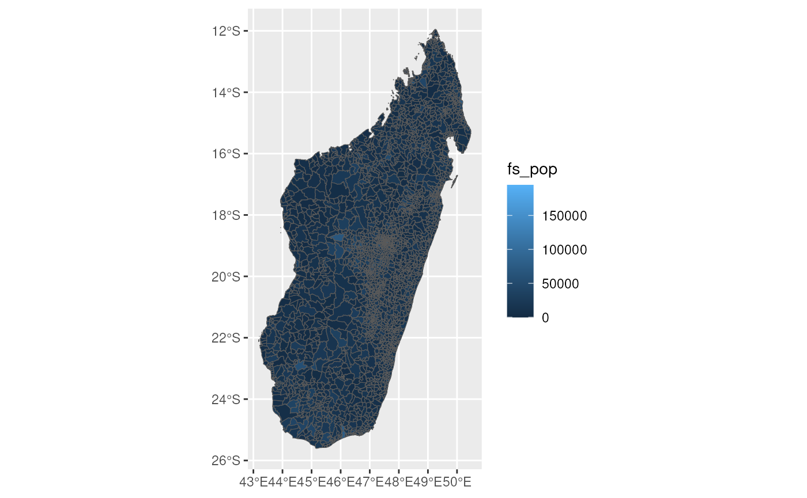
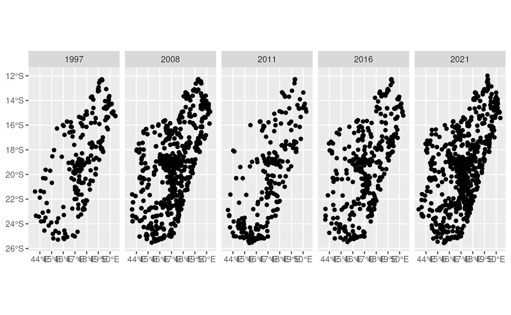
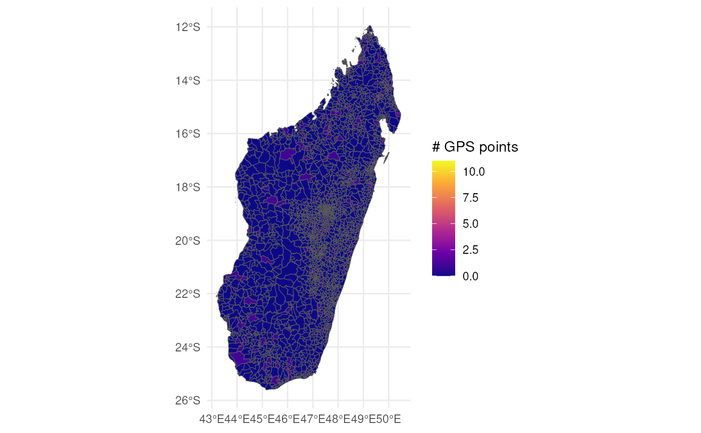
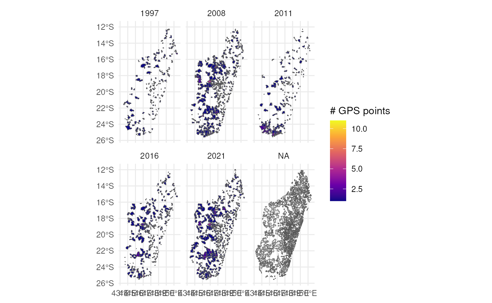

# Reading in Files from DHS

``` r

library(DHSHarmonization)
```

Here we demonstrate how to load and view the DHS datasets that will be
harmonized in this package. Each section builds the function needed to
read in the data, and then tests it to ensure it works as expected. The
functions are then implemented in the targets pipeline.

Some basic EDA is provided for you to help you understand what data can
be made available to you through a data request.

``` r

library(targets)
library(here)
#> here() starts at /work
library(tidyverse)
#> ── Attaching core tidyverse packages ──────────────────────── tidyverse 2.0.0 ──
#> ✔ dplyr     1.2.1     ✔ readr     2.2.0
#> ✔ forcats   1.0.1     ✔ stringr   1.6.0
#> ✔ ggplot2   4.0.3     ✔ tibble    3.3.1
#> ✔ lubridate 1.9.5     ✔ tidyr     1.3.2
#> ✔ purrr     1.2.2
#> ── Conflicts ────────────────────────────────────────── tidyverse_conflicts() ──
#> ✖ dplyr::filter() masks stats::filter()
#> ✖ dplyr::lag()    masks stats::lag()
#> ℹ Use the conflicted package (<http://conflicted.r-lib.org/>) to force all conflicts to become errors
library(purrr)
library(rdhs)
#> Thank you for using rdhs. If you are using rdhs regularly
#> or for automated tasks, please register for your own API key by
#> emailing api@dhsprogram.com. 
#> 
#> More info at <https://api.dhsprogram.com/#/introdevelop.html>
library(glue)
library(sf)
#> Linking to GEOS 3.12.1, GDAL 3.8.4, PROJ 9.4.0; sf_use_s2() is TRUE
```

## load_flat_dhs_data

So long as the data has a flat structure, it should be straightforward
to load it into R and view it using the `rdhs` package. The structure is
taken from this [DHS
page](https://dhsprogram.com/data/File-Types-and-Names.cfm#CP_JUMP_10334).

    Example:
    To give an example of how distribution files for a survey are organized, the following table shows the available files, along with the names that they are given for the Kenya 2003 DHS survey.
    Kenya 2003 DHS Survey
        ASCII File Types    Software-Specific Data File Types
    Unit of Analysis    Hierarchical    Flat    SAS SPSS    Stata
    Households      KEHR42FL.ZIP    KEHR42SD.ZIP    KEHR42SV.ZIP    KEHR42DT.ZIP
    Household Members       KEPR42FL.ZIP    KEPR42SD.ZIP    KEPR42SV.ZIP    KEPR42DT.ZIP
    Women   KEIR42.ZIP  KEIR42FL.ZIP    KEIR42SD.ZIP    KEIR42SV.ZIP    KEIR42DT.ZIP
    Men KEMR42.ZIP  KEMR42FL.ZIP    KEMR42SD.ZIP    KEMR42SV.ZIP    KEMR42DT.ZIP
    Births      KEBR42FL.ZIP    KEBR42SD.ZIP    KEBR42SV.ZIP    KEBR42DT.ZIP
    Children        KEKR42FL.ZIP    KEKR42SD.ZIP    KEKR42SV.ZIP    KEKR42DT.ZIP
    Couples     KECR42FL.ZIP    KECR42SD.ZIP    KECR42SV.ZIP    KECR42DT.ZIP
    HIV Test Results    KEAR42.ZIP  KEAR42FL.ZIP    KEAR42SD.ZIP    KEAR42SV.ZIP    KEAR42DT.ZIP

    The following reference tables contain the descriptions for the four different types of filename codes (country, data type, data version, and file format).

In our case, we have the following:

    tree -L 3 data/DHS\ Data/

    data/DHS Data/
    ├── DHS 1992
    │   ├── MDBR21FL
    │   │   ├── MDBR21FL.DAT
    │   │   ├── MDBR21FL.DCF
    │   │   ├── MDBR21FL.DCT
    │   │   ├── MDBR21FL.DO
    │   │   ├── MDBR21FL.frq
    │   │   ├── MDBR21FL.frw
    │   │   ├── MDBR21FL.MAP
    │   │   ├── MDBR21FL.SAS
    │   │   └── MDBR21FL.SPS
    │   ├── MDHR21FL
    │   │   ├── MDHR21FL.DAT
    │   │   ├── MDHR21FL.DCT
    │   │   ├── MDHR21FL.DO
    │   │   ├── MDHR21FL.FRQ
    │   │   ├── MDHR21FL.FRW
    │   │   ├── MDHR21FL.MAP
    │   │   ├── MDHR21FL.SAS
    │   │   └── MDHR21FL.SPS
    │   ├── MDHW21FL
    │   │   ├── MDHW21FL.DAT
    │   │   ├── MDHW21FL.DCF
    │   │   ├── MDHW21FL.DCT
    │   │   ├── MDHW21FL.DO
    │   │   ├── MDHW21FL.MAP
    │   │   ├── MDHW21FL.SAS
    │   │   ├── MDHW21FL.SPS
    │   │   └── MERGE.DOC
    │   ├── MDIR21FL
    │   │   ├── MDIR21FL.DAT
    │   │   ├── MDIR21FL.DCT
    │   │   ├── MDIR21FL.DO
    │   │   ├── MDIR21FL.DOC
    │   │   ├── MDIR21FL.FRQ
    │   │   ├── MDIR21FL.FRW
    │   │   ├── MDIR21FL.MAP
    │   │   ├── MDIR21FL.SAS
    │   │   └── MDIR21FL.SPS
    │   ├── MDKR21FL
    │   │   ├── MDKR21FL.DAT
    │   │   ├── MDKR21FL.DCT
    │   │   ├── MDKR21FL.DO
    │   │   ├── MDKR21FL.DOC
    │   │   ├── MDKR21FL.FRQ
    │   │   ├── MDKR21FL.MAP
    │   │   ├── MDKR21FL.SAS
    │   │   └── MDKR21FL.SPS
    │   ├── MDPR21FL
    │   │   ├── MDPR21FL.DAT
    │   │   ├── MDPR21FL.DCT
    │   │   ├── MDPR21FL.DO
    │   │   ├── MDPR21FL.FRQ
    │   │   ├── MDPR21FL.FRW
    │   │   ├── MDPR21FL.MAP
    │   │   ├── MDPR21FL.SAS
    │   │   └── MDPR21FL.SPS
    │   └── MDSQ21FL
    │       ├── MDSQ21FL.DAT
    │       ├── MDSQ21FL.DCT
    │       ├── MDSQ21FL.DO
    │       ├── MDSQ21FL.MAP
    │       ├── MDSQ21FL.SAS
    │       └── MDSQ21FL.SPS

So, for the generic ones, we know that we have BR (Birth rates), HR
(Household), HW (height and weight), IR (individual), KR (kids), PR
(household member), and SQ (Service Availability). We also have WI
(wealth), CR (couples), MR (men’s), GE (Geographic Data), GC (geospatial
covariates), FW (Fieldworker), and MIS data (malaria response survey).

To read in the generic flat files, we can use the `rdhs` package. This
has to be done by first zipping the files to a temporary location, and
then using the `rdhs::read_flat()` function.

``` r

library(rdhs)
library(dplyr)
library(here)
library(zip)
#> 
#> Attaching package: 'zip'
#> The following objects are masked from 'package:utils':
#> 
#>     unzip, zip

ex_data <- here("data", "DHS Data", "DHS 1992", "MDIR21FL")
temp_zip <- tempfile(fileext = ".zip")

zip::zipr(zipfile = temp_zip, files = list.files(ex_data, full.names = TRUE))
file.exists(temp_zip)
#> [1] TRUE
```

``` r

dhs_data <- rdhs:::read_dhs_flat(temp_zip)
tibble(dhs_data)
#> # A tibble: 6,260 × 2,347
#>    caseid     v000   v001  v002  v003  v004   v005  v006  v007  v008  v009  v010
#>    <chr>      <chr> <int> <int> <int> <int>  <int> <int> <int> <int> <int> <int>
#>  1 "        … MD2       1     1     6     1 1.26e6     6    92  1110     2    70
#>  2 "        … MD2       1     1     8     1 1.26e6     6    92  1110     6    73
#>  3 "        … MD2       1     1     9     1 1.26e6     6    92  1110     1    75
#>  4 "        … MD2       1     2     2     1 1.26e6     6    92  1110    11    63
#>  5 "        … MD2       1     3     2     1 1.26e6     6    92  1110     7    55
#>  6 "        … MD2       1     3     3     1 1.26e6     6    92  1110     3    77
#>  7 "        … MD2       1     4     2     1 1.26e6     6    92  1110     8    67
#>  8 "        … MD2       1     5     1     1 1.26e6     6    92  1110     7    53
#>  9 "        … MD2       1     6     2     1 1.26e6     6    92  1110    11    53
#> 10 "        … MD2       1     6     3     1 1.26e6     6    92  1110     9    69
#> # ℹ 6,250 more rows
#> # ℹ 2,335 more variables: v011 <int>, v012 <int>, v013 <int+lbl>,
#> #   v014 <int+lbl>, v015 <int+lbl>, v016 <int>, v017 <int>, v018 <int+lbl>,
#> #   v019 <int+lbl>, v020 <int+lbl>, v021 <int>, v022 <int>, v023 <int+lbl>,
#> #   v024 <int+lbl>, v025 <int+lbl>, v026 <int+lbl>, v027 <int>, v028 <int>,
#> #   v029 <int>, v101 <int+lbl>, v102 <int+lbl>, v103 <int+lbl>, v104 <int+lbl>,
#> #   v105 <int+lbl>, v106 <int+lbl>, v107 <int>, v108 <int+lbl>, …
```

We can see that the variables do come with labels and attributes. This
is useful information for understanding the data.

``` r

get_variable_labels(dhs_data) %>%
  head()
#>   variable              description
#> 1   caseid      Case Identification
#> 2     v000   Country code and phase
#> 3     v001           Cluster number
#> 4     v002         Household number
#> 5     v003 Respondent's line number
#> 6     v004       Ultimate area unit
```

So, to read in a generic flat file from DHS, we can define the function
[`load_flat_dhs_data()`](../reference/load_flat_dhs_data.md):

``` r

ex_data <- here("data", "DHS Data", "DHS 1992", "MDIR21FL")
load_flat_dhs_data(ex_data) %>%
  tibble() %>%
  head()
#> # A tibble: 6 × 2,347
#>   caseid      v000   v001  v002  v003  v004   v005  v006  v007  v008  v009  v010
#>   <chr>       <chr> <int> <int> <int> <int>  <int> <int> <int> <int> <int> <int>
#> 1 "         … MD2       1     1     6     1 1.26e6     6    92  1110     2    70
#> 2 "         … MD2       1     1     8     1 1.26e6     6    92  1110     6    73
#> 3 "         … MD2       1     1     9     1 1.26e6     6    92  1110     1    75
#> 4 "         … MD2       1     2     2     1 1.26e6     6    92  1110    11    63
#> 5 "         … MD2       1     3     2     1 1.26e6     6    92  1110     7    55
#> 6 "         … MD2       1     3     3     1 1.26e6     6    92  1110     3    77
#> # ℹ 2,335 more variables: v011 <int>, v012 <int>, v013 <int+lbl>,
#> #   v014 <int+lbl>, v015 <int+lbl>, v016 <int>, v017 <int>, v018 <int+lbl>,
#> #   v019 <int+lbl>, v020 <int+lbl>, v021 <int>, v022 <int>, v023 <int+lbl>,
#> #   v024 <int+lbl>, v025 <int+lbl>, v026 <int+lbl>, v027 <int>, v028 <int>,
#> #   v029 <int>, v101 <int+lbl>, v102 <int+lbl>, v103 <int+lbl>, v104 <int+lbl>,
#> #   v105 <int+lbl>, v106 <int+lbl>, v107 <int>, v108 <int+lbl>, v109 <int+lbl>,
#> #   v110 <int+lbl>, v111 <int>, v112 <int+lbl>, v113 <int+lbl>, …
```

We can also test that this works for the malaria response survey data:

``` r

ex_data <- here("data", "DHS Data", "MIS 2016", "MDIR71FL")

load_flat_dhs_data(ex_data) %>%
  tibble() %>%
  head()
#> # A tibble: 6 × 3,532
#>   caseid      v000   v001  v002  v003  v004   v005  v006  v007  v008 v008a  v009
#>   <chr>       <chr> <int> <int> <int> <int>  <int> <int> <int> <int> <int> <int>
#> 1 "    00010… MD7       1     9     4     1 3.47e6     4  2016  1396 42489     3
#> 2 "    00010… MD7       1    15     4     1 3.47e6     4  2016  1396 42489     7
#> 3 "    00010… MD7       1    21     2     1 3.47e6     4  2016  1396 42490     1
#> 4 "    00010… MD7       1    27     2     1 3.47e6     4  2016  1396 42490     9
#> 5 "    00010… MD7       1    39     2     1 3.47e6     4  2016  1396 42489     7
#> 6 "    00010… MD7       1    39     3     1 3.47e6     4  2016  1396 42489     9
#> # ℹ 3,520 more variables: v010 <int>, v011 <int>, v012 <int>, v013 <int+lbl>,
#> #   v014 <int+lbl>, v015 <int+lbl>, v016 <int>, v017 <int>, v018 <int+lbl>,
#> #   v019 <int+lbl>, v019a <int+lbl>, v020 <int+lbl>, v021 <int>,
#> #   v022 <int+lbl>, v023 <int+lbl>, v024 <int+lbl>, v025 <int+lbl>,
#> #   v026 <int+lbl>, v027 <int+lbl>, v028 <int+lbl>, v029 <int>, v030 <int+lbl>,
#> #   v031 <int>, v032 <int>, v034 <int+lbl>, v040 <int+lbl>, v042 <int+lbl>,
#> #   v044 <int+lbl>, v045a <int+lbl>, v045b <int+lbl>, v045c <int+lbl>, …
```

Because the different kinds of surveys have different variable
structures, we will read each type separately.

To do this, we’ll read in a list of file paths, and then map over them
to read them in.

In the targets pipeline, we’ve assigned the BR files to a target called
`dhs_data_BR`, which has multiple files per target.

``` r

tar_read(dhs_data_BR, store = here("_targets"))[[1]] -> ex_data_1
tar_read(dhs_data_BR, store = here("_targets"))[[5]] -> ex_data_2

tibble(ex_data_1)
#> # A tibble: 18,931 × 580
#>    caseid      bidx v000   v001  v002  v003  v004   v005  v006  v007  v008  v009
#>    <chr>      <int> <chr> <int> <int> <int> <int>  <int> <int> <int> <int> <int>
#>  1 "        …     1 MD2       1     2     2     1 1.26e6     6    92  1110    11
#>  2 "        …     2 MD2       1     2     2     1 1.26e6     6    92  1110    11
#>  3 "        …     3 MD2       1     2     2     1 1.26e6     6    92  1110    11
#>  4 "        …     4 MD2       1     2     2     1 1.26e6     6    92  1110    11
#>  5 "        …     1 MD2       1     3     2     1 1.26e6     6    92  1110     7
#>  6 "        …     2 MD2       1     3     2     1 1.26e6     6    92  1110     7
#>  7 "        …     3 MD2       1     3     2     1 1.26e6     6    92  1110     7
#>  8 "        …     4 MD2       1     3     2     1 1.26e6     6    92  1110     7
#>  9 "        …     5 MD2       1     3     2     1 1.26e6     6    92  1110     7
#> 10 "        …     6 MD2       1     3     2     1 1.26e6     6    92  1110     7
#> # ℹ 18,921 more rows
#> # ℹ 568 more variables: v010 <int>, v011 <int>, v012 <int>, v013 <int+lbl>,
#> #   v014 <int+lbl>, v015 <int+lbl>, v016 <int>, v017 <int>, v018 <int+lbl>,
#> #   v019 <int+lbl>, v020 <int+lbl>, v021 <int>, v022 <int>, v023 <int+lbl>,
#> #   v024 <int+lbl>, v025 <int+lbl>, v026 <int+lbl>, v027 <int>, v028 <int+lbl>,
#> #   v029 <int+lbl>, v101 <int+lbl>, v102 <int+lbl>, v103 <int+lbl>,
#> #   v104 <int+lbl>, v105 <int+lbl>, v106 <int+lbl>, v107 <int+lbl>, …
```

``` r

tibble(ex_data_2)
#> # A tibble: 47,720 × 1,162
#>    caseid      bidx v000   v001  v002  v003  v004   v005  v006  v007  v008 v008a
#>    <chr>      <int> <chr> <int> <int> <int> <int>  <int> <int> <int> <int> <int>
#>  1 "       1…     1 MD7       1    10     2     1 733467     3  2021  1455 44259
#>  2 "       1…     2 MD7       1    10     2     1 733467     3  2021  1455 44259
#>  3 "       1…     1 MD7       1    16     1     1 733467     3  2021  1455 44262
#>  4 "       1…     1 MD7       1    23     2     1 733467     3  2021  1455 44261
#>  5 "       1…     2 MD7       1    23     2     1 733467     3  2021  1455 44261
#>  6 "       1…     3 MD7       1    23     2     1 733467     3  2021  1455 44261
#>  7 "       1…     1 MD7       1    30     2     1 733467     3  2021  1455 44263
#>  8 "       1…     1 MD7       1    45     2     1 733467     3  2021  1455 44259
#>  9 "       1…     2 MD7       1    45     2     1 733467     3  2021  1455 44259
#> 10 "       1…     1 MD7       1    52     2     1 733467     3  2021  1455 44259
#> # ℹ 47,710 more rows
#> # ℹ 1,150 more variables: v009 <int>, v010 <int>, v011 <int>, v012 <int>,
#> #   v013 <int+lbl>, v014 <int+lbl>, v015 <int+lbl>, v016 <int>, v017 <int>,
#> #   v018 <int+lbl>, v019 <int+lbl>, v019a <int+lbl>, v020 <int+lbl>,
#> #   v021 <int>, v022 <int>, v023 <int>, v024 <int+lbl>, v025 <int+lbl>,
#> #   v026 <int+lbl>, v027 <int+lbl>, v028 <int>, v029 <int>, v030 <int>,
#> #   v031 <int>, v032 <int>, v034 <int+lbl>, v040 <int+lbl>, v042 <int+lbl>, …
```

So even though they come from the same type of survey, the variables are
different and cannot be easily merged with the `rhds::rbind_labelled()`
function, because they change year over year:

``` r

# try to merge all of the BR datasets
all_br_data <- tar_read(dhs_data_BR, store = here("_targets"))
tryCatch({
  rdhs::rbind_labelled(all_br_data) %>% tibble()
}, error = function(e) {
  message("Error merging BR datasets: ", e$message)
  NULL
})
#> Error merging BR datasets: undefined columns selected
#> NULL
```

So with that in mind, we should take a look at the actual variable
dictionaries for each survey type to plan how we will eventually
harmonize and release them (descriptions are provided by ChatGPT and
verified with DHS documentation available
[here](https://preview.dhsprogram.com/pubs/pdf/DHSG1/Guide_to_DHS_Statistics_DHS-7_v2.pdf)).

## summarize_dhs_flat_dictionary

The function
[`summarize_dhs_flat_dictionary()`](../reference/summarize_dhs_flat_dictionary.md)
will read in all of the flat files of a given survey type (e.g., BR, HR,
IR) and summarize the variable names.

### Birth Recode Variables

> A dataset where each record represents a live birth to a surveyed
> woman. It is used primarily for fertility and mortality analyses
> (e.g., age‐specific fertility rates, infant/child mortality) by
> linking births to the mother’s survey responses.

``` r

survey_data <- tar_read(dhs_data_BR, store = here("_targets"))
var_descriptions_br <- summarize_dhs_flat_dictionary(survey_data)
n_surveys <- length(tar_read(dhs_data_BR, store = here("_targets"))) # shows the number of branches
DT::datatable(var_descriptions_br, caption = glue("Variable Descriptions for Birth Recode Surveys ({n_surveys} Distinct Surveys Total)"))
```

### Couples Recode Variables

> A dataset where each record is a couple (husband + wife) interviewed
> in the survey. Used for analyses of spousal/partner characteristics,
> family planning dynamics, and household reproduction.

``` r

survey_data <- tar_read(dhs_data_CR, store = here("_targets"))
var_descriptions_cr <- summarize_dhs_flat_dictionary(survey_data)
n_surveys <- length(tar_read(dhs_data_CR, store = here("_targets"))) # shows the number of branches
DT::datatable(var_descriptions_cr, caption = glue("Variable Descriptions for Couples Recode Surveys ({n_surveys} Distinct Surveys Total)"))
```

### Height/Weight Variables

> A dataset focusing on anthropometric measurements for children under
> age 5 (height/length, weight, nutritional status z-scores) designed to
> support child nutrition and growth‐monitoring analyses.

``` r

survey_data <- tar_read(dhs_data_HW, store = here("_targets"))
var_descriptions_hw <- summarize_dhs_flat_dictionary(survey_data)
n_surveys <- length(tar_read(dhs_data_HW, store = here("_targets"))) # shows the number of branches
DT::datatable(var_descriptions_hw, caption = glue("Variable Descriptions for Height/Weight Surveys ({n_surveys} Distinct Surveys Total)"))
```

### Household Recode Variables

> A dataset in which each record is a household. It contains information
> on household structure, living conditions, assets, water/sanitation,
> and biomarkers for household members. Useful for household‐level
> analysis and linking to individual recodes

``` r

survey_data <- tar_read(dhs_data_HR, store = here("_targets"))
var_descriptions_hr <- summarize_dhs_flat_dictionary(survey_data)
n_surveys <- length(tar_read(dhs_data_HR, store = here("_targets"))) # shows the number of branches
DT::datatable(var_descriptions_hr, caption = glue("Variable Descriptions for Household Recode Surveys ({n_surveys} Distinct Surveys Total)"))
```

### Individual Recode (Women) Variables

> A dataset with one record per interviewed woman (usually ages 15-49).
> Contains their birth histories, reproductive health, contraceptive
> use, maternity care, and child health modules. It is the primary unit
> for women’s health and fertility research.

``` r

survey_data <- tar_read(dhs_data_IR, store = here("_targets"))
var_descriptions_ir <- summarize_dhs_flat_dictionary(survey_data)
n_surveys <- length(tar_read(dhs_data_IR, store = here("_targets"))) # shows the number of branches
DT::datatable(var_descriptions_ir, caption = glue("Variable Descriptions for Individual Recode (Women) Surveys ({n_surveys} Distinct Surveys Total)"))
#> Warning in instance$preRenderHook(instance): It seems your data is too big for
#> client-side DataTables. You may consider server-side processing:
#> https://rstudio.github.io/DT/server.html
```

### Kids Recode Variables

> A dataset with one record per child under age 5 born to a surveyed
> woman. It includes immunization, illness episodes, nutrition, growth,
> and survival status for each child.

``` r

survey_data <- tar_read(dhs_data_KR, store = here("_targets"))
var_descriptions_kr <- summarize_dhs_flat_dictionary(survey_data)
n_surveys <- length(tar_read(dhs_data_KR, store = here("_targets"))) # shows the number of branches
DT::datatable(var_descriptions_kr, caption = glue("Variable Descriptions for Kids Recode Surveys ({n_surveys} Distinct Surveys Total)"))
```

### Household Member Recode Variables

> A dataset with one record per household member (both male and female)
> in the selected households. Contains demographic, socio‐economic, and
> biomarker information. Useful for analyses of all household
> members—not just women or children.

``` r

survey_data <- tar_read(dhs_data_PR, store = here("_targets"))
var_descriptions_pr <- summarize_dhs_flat_dictionary(survey_data)
n_surveys <- length(tar_read(dhs_data_PR, store = here("_targets"))) # shows the number of branches
DT::datatable(var_descriptions_pr, caption = glue("Variable Descriptions for Household Member Recode Surveys ({n_surveys} Distinct Surveys Total)"))
```

### Wealth Index Variables

> An optional dataset (in older surveys) where each record is a
> household and it specifically provides wealth score and quintile for
> that survey, used when wealth index was not yet integrated in other
> recode files.

``` r

survey_data <- tar_read(dhs_data_WI, store = here("_targets"))
var_descriptions_wi <- summarize_dhs_flat_dictionary(survey_data)
n_surveys <- length(tar_read(dhs_data_WI, store = here("_targets"))) # shows the number of branches
DT::datatable(var_descriptions_wi, caption = glue("Variable Descriptions for Wealth Index Surveys ({n_surveys} Distinct Surveys Total)"))
```

### Men’s Recode Variables

> A dataset where each record is an interviewed man (often ages 15-59).
> It includes his fertility, contraception, HIV/AIDS, and
> health‐behavior modules. Useful for research on men’s health and
> reproductive behavior.

``` r

survey_data <- tar_read(dhs_data_MR, store = here("_targets"))
var_descriptions_mr <- summarize_dhs_flat_dictionary(survey_data)
n_surveys <- length(tar_read(dhs_data_MR, store = here("_targets"))) # shows the number of branches
DT::datatable(var_descriptions_mr, caption = glue("Variable Descriptions for Men's Recode Surveys ({n_surveys} Distinct Surveys Total)"))
```

### Fieldworker Variables

> A dataset with one record for each fieldworker/interviewer in the
> survey. It contains characteristics of data collection staff (age,
> education, languages, prior experience), used for survey‐quality and
> interviewer bias analyses

``` r

survey_data <- tar_read(dhs_data_FW, store = here("_targets"))
var_descriptions_fw <- summarize_dhs_flat_dictionary(survey_data)
n_surveys <- length(tar_read(dhs_data_FW, store = here("_targets"))) # shows the number of branches
DT::datatable(var_descriptions_fw, caption = glue("Variable Descriptions for Fieldworker Surveys ({n_surveys} Distinct Surveys Total)"))
```

### Supplemental Questionnaire Variables

> A file type associated with additional modules or supplemental
> questionnaires (e.g., field worker interviews, special modules) beyond
> the core recode files. Use is more specialized depending on the
> country/survey.

``` r

survey_data <- tar_read(dhs_data_SQ, store = here("_targets"))
var_descriptions_sq <- summarize_dhs_flat_dictionary(survey_data)
n_surveys <- length(tar_read(dhs_data_SQ, store = here("_targets"))) # shows the number of branches
DT::datatable(var_descriptions_sq, caption = glue("Variable Descriptions for Supplemental Questionnaire Surveys ({n_surveys} Distinct Surveys Total)"))
```

## load_gps_dhs_data

Reading in the geospatial data is a little bit different:

``` r

ex_data <- here("data", "DHS Data", "DHS 1997", "GPS Data", "MDGE32FL")
list.files(ex_data)
#> [1] "DHS_README.txt"   "MDGE32FL.dbf"     "MDGE32FL.prj"     "MDGE32FL.sbn"    
#> [5] "MDGE32FL.sbx"     "MDGE32FL.shp"     "MDGE32FL.shp.xml" "MDGE32FL.shx"
```

To read in shapefiles, we can use the `sf` package:

``` r

library(sf)
gps_data <- sf::st_read(dsn = ex_data)
#> Reading layer `MDGE32FL' from data source 
#>   `/n/holylabs/cgolden_lab/Lab/data_freeze/golden_googledrive_rclone/Climate-Smart Public Health - Madagascar/4. Datasets/DHS Data/DHS 1997/GPS Data/MDGE32FL' 
#>   using driver `ESRI Shapefile'
#> Simple feature collection with 269 features and 20 fields
#> Geometry type: POINT
#> Dimension:     XY
#> Bounding box:  xmin: 6.661338e-16 ymin: -25.28438 xmax: 50.45773 ymax: 0
#> Geodetic CRS:  WGS 84
gps_data
#> Simple feature collection with 269 features and 20 fields
#> Geometry type: POINT
#> Dimension:     XY
#> Bounding box:  xmin: 6.661338e-16 ymin: -25.28438 xmax: 50.45773 ymax: 0
#> Geodetic CRS:  WGS 84
#> First 10 features:
#>             DHSID DHSCC DHSYEAR DHSCLUST CCFIPS ADM1FIPS ADM1FIPSNA ADM1SALBNA
#> 1  MD199700000001    MD    1997        1     MA     NULL       NULL       NULL
#> 2  MD199700000002    MD    1997        2     MA     NULL       NULL       NULL
#> 3  MD199700000003    MD    1997        3     MA     NULL       NULL       NULL
#> 4  MD199700000004    MD    1997        4     MA     NULL       NULL       NULL
#> 5  MD199700000005    MD    1997        5     MA     NULL       NULL       NULL
#> 6  MD199700000006    MD    1997        6     MA     NULL       NULL       NULL
#> 7  MD199700000007    MD    1997        7     MA     NULL       NULL       NULL
#> 8  MD199700000008    MD    1997        8     MA     NULL       NULL       NULL
#> 9  MD199700000009    MD    1997        9     MA     NULL       NULL       NULL
#> 10 MD199700000010    MD    1997       10     MA     NULL       NULL       NULL
#>    ADM1SALBCO ADM1DHS     ADM1NAME DHSREGCO     DHSREGNA SOURCE URBAN_RURA
#> 1        NULL       1 antananarivo        1 antananarivo    GPS          U
#> 2        NULL       1 antananarivo        1 antananarivo    GPS          U
#> 3        NULL       1 antananarivo        1 antananarivo    GPS          U
#> 4        NULL       1 antananarivo        1 antananarivo    GPS          U
#> 5        NULL       1 antananarivo        1 antananarivo    GPS          U
#> 6        NULL       1 antananarivo        1 antananarivo    MIS          U
#> 7        NULL       1 antananarivo        1 antananarivo    GPS          U
#> 8        NULL       1 antananarivo        1 antananarivo    GPS          U
#> 9        NULL       1 antananarivo        1 antananarivo    GPS          U
#> 10       NULL       1 antananarivo        1 antananarivo    GPS          U
#>       LATNUM  LONGNUM ALT_GPS ALT_DEM DATUM                   geometry
#> 1  -18.92010 47.51332    9999    1290 WGS84  POINT (47.51332 -18.9201)
#> 2  -18.90276 47.50940    9999    1289 WGS84  POINT (47.5094 -18.90276)
#> 3  -18.90329 47.50141    9999    1290 WGS84 POINT (47.50141 -18.90329)
#> 4  -18.89096 47.51720    9999    1297 WGS84  POINT (47.5172 -18.89096)
#> 5  -18.88167 47.54719    9999    1334 WGS84 POINT (47.54719 -18.88167)
#> 6    0.00000  0.00000    9999    9999 WGS84     POINT (6.661338e-16 0)
#> 7  -18.88372 47.51306    9999    1301 WGS84 POINT (47.51306 -18.88372)
#> 8  -18.93616 47.51758    9999    1285 WGS84 POINT (47.51758 -18.93616)
#> 9  -18.92530 47.52272    9999    1285 WGS84  POINT (47.52272 -18.9253)
#> 10 -18.93636 47.51839    9999    1277 WGS84 POINT (47.51839 -18.93636)
```

We can plot the data as well:

``` r

plot(st_geometry(gps_data))
```


### What Geospatial Data Do we have?

Let’s do some simple EDA of the geospatial data to understand what we
have.

From the manual:

> In most recent DHS surveys, the groupings of households that
> participated in the survey, known as clusters, are geo referenced.
> These survey cluster coordinates are collected in the field using GPS
> receivers, usually during the survey sample listing process. In
> general, the GPS readings for most clusters are accurate to less than
> 15 meters.

So a DHS cluster is a group of households surveyed at a given location.

We have the following number of years of GPS surveys:

``` r

gps_data <- tar_read(gps_data, store = here("_targets"))
length(gps_data)
#> [1] 6
```

This tells us how many unique clusters (features, in the sf df) we have
across each year:

``` r

map(
  gps_data,
  ~ .x %>%
    select(DHSID, DHSYEAR) %>%
    distinct()
)
#> $gps_data_8298b5191d2ae010
#> Simple feature collection with 269 features and 2 fields
#> Geometry type: POINT
#> Dimension:     XY
#> Bounding box:  xmin: 6.661338e-16 ymin: -25.28438 xmax: 50.45773 ymax: 0
#> Geodetic CRS:  WGS 84
#> First 10 features:
#>             DHSID DHSYEAR                   geometry
#> 1  MD199700000001    1997  POINT (47.51332 -18.9201)
#> 2  MD199700000002    1997  POINT (47.5094 -18.90276)
#> 3  MD199700000003    1997 POINT (47.50141 -18.90329)
#> 4  MD199700000004    1997  POINT (47.5172 -18.89096)
#> 5  MD199700000005    1997 POINT (47.54719 -18.88167)
#> 6  MD199700000006    1997     POINT (6.661338e-16 0)
#> 7  MD199700000007    1997 POINT (47.51306 -18.88372)
#> 8  MD199700000008    1997 POINT (47.51758 -18.93616)
#> 9  MD199700000009    1997  POINT (47.52272 -18.9253)
#> 10 MD199700000010    1997 POINT (47.51839 -18.93636)
#> 
#> $gps_data_f50ff43195c3431a
#> Simple feature collection with 594 features and 2 fields
#> Geometry type: POINT
#> Dimension:     XY
#> Bounding box:  xmin: 0 ymin: -25.52226 xmax: 50.29224 ymax: 0
#> Geodetic CRS:  WGS 84
#> First 10 features:
#>             DHSID DHSYEAR                   geometry
#> 1  MD200800000001    2008  POINT (47.50036 -18.9088)
#> 2  MD200800000002    2008 POINT (47.49953 -18.90939)
#> 3  MD200800000003    2008 POINT (47.51908 -18.90449)
#> 4  MD200800000004    2008 POINT (47.50856 -18.91917)
#> 5  MD200800000005    2008 POINT (47.49968 -18.92357)
#> 6  MD200800000006    2008 POINT (47.52111 -18.91133)
#> 7  MD200800000007    2008 POINT (47.50696 -18.88818)
#> 8  MD200800000008    2008 POINT (47.50463 -18.92391)
#> 9  MD200800000009    2008  POINT (47.52437 -18.9085)
#> 10 MD200800000010    2008   POINT (47.528 -18.92913)
#> 
#> $gps_data_ae75628c32935f2f
#> Simple feature collection with 594 features and 2 fields
#> Geometry type: POINT
#> Dimension:     XY
#> Bounding box:  xmin: 0 ymin: -25.52226 xmax: 50.29224 ymax: 0
#> Geodetic CRS:  WGS 84
#> First 10 features:
#>             DHSID DHSYEAR                   geometry
#> 1  MD200800000001    2008  POINT (47.50036 -18.9088)
#> 2  MD200800000002    2008 POINT (47.49953 -18.90939)
#> 3  MD200800000003    2008 POINT (47.51908 -18.90449)
#> 4  MD200800000004    2008 POINT (47.50856 -18.91917)
#> 5  MD200800000005    2008 POINT (47.49968 -18.92357)
#> 6  MD200800000006    2008 POINT (47.52111 -18.91133)
#> 7  MD200800000007    2008 POINT (47.50696 -18.88818)
#> 8  MD200800000008    2008 POINT (47.50463 -18.92391)
#> 9  MD200800000009    2008  POINT (47.52437 -18.9085)
#> 10 MD200800000010    2008   POINT (47.528 -18.92913)
#> 
#> $gps_data_b505060d1bee8a8f
#> Simple feature collection with 650 features and 2 fields
#> Geometry type: POINT
#> Dimension:     XY
#> Bounding box:  xmin: 43.3746 ymin: -25.5548 xmax: 50.36067 ymax: -11.99102
#> Geodetic CRS:  WGS 84
#> First 10 features:
#>             DHSID DHSYEAR                   geometry
#> 1  MD202100000001    2021  POINT (47.51655 -18.9005)
#> 2  MD202100000002    2021  POINT (47.50252 -18.9037)
#> 3  MD202100000003    2021 POINT (47.51845 -18.90855)
#> 4  MD202100000004    2021 POINT (47.51001 -18.89412)
#> 5  MD202100000005    2021 POINT (47.50749 -18.91743)
#> 6  MD202100000006    2021 POINT (47.50042 -18.89919)
#> 7  MD202100000007    2021 POINT (47.51526 -18.91396)
#> 8  MD202100000008    2021 POINT (47.49963 -18.93202)
#> 9  MD202100000009    2021 POINT (47.54904 -18.90876)
#> 10 MD202100000010    2021 POINT (47.55657 -18.92492)
#> 
#> $gps_data_b28c64131ce2bbdc
#> Simple feature collection with 267 features and 2 fields
#> Geometry type: POINT
#> Dimension:     XY
#> Bounding box:  xmin: 0 ymin: -25.55782 xmax: 50.27262 ymax: 0
#> Geodetic CRS:  WGS 84
#> First 10 features:
#>             DHSID DHSYEAR                   geometry
#> 1  MD201100000001    2011 POINT (47.54769 -18.81059)
#> 2  MD201100000002    2011 POINT (47.56216 -18.82146)
#> 3  MD201100000003    2011 POINT (47.57843 -18.85815)
#> 4  MD201100000004    2011 POINT (47.62707 -18.75119)
#> 5  MD201100000005    2011 POINT (47.45572 -18.79091)
#> 6  MD201100000006    2011 POINT (47.51928 -18.82442)
#> 7  MD201100000007    2011 POINT (47.48078 -18.80002)
#> 8  MD201100000008    2011 POINT (47.36249 -18.74972)
#> 9  MD201100000009    2011 POINT (47.40767 -18.88466)
#> 10 MD201100000010    2011 POINT (47.09381 -18.28693)
#> 
#> $gps_data_64ab67e0f91b63ce
#> Simple feature collection with 358 features and 2 fields
#> Geometry type: POINT
#> Dimension:     XY
#> Bounding box:  xmin: 43.64903 ymin: -25.47617 xmax: 50.31325 ymax: -12.27554
#> Geodetic CRS:  WGS 84
#> First 10 features:
#>             DHSID DHSYEAR                   geometry
#> 1  MD201600000001    2016 POINT (47.56798 -18.96995)
#> 2  MD201600000002    2016 POINT (47.57159 -18.83351)
#> 3  MD201600000003    2016 POINT (47.63072 -18.84299)
#> 4  MD201600000004    2016 POINT (47.41192 -18.83302)
#> 5  MD201600000005    2016 POINT (47.44783 -18.82412)
#> 6  MD201600000006    2016 POINT (47.55835 -18.75685)
#> 7  MD201600000007    2016 POINT (47.07283 -18.31702)
#> 8  MD201600000008    2016 POINT (46.98167 -18.01371)
#> 9  MD201600000009    2016 POINT (47.65978 -18.92267)
#> 10 MD201600000010    2016  POINT (47.8041 -18.48754)
```

There’s a weird data point in the data that is far outside of
Madagascar.

Let’s remove this:

``` r

map(
  gps_data,
  ~ .x %>%
    select(LATNUM, LONGNUM) %>%
    summary()
)
#> $gps_data_8298b5191d2ae010
#>      LATNUM          LONGNUM               geometry  
#>  Min.   :-25.28   Min.   : 0.00   POINT        :269  
#>  1st Qu.:-20.35   1st Qu.:46.97   epsg:4326    :  0  
#>  Median :-18.90   Median :47.52   +proj=long...:  0  
#>  Mean   :-18.65   Mean   :47.38                      
#>  3rd Qu.:-16.27   3rd Qu.:48.52                      
#>  Max.   :  0.00   Max.   :50.46                      
#> 
#> $gps_data_f50ff43195c3431a
#>      LATNUM          LONGNUM               geometry  
#>  Min.   :-25.52   Min.   : 0.00   POINT        :594  
#>  1st Qu.:-21.45   1st Qu.:46.29   epsg:4326    :  0  
#>  Median :-18.95   Median :47.27   +proj=long...:  0  
#>  Mean   :-19.04   Mean   :46.45                      
#>  3rd Qu.:-17.34   3rd Qu.:47.92                      
#>  Max.   :  0.00   Max.   :50.29                      
#> 
#> $gps_data_ae75628c32935f2f
#>      LATNUM          LONGNUM               geometry  
#>  Min.   :-25.52   Min.   : 0.00   POINT        :594  
#>  1st Qu.:-21.45   1st Qu.:46.29   epsg:4326    :  0  
#>  Median :-18.95   Median :47.27   +proj=long...:  0  
#>  Mean   :-19.04   Mean   :46.45                      
#>  3rd Qu.:-17.34   3rd Qu.:47.92                      
#>  Max.   :  0.00   Max.   :50.29                      
#> 
#> $gps_data_b505060d1bee8a8f
#>      LATNUM          LONGNUM               geometry  
#>  Min.   :-25.55   Min.   :43.37   POINT        :650  
#>  1st Qu.:-21.46   1st Qu.:46.31   epsg:4326    :  0  
#>  Median :-18.95   Median :47.29   +proj=long...:  0  
#>  Mean   :-19.25   Mean   :47.17                      
#>  3rd Qu.:-17.36   3rd Qu.:48.07                      
#>  Max.   :-11.99   Max.   :50.36                      
#> 
#> $gps_data_b28c64131ce2bbdc
#>      LATNUM          LONGNUM               geometry  
#>  Min.   :-25.56   Min.   : 0.00   POINT        :267  
#>  1st Qu.:-23.93   1st Qu.:45.91   epsg:4326    :  0  
#>  Median :-20.30   Median :47.01   +proj=long...:  0  
#>  Mean   :-20.28   Mean   :46.77                      
#>  3rd Qu.:-18.01   3rd Qu.:47.95                      
#>  Max.   :  0.00   Max.   :50.27                      
#> 
#> $gps_data_64ab67e0f91b63ce
#>      LATNUM          LONGNUM               geometry  
#>  Min.   :-25.48   Min.   :43.65   POINT        :358  
#>  1st Qu.:-22.05   1st Qu.:46.13   epsg:4326    :  0  
#>  Median :-19.04   Median :47.18   +proj=long...:  0  
#>  Mean   :-19.42   Mean   :47.17                      
#>  3rd Qu.:-17.23   3rd Qu.:48.31                      
#>  Max.   :-12.28   Max.   :50.31
```

The data point at 0-0 is clearly an error. Let’s remove any points with
latitudes or longitudes equal to 0.

``` r

gps_data2 <- map(
  gps_data,
  ~ .x %>%
    filter(LATNUM != 0 & LONGNUM != 0)
)
```

Now, what is the overlap of our clusters with our Madagascar
healthsheds? To do this, we will perform a spatial join between the GPS
points and the healthshed polygons.

Fetching our healthsheds:

``` r

# note this is not part of the pipeline yet
healthsheds <- tar_read(mdg_healthsheds, store = here("_targets"))
```

Ensure both datasets use the same coordinate reference system (CRS):

``` r

map(
  gps_data2,
  ~ st_crs(.x)
)
#> $gps_data_8298b5191d2ae010
#> Coordinate Reference System:
#>   User input: WGS 84 
#>   wkt:
#> GEOGCRS["WGS 84",
#>     DATUM["World Geodetic System 1984",
#>         ELLIPSOID["WGS 84",6378137,298.257223563,
#>             LENGTHUNIT["metre",1]]],
#>     PRIMEM["Greenwich",0,
#>         ANGLEUNIT["degree",0.0174532925199433]],
#>     CS[ellipsoidal,2],
#>         AXIS["latitude",north,
#>             ORDER[1],
#>             ANGLEUNIT["degree",0.0174532925199433]],
#>         AXIS["longitude",east,
#>             ORDER[2],
#>             ANGLEUNIT["degree",0.0174532925199433]],
#>     ID["EPSG",4326]]
#> 
#> $gps_data_f50ff43195c3431a
#> Coordinate Reference System:
#>   User input: WGS 84 
#>   wkt:
#> GEOGCRS["WGS 84",
#>     DATUM["World Geodetic System 1984",
#>         ELLIPSOID["WGS 84",6378137,298.257223563,
#>             LENGTHUNIT["metre",1]]],
#>     PRIMEM["Greenwich",0,
#>         ANGLEUNIT["degree",0.0174532925199433]],
#>     CS[ellipsoidal,2],
#>         AXIS["latitude",north,
#>             ORDER[1],
#>             ANGLEUNIT["degree",0.0174532925199433]],
#>         AXIS["longitude",east,
#>             ORDER[2],
#>             ANGLEUNIT["degree",0.0174532925199433]],
#>     ID["EPSG",4326]]
#> 
#> $gps_data_ae75628c32935f2f
#> Coordinate Reference System:
#>   User input: WGS 84 
#>   wkt:
#> GEOGCRS["WGS 84",
#>     DATUM["World Geodetic System 1984",
#>         ELLIPSOID["WGS 84",6378137,298.257223563,
#>             LENGTHUNIT["metre",1]]],
#>     PRIMEM["Greenwich",0,
#>         ANGLEUNIT["degree",0.0174532925199433]],
#>     CS[ellipsoidal,2],
#>         AXIS["latitude",north,
#>             ORDER[1],
#>             ANGLEUNIT["degree",0.0174532925199433]],
#>         AXIS["longitude",east,
#>             ORDER[2],
#>             ANGLEUNIT["degree",0.0174532925199433]],
#>     ID["EPSG",4326]]
#> 
#> $gps_data_b505060d1bee8a8f
#> Coordinate Reference System:
#>   User input: WGS 84 
#>   wkt:
#> GEOGCRS["WGS 84",
#>     DATUM["World Geodetic System 1984",
#>         ELLIPSOID["WGS 84",6378137,298.257223563,
#>             LENGTHUNIT["metre",1]]],
#>     PRIMEM["Greenwich",0,
#>         ANGLEUNIT["degree",0.0174532925199433]],
#>     CS[ellipsoidal,2],
#>         AXIS["latitude",north,
#>             ORDER[1],
#>             ANGLEUNIT["degree",0.0174532925199433]],
#>         AXIS["longitude",east,
#>             ORDER[2],
#>             ANGLEUNIT["degree",0.0174532925199433]],
#>     ID["EPSG",4326]]
#> 
#> $gps_data_b28c64131ce2bbdc
#> Coordinate Reference System:
#>   User input: WGS 84 
#>   wkt:
#> GEOGCRS["WGS 84",
#>     DATUM["World Geodetic System 1984",
#>         ELLIPSOID["WGS 84",6378137,298.257223563,
#>             LENGTHUNIT["metre",1]]],
#>     PRIMEM["Greenwich",0,
#>         ANGLEUNIT["degree",0.0174532925199433]],
#>     CS[ellipsoidal,2],
#>         AXIS["latitude",north,
#>             ORDER[1],
#>             ANGLEUNIT["degree",0.0174532925199433]],
#>         AXIS["longitude",east,
#>             ORDER[2],
#>             ANGLEUNIT["degree",0.0174532925199433]],
#>     ID["EPSG",4326]]
#> 
#> $gps_data_64ab67e0f91b63ce
#> Coordinate Reference System:
#>   User input: WGS 84 
#>   wkt:
#> GEOGCRS["WGS 84",
#>     DATUM["World Geodetic System 1984",
#>         ELLIPSOID["WGS 84",6378137,298.257223563,
#>             LENGTHUNIT["metre",1]]],
#>     PRIMEM["Greenwich",0,
#>         ANGLEUNIT["degree",0.0174532925199433]],
#>     CS[ellipsoidal,2],
#>         AXIS["latitude",north,
#>             ORDER[1],
#>             ANGLEUNIT["degree",0.0174532925199433]],
#>         AXIS["longitude",east,
#>             ORDER[2],
#>             ANGLEUNIT["degree",0.0174532925199433]],
#>     ID["EPSG",4326]]
```

``` r

st_crs(healthsheds) == st_crs(gps_data2[[1]])
#> [1] TRUE
```

Here’s what the healthsheds look like:

``` r

ggplot(healthsheds) +
  geom_sf(aes(fill = fs_pop))
```



What we want to know: Our healthsheds represent areas of healthcare
access. Any analysis that we want to think about should be done with
respect to these areas, so that we can know how different variables
relate to “healthcare access”.

So, we want to know how many survey clusters fall within each
healthshed. To do this, we should do a spatial join between the GPS
points and the healthshed polygons, where the goal is to know how many
GPS points fall within each healthshed.

At first, this may not look to be very successful because the surveys
are relatively sparse:

``` r

bind_rows(gps_data2) %>%
  ggplot() +
  geom_sf() +
  facet_grid(~ DHSYEAR)
```



So we need to figure out the degree of overlap between the GPS points
and the healthsheds.

``` r

# Spatial join: assign each GPS point to a healthshed polygon
# st_intersects means we are looking for points in the DHS that overlap on the healthshed polygons
pts <- gps_data2[[1]]
joined <- st_join(healthsheds, pts, left = TRUE, join = st_intersects)
```

``` r

joined %>%
  st_drop_geometry() %>% 
  group_by(fs_uid, fs_name) %>%
  # how many DHSIDs are in each fs_uid
  summarise(n_points = n_distinct(DHSID, na.rm = TRUE), .groups = "drop") -> summary_counts

DT::datatable(summary_counts)
```

Most of the healthsheds have zero GPS points overlapping them, but at
most there are 11. Let’s visualize these for one year:

``` r

summary_counts %>%
  left_join(healthsheds, ., by = c("fs_uid", "fs_name")) %>%
  ggplot() +
  geom_sf(aes(fill = n_points)) +
  scale_fill_viridis_c(option = "plasma", na.value = "grey90") +
  theme_minimal() +
  labs(fill = "# GPS points")
```



With the same strategy, we can plot all of the years:

``` r

map(
  gps_data2,
  function(x) {
    year <- unique(x$DHSYEAR)
    pts <- x
    joined <- st_join(pts, healthsheds, left = FALSE)
    summary_counts <- joined %>% 
      st_drop_geometry() %>%
      group_by(fs_uid, fs_name) %>% 
      summarise(n_points = n(), .groups = "drop") %>%
      mutate(DHSYEAR = year)

    return(summary_counts)

  }
) %>%
  list_rbind() %>%
  left_join(healthsheds, ., by = c("fs_uid", "fs_name")) %>%
  ggplot() +
  geom_sf(aes(fill = n_points)) +
  scale_fill_viridis_c(option = "plasma", na.value = "grey90") +
  theme_minimal() +
  labs(fill = "# GPS points") +
  facet_wrap(DHSYEAR ~ ., nrow=2)
```



You may notice that the join created more rows than the original
healthsheds. This is because healthsheds are not mutually exclusive
(topologically disjoint) and have some overlap:

``` r

# st_intersects shows indeces of healthsheds with overlaps; the fact that
# some have lengths > 1 indicates overlap
lengths(st_intersects(healthsheds))
#>    [1]  7  6  6  6  7  6  8  9  8  6  7  9  5  8  9  8  8  5  6  6  5  6  9  8
#>   [25]  7  7  6  7  7  7  4  4  9  6  4  9  7  6  3  3  6  4  7  9  5  7  6  7
#>   [49] 12  5  5  9  7  8  7  8  9  9  6  9 10  6  6  3  9  6 10  2 10  9  9  6
#>   [73]  7  4  5  4  6  5  9 10  9  9  7  7  5  9  7  4  6  7  9 11  6  8  6  4
#>   [97]  7  5  7  7  7 11  7  6  6  7  8  5  5  4  8  7  3  4 10 10  5  7  7  4
#>  [121]  4  9  6  5 10  9  5 13  8  8  6  6  6  6  4  7  9  8  7  7  3  9  4  5
#>  [145]  4  6  6  3  5  4  9 11  5  7  8  6  6  8  7  6  8  9  7  8  9  5  9  7
#>  [169]  7 10  7  6  7  5  7  7 10  7  8 11 11  5  7  7 11  5  9  4  9  5  9  7
#>  [193]  8  4  7  8  7  4 10  8  5  7  7  8  5  8  5  6  9  5  7  5  8  5  8  6
#>  [217]  6  5 10  7  6  4  7  5  6  9  7  6  9  6  8 10  5  1  7  8  5  4  9  6
#>  [241]  6  6  5  6  4  7  9  6 12  4  6  8  6  8  6  8  8  7  7  7  5  7  8  5
#>  [265]  7  6  6  4  7  7  8  6  8  8 11 10  6  6  7  7  7 11  5  7  7  5  6  6
#>  [289]  3  6  8  7  6  4  4 10  8  6  8  9  6  6  8  5  9  6  8  8  4  6 10  5
#>  [313]  6  4  6  8  6  4  8  9  6  5  8  6  7  6  8  7  5  8  5  9 12  5  4  5
#>  [337]  8  5  9  8  6  6  6  6  5  8  9  8  6  7  8  6  6  4  5  9  8  9  6  4
#>  [361]  8  7  2  9  4  8  6  7  6  3  8  5  8  5  7  8  6  6  5  8  8  8  4  5
#>  [385]  5  9  5  9  5  7  6 11 11  9  7  7 10  4  7  6  6  7 11  3  4  6  7  7
#>  [409]  7  8  7  9  5  4  6  6  6 11  3  8  5  6  9  5  6  6  6  7  8  6  8  9
#>  [433]  7  5  4  4  8  7  4  5  7  7  5 12  4  6  9 11  7  6  4  7  6  9  4  6
#>  [457]  7  9  9  6  7  9  6  7  5  4  6  5 10  8  9  7  5  5  4  3  8  9  8  7
#>  [481]  7  5  7  9  7  7  9  6  7  7  7  5  8  7  7  8  8  8  7  0  9  6  3  6
#>  [505]  7  8  6  6  9  6  8  7  3  6  6  5  6 11  6  5  8  9  6  6  7  6  8  4
#>  [529]  7  9  7  6  9  6  5  8  6  6  7  7 10  8  6  1  5  8  5  6  8  7  4  6
#>  [553]  6  6  5 11  9  5  7  5  7  6  5  4  7  8  6 12  5  7  5  4  6  7  8 11
#>  [577]  7  7  9  6  9  6  5  9 10  6  6  9  5  3 13 10  4  5  7  6  6  6  5 10
#>  [601]  5  8  6  4  9  6  7  6  6  4  8  6  6  5  6  8  7  7  6  8 10  6 10  8
#>  [625]  9  6  8  8  8  6  8  6  4  7  4  7  6  7  6  9  8  9  7  8  6  7  9  5
#>  [649]  8  5  5  7  4  8  9  7  8  4  5  5  7 10  5  7 10  6  7  7 11  7  9 11
#>  [673]  6 10  7  6  6 10  8  8  8  3  8  7  8  4  7  7  5  5  8  5  6  8  4  6
#>  [697]  7  6  5  6  9 10 10  7  5  7  5  8  3  8 10  9  5  5  8  6  6  7  7 10
#>  [721]  7  6  9  7  5  8 11  7  8  8  7  5  5  6  6  9  7  6  7  7 12  4 10  6
#>  [745]  6  7 13  8  7 11  8  7  6  6  8  8  5  5  5  5  5  6  7  7  5  6  6  9
#>  [769]  9 10  7  5  8  7  5  6  9  6 10  4  4  4  7  6  8  8  5  5  7  7  8  8
#>  [793]  8  6  5  5  6 12  7  3  6  8 12  6  4  6  5  8  5  5  5  5  3  6  5  9
#>  [817]  5  6  6  4  9  5  9 11 13  9  7 11  8 13  4  5  6  9  8  2  3  9  9  9
#>  [841]  7  3 12  5  6  4  6  8  4  6  7  5  5  8 10  6  5  8  5  5  6  8  5  4
#>  [865]  4 10  7  9  7  7  7  9  8  5  6  6  7  8  6  7  6  8  5  7  6  7  8 12
#>  [889]  5  7  6  8  5  8  7  8  5  7  5  5 10  6  8 10 10 10  8 15 10  9  6  5
#>  [913]  7  5  5  5  7  8  7  5  8  6  5  8  7  7  5  6  5  5  6  6  7 10  4  7
#>  [937]  6  8  5  5  5  7  9 11  7  8  7  9  5  6  7  8  4  7  8  6  4  7  9  8
#>  [961]  6 10  5  4  4  7  9  5  7  6 12  6  5 10  4  4  9  6  9  5  5  5  5  7
#>  [985]  7  9  9  8  7  7  6  7  6  7  6  6  7  8  6  6  8  5  5  9  6  7  7  7
#> [1009] 10  7  6  7 12  7  5 10  6  6  5  7  7  8  6  7  5  5  6 12  6  6 10  5
#> [1033] 11  4  4  9  6  4  7  5  6  4  7  6  5  6  5  7  5  7  5  7  7  7  4  5
#> [1057]  7  7  6  7  9  6  5  7  6  8  5  4  8  5  0  6  5  5  5  9  6 10 10 10
#> [1081]  6  8  9  4  7  8  6  6  6  6  5  7 11  8  8  8  8  4  8  5  8  7  8 10
#> [1105]  7  6  7  8  7  9  6  9  5  7  7  4  5  7  8  6  7  7  8  8  5  6  7  7
#> [1129]  6  8  4  4  4  8  5  6  3  4  4  6 12  4  4  8  8  6  6  4  8  4  5  4
#> [1153]  6  8 10 10  7  2 10  6  6 10  8  8  6 10  5  9  6  5  3  7  5  7  7  8
#> [1177]  9  6  6  4  8  6  6  6  5  8 10  8  8  0  6 11  7  7  6  8  8  7  5 13
#> [1201]  6  6  8  9  7 10  7  8  9  9  8  6  9  4  4  9  5  7  8  7  8  5  4  8
#> [1225]  5  4  9  7  7  6  9  5  5  3  4  7  8  0  4 11  8  7  5  5 11  8  5 14
#> [1249]  7  5  5  8  5  5  6  7  4  8  7  5  7  9  6  6  9  7  7  6  4  7  6  8
#> [1273]  3  5  8  8  7  8  7  6  3  9  7  4  6  5  5  8  7  8  9  8  5  7  4  5
#> [1297]  7  7  4 10  7  7  7  8 14  5  4  5  9  4  6  7  6  7  3  8  6  9  6  9
#> [1321]  4  5 10 10  8  5  8  6  8  7  8  6  5  9  7  7  5  7  9  7  8  9 10  6
#> [1345]  6  9  8  9  7  7  8  8  7  8  9  6  6  6  4  9  6  2  6  5  6  6  9  4
#> [1369]  7  5  8  5  9  7  4  8  5  5  8  7 10 11  6  7  7  7  6  8  6  7  6  8
#> [1393]  0  9 10  9  6 12  7  6  6  6  9  4  7  9  7  8  6  6  5  7  7  5  5  7
#> [1417]  7  6  8  6  7  5  9  5  7 10  6 10  7  7  9  8  8  4  8 12  8  5  0  4
#> [1441]  7  9  4  7  6  8  8  6  9  9  8  9  6  6  6  8  6  6  4  7  8  8  6  9
#> [1465]  8  6  8  9  6 10  8  6  8  6  4  8  7  7  7  6  7  8  6  2  7  6  7  4
#> [1489]  7  8  9  7  6  6  4  4  9  7  8  8  7  4  9  5  6  6  9  7  7  4  5  7
#> [1513]  6  7  8  7  7  6  3  8  5  5  6  6 13  4  6  7  5  8  7  6  6  7  6  7
#> [1537]  9  7  6  8 10  5  6  6  7  7  6  3  6  9  6  6  7  5 11  5  7  4  8  7
#> [1561]  6  8  8  6  5  7  6  7  7  6  7 10  7  7  9  6  5  4  6  8  6  5  7  8
#> [1585]  9  5 10  4  7  8  6  7  7  8  4  6  5  3  7  6  5  5  9  5  7  7  6  4
#> [1609]  6 11  7  7  8  6  5  6  6  6  5  7  7  9  7  6 11  6  8  6  9  6  7  7
#> [1633]  7 10  8  4  6  5 11  4  8  9  5  9  8  6  5  8  7 11  8 12  4 12  9  6
#> [1657]  6  8  6  5  8  4  4  8  4  7  9  4  7  6  7  5  8  6  7  4  7  8  8  8
#> [1681]  6  8  5  5  7 10  6  8  8  6  8  6  5  9  8  5  7  4  8  6  7  6  6  7
#> [1705]  6  4  6  9  9  5  9  4  6 10  7  5  9  9  8  7  5  6  6  7  5  8  4  7
#> [1729]  8  7  5  7  4  4  5  6  7  6  7  6  7  3  8  7  6  7  5  6  6 11 11  5
#> [1753]  7  8  9  6  6  4  5  6  5  8  6  7 10  4  6  7  3  7  7  6  5  8  7  7
#> [1777]  6  9  4  7  7  7 12  7  6  8  5  8 10  3  5  8 14  5  5  7  5  6  6  3
#> [1801]  6  8  6  6  5  5  7  6 11  5  5  8  6  6  9  5  6  5  5  6  6  6  4  6
#> [1825]  6  7  8  6  6  6  7  7  6 14  4  5  7  6  8  8  6  7  6  5  6  9  4  8
#> [1849]  8  8  7  8  7  8 10  5  4  9  5  6  8  6  7  8  5  8  7  5  5  5  7  6
#> [1873]  5  7  5  8  7 11  9  4  6  8  8  4  6  7  8  7  5  8  8  8  3  6  2 10
#> [1897]  8  7  7  7  6  5 10  9  5  9  9  7  3  3  9  8  7  5  5  7  6  4  6 10
#> [1921]  6  3  5  9 10  8  5  8 10  6  6  6 11  5  7  7  6  5  9 10  7  8  6  5
#> [1945]  6  5  6  5  6  7  6  3  4  7  6  5  6  5  6  7 10  9  6  7  5  4  8 13
#> [1969]  6  5  6  7  5  8  4  9  3  5  5  4  7  6  9  4  8  7  8  6  4  9  7  8
#> [1993]  6  9  5  5  8  8  3  9  8  5  5  9  7  6  5 10 13  5  9  9  8  8  5  7
#> [2017]  8  7  6  6  7  5  6  6  5  8  8  7  9  7  5  9  6  6 10  7  9  9  4 11
#> [2041]  6  5  8  5  7  6  4  6  4  6  5  5  8  7  4 10  4  7 12  7  6  7  7  7
#> [2065]  7  7  6  6  6  8 12  6  7  8  6  5  8  6  7  8  7  9  9  9  6  6  7  7
#> [2089]  5  7  5  3  8  8  9  9  7  6  9  9  6 10  7  5  6  6  6  6  6  5  7  3
#> [2113]  6  6  5  8  7  8  8  5  7 10  5 10  6  8  9  6  6  8  7  7 10  9  0 10
#> [2137]  5  7  5 10  8  6  8  5 10  4 11  7  8  5  9  5  6  6  4  9  8  7  5  5
#> [2161]  7  8  8  8  7  4 10  9  6  5  7  8  7  9  5  5  7  7  9  5  5 11  9  5
#> [2185]  7  7  5  6  6  5  7  4  8  8  5  7  8 10  9  9  8  5  6  5  4 10  3  6
#> [2209]  8  4  5  5  5  8  6 12  4 11  6  5  6  7  9  9  7  6  6  7  6  2  6  8
#> [2233]  6  5  8  8  8  6  7  5  6  6  4  8  7  9  7  9  5  7  6  7  4  5  6  8
#> [2257]  6  4  8  7  7  3  8 10  5  7 10  7  6  4  7  6  9  8  7  7  7  7  6  5
#> [2281]  7 10  5 14  7  7  6  6  6 10  6  6  7  8  5  6  4  6  9  9 10 10 11  6
#> [2305]  4  9  8  7  7  8  9  9  8 10  8 11  6  8  4  4  5  7 10  9  9  5 11  6
#> [2329]  9  5  5  7  6  6 11  7  6  7  7  8  8  7  9 10  6  6  7  9  7  4  5  8
#> [2353]  9 10  5  4  5  6  7  5  7  9  9  7  7  7  5  3  5  5  8  8  7  6  5  4
#> [2377]  7  6  9  6  8  6  6  7  8 10  7  5  4  5  3  9  6  4  9  5  6  6  7  4
#> [2401]  6  4  6  6  4  8  4  5  8  6  7  8  7  9  5  6  7  5  4  7  7 10  9  7
#> [2425]  4  7  4  6  8  6  6  6  6 11  6  8  6  5  7 11  4  3  5  4  3  7  7  9
#> [2449]  5  6  4  7  6  8  7  6  6  8  7  8  5  3  7  6  4  6  6 10  6 13  6  3
#> [2473]  6  8  6  7  8  5 10  6  8  5  7 11  5  8  8  4  5  8  5  8  7  9  5  5
#> [2497]  5  5  5  8  7  7  6  7 10 11  7  6  6  5  7  8 10  6  9  6  7  9  8  9
#> [2521]  6  4  8  8 10  5  6  7  6  7  6  8  4  7  5 10  5  9  7  8  4  6  8  8
#> [2545]  8  8  7  3  5 11  6 13  9  6  8  6  7  8  6  6 10  6  6  5  6  7  6  2
#> [2569]  7  7  5  6 14  6 10  3  7  5  7  5  4  6  6  6  9  6  8  9  5  4  6  6
#> [2593]  5  7  6  9  6  5  6  8  6  5 10  9  4  9  4 11  4 11  6  5  3  6  9  7
#> [2617]  3  6  6  7  9  9  7  6  6  7  6  6 10 10  7  7  3  5  7  9  7  5  9  6
#> [2641]  5  6  6  5  9  6  7  4  5  6  7 11 11 10  6  8  6  5  4  6  5  9  7  8
#> [2665] 10  6  4  7  7  5  6  7  5  6  5  8  8  3  6  8  9  9  6  6  7  8  5  6
#> [2689]  6  9  5  7  6 10  8 10  8  8  6  6  8  9  7  7  7  4  6 10  8  9  4  6
#> [2713]  6  7  8  8  6  5  7  7  5  7  8  4  4  7  8 12  7  6  5  4  6  7  5  4
#> [2737]  6  9  7  5  9  5  7  4  9  3  8  7 13  7  6  5  5  9  5  6 10  5  6  7
#> [2761]  4  8  8  8  6  8 10  9  5  7  6  7  6
```

This is important to note for future analyses.

## load_gps_covars

There’s a covariate file that comes with the GPS data as well.

``` r

ex_data <- here("data", "DHS Data", "DHS 1997", "GPS Data", "MDGC32FL") %>%
  list.files(full.names = TRUE) %>%
  grep(pattern = "csv$", value = TRUE)
ex_data
#> [1] "/work/data/DHS Data/DHS 1997/GPS Data/MDGC32FL/MDGC32FL.csv"
```

``` r

library(readr)
library(skimr)

gps_covars <- read_csv(ex_data)
#> Rows: 269 Columns: 131
#> ── Column specification ────────────────────────────────────────────────────────
#> Delimiter: ","
#> chr   (4): DHSID, GPS_Dataset, DHSCC, SurveyID
#> dbl (127): DHSYEAR, DHSCLUST, All_Population_Count_2005, All_Population_Coun...
#> 
#> ℹ Use `spec()` to retrieve the full column specification for this data.
#> ℹ Specify the column types or set `show_col_types = FALSE` to quiet this message.
skim(gps_covars)
```

|                                                  |            |
|:-------------------------------------------------|:-----------|
| Name                                             | gps_covars |
| Number of rows                                   | 269        |
| Number of columns                                | 131        |
| \_\_\_\_\_\_\_\_\_\_\_\_\_\_\_\_\_\_\_\_\_\_\_   |            |
| Column type frequency:                           |            |
| character                                        | 4          |
| numeric                                          | 127        |
| \_\_\_\_\_\_\_\_\_\_\_\_\_\_\_\_\_\_\_\_\_\_\_\_ |            |
| Group variables                                  | None       |

Data summary {.table}

**Variable type: character**

| skim_variable | n_missing | complete_rate | min | max | empty | n_unique | whitespace |
|:--------------|----------:|--------------:|----:|----:|------:|---------:|-----------:|
| DHSID         |         0 |             1 |  14 |  14 |     0 |      269 |          0 |
| GPS_Dataset   |         0 |             1 |   8 |   8 |     0 |        1 |          0 |
| DHSCC         |         0 |             1 |   2 |   2 |     0 |        1 |          0 |
| SurveyID      |         0 |             1 |   9 |   9 |     0 |        1 |          0 |

**Variable type: numeric**

| skim_variable | n_missing | complete_rate | mean | sd | p0 | p25 | p50 | p75 | p100 | hist |
|:---|---:|---:|---:|---:|---:|---:|---:|---:|---:|:---|
| DHSYEAR | 0 | 1 | 1997.00 | 0.00 | 1997 | 1997.00 | 1997.00 | 1997.00 | 1997.00 | ▁▁▇▁▁ |
| DHSCLUST | 0 | 1 | 135.38 | 78.21 | 1 | 68.00 | 135.00 | 203.00 | 270.00 | ▇▇▇▇▇ |
| All_Population_Count_2005 | 0 | 1 | 62355.44 | 132320.25 | -9999 | 5312.18 | 16197.22 | 59501.18 | 1387207.75 | ▇▁▁▁▁ |
| All_Population_Count_2010 | 0 | 1 | 71869.81 | 152494.94 | -9999 | 6122.24 | 18667.16 | 68574.62 | 1598745.75 | ▇▁▁▁▁ |
| All_Population_Count_2015 | 0 | 1 | 82635.15 | 175322.28 | -9999 | 7038.82 | 21461.86 | 78841.06 | 1838097.12 | ▇▁▁▁▁ |
| Annual_Precipitation_2000 | 0 | 1 | -928.14 | 3097.83 | -9999 | 96.01 | 127.00 | 137.94 | 220.57 | ▁▁▁▁▇ |
| Annual_Precipitation_2005 | 0 | 1 | -919.87 | 3100.68 | -9999 | 101.47 | 132.21 | 153.38 | 226.19 | ▁▁▁▁▇ |
| Annual_Precipitation_2010 | 0 | 1 | -930.06 | 3097.30 | -9999 | 87.10 | 106.68 | 142.65 | 230.76 | ▁▁▁▁▇ |
| Annual_Precipitation_2015 | 0 | 1 | -931.87 | 3096.53 | -9999 | 95.94 | 117.21 | 131.85 | 230.28 | ▁▁▁▁▇ |
| Aridity_2000 | 0 | 1 | -1004.64 | 3071.52 | -9999 | 27.14 | 40.16 | 46.11 | 70.39 | ▁▁▁▁▇ |
| Aridity_2005 | 0 | 1 | -1002.82 | 3072.14 | -9999 | 28.10 | 42.27 | 49.34 | 69.74 | ▁▁▁▁▇ |
| Aridity_2010 | 0 | 1 | -1007.59 | 3070.52 | -9999 | 26.64 | 34.62 | 40.79 | 67.70 | ▁▁▁▁▇ |
| Aridity_2015 | 0 | 1 | -1007.99 | 3070.37 | -9999 | 26.88 | 35.86 | 39.07 | 67.07 | ▁▁▁▁▇ |
| BUILT_Population_1990 | 0 | 1 | -37.06 | 609.66 | -9999 | 0.00 | 0.00 | 0.05 | 0.82 | ▁▁▁▁▇ |
| BUILT_Population_2000 | 0 | 1 | -37.04 | 609.66 | -9999 | 0.00 | 0.00 | 0.06 | 0.86 | ▁▁▁▁▇ |
| BUILT_Population_2014 | 0 | 1 | -37.03 | 609.66 | -9999 | 0.00 | 0.00 | 0.07 | 0.89 | ▁▁▁▁▇ |
| Day_Land_Surface_Temp_2000 | 0 | 1 | -83.13 | 1055.02 | -9999 | 26.09 | 27.39 | 31.43 | 36.91 | ▁▁▁▁▇ |
| Day_Land_Surface_Temp_2005 | 0 | 1 | -83.86 | 1054.94 | -9999 | 25.72 | 26.30 | 30.76 | 35.23 | ▁▁▁▁▇ |
| Day_Land_Surface_Temp_2010 | 0 | 1 | -82.83 | 1055.05 | -9999 | 26.54 | 27.93 | 31.55 | 37.75 | ▁▁▁▁▇ |
| Day_Land_Surface_Temp_2015 | 0 | 1 | -82.81 | 1055.06 | -9999 | 26.73 | 28.03 | 31.54 | 37.64 | ▁▁▁▁▇ |
| Diurnal_Temperature_Range_2000 | 0 | 1 | -1032.63 | 3061.93 | -9999 | 8.40 | 9.08 | 9.32 | 11.95 | ▁▁▁▁▇ |
| Diurnal_Temperature_Range_2005 | 0 | 1 | -1032.63 | 3061.93 | -9999 | 8.40 | 9.08 | 9.32 | 11.95 | ▁▁▁▁▇ |
| Diurnal_Temperature_Range_2010 | 0 | 1 | -1032.63 | 3061.93 | -9999 | 8.40 | 9.08 | 9.32 | 11.95 | ▁▁▁▁▇ |
| Diurnal_Temperature_Range_2015 | 0 | 1 | -1032.63 | 3061.93 | -9999 | 8.40 | 9.08 | 9.32 | 11.95 | ▁▁▁▁▇ |
| Drought_Episodes | 0 | 1 | -5164.38 | 5008.49 | -9999 | -9999.00 | -9999.00 | 5.00 | 10.00 | ▇▁▁▁▇ |
| Enhanced_Vegetation_Index_1985 | 0 | 1 | 2641.85 | 1628.89 | -9999 | 2127.82 | 2486.00 | 3271.57 | 5015.00 | ▁▁▁▁▇ |
| Enhanced_Vegetation_Index_1990 | 0 | 1 | 2668.10 | 1674.59 | -9999 | 2046.83 | 2475.45 | 3382.38 | 5532.00 | ▁▁▁▇▇ |
| Enhanced_Vegetation_Index_1995 | 0 | 1 | 2745.19 | 1672.87 | -9999 | 2179.00 | 2584.80 | 3458.50 | 5208.00 | ▁▁▁▂▇ |
| Enhanced_Vegetation_Index_2000 | 0 | 1 | 2786.01 | 1667.32 | -9999 | 2235.00 | 2633.70 | 3519.38 | 5156.00 | ▁▁▁▂▇ |
| Enhanced_Vegetation_Index_2005 | 0 | 1 | 3045.12 | 1828.62 | -9999 | 2322.00 | 2790.90 | 4004.44 | 5861.50 | ▁▁▁▆▇ |
| Enhanced_Vegetation_Index_2010 | 0 | 1 | 2965.26 | 1801.94 | -9999 | 2213.00 | 2756.54 | 3947.89 | 5738.00 | ▁▁▁▅▇ |
| Enhanced_Vegetation_Index_2015 | 0 | 1 | 2900.93 | 1815.97 | -9999 | 2096.00 | 2662.73 | 3898.33 | 5616.56 | ▁▁▁▅▇ |
| Frost_Days_2000 | 0 | 1 | -1040.79 | 3059.15 | -9999 | 0.00 | 0.00 | 0.00 | 0.02 | ▁▁▁▁▇ |
| Frost_Days_2005 | 0 | 1 | -1040.79 | 3059.15 | -9999 | 0.00 | 0.00 | 0.00 | 0.02 | ▁▁▁▁▇ |
| Frost_Days_2010 | 0 | 1 | -1040.79 | 3059.15 | -9999 | 0.00 | 0.00 | 0.00 | 0.00 | ▁▁▁▁▇ |
| Frost_Days_2015 | 0 | 1 | -1040.79 | 3059.15 | -9999 | 0.00 | 0.00 | 0.00 | 0.00 | ▁▁▁▁▇ |
| Global_Human_Footprint | 0 | 1 | -35.28 | 864.18 | -9999 | 25.94 | 30.80 | 46.37 | 87.00 | ▁▁▁▁▇ |
| Gross_Cell_Production | 0 | 1 | 759.79 | 940.29 | -9999 | 741.36 | 809.05 | 992.86 | 1009.43 | ▁▁▁▁▇ |
| Growing_Season_Length | 0 | 1 | -360.92 | 1897.36 | -9999 | 9.00 | 11.00 | 14.00 | 15.00 | ▁▁▁▁▇ |
| Irrigation | 0 | 1 | -289.91 | 1703.01 | -9999 | 0.00 | 3.07 | 15.86 | 58.66 | ▁▁▁▁▇ |
| ITN_Coverage_2005 | 0 | 1 | -185.75 | 1353.02 | -9999 | 0.00 | 0.09 | 0.21 | 0.31 | ▁▁▁▁▇ |
| ITN_Coverage_2010 | 0 | 1 | -185.32 | 1353.08 | -9999 | 0.22 | 0.65 | 0.78 | 0.87 | ▁▁▁▁▇ |
| ITN_Coverage_2015 | 0 | 1 | -185.11 | 1353.11 | -9999 | 0.42 | 0.97 | 1.00 | 1.00 | ▁▁▁▁▇ |
| Land_Surface_Temperature_2000 | 0 | 1 | -89.60 | 1054.33 | -9999 | 19.75 | 20.75 | 25.31 | 28.43 | ▁▁▁▁▇ |
| Land_Surface_Temperature_2005 | 0 | 1 | -89.54 | 1054.34 | -9999 | 20.14 | 21.02 | 24.92 | 28.58 | ▁▁▁▁▇ |
| Land_Surface_Temperature_2010 | 0 | 1 | -88.72 | 1054.43 | -9999 | 20.97 | 21.78 | 25.98 | 29.09 | ▁▁▁▁▇ |
| Land_Surface_Temperature_2015 | 0 | 1 | -88.72 | 1054.43 | -9999 | 21.03 | 21.88 | 25.94 | 29.32 | ▁▁▁▁▇ |
| Livestock_Cattle | 0 | 1 | -19.22 | 611.00 | -9999 | 7.35 | 14.13 | 23.47 | 189.52 | ▁▁▁▁▇ |
| Livestock_Chickens | 0 | 1 | 242.55 | 791.62 | -9999 | 30.02 | 72.96 | 224.79 | 2216.75 | ▁▁▁▁▇ |
| Livestock_Goats | 0 | 1 | -31.36 | 614.43 | -9999 | 0.00 | 0.01 | 0.48 | 1206.19 | ▁▁▁▁▇ |
| Livestock_Pigs | 0 | 1 | -30.85 | 610.10 | -9999 | 0.71 | 2.28 | 9.82 | 53.50 | ▁▁▁▁▇ |
| Livestock_Sheep | 0 | 1 | -34.20 | 610.56 | -9999 | 0.00 | 0.19 | 1.07 | 487.91 | ▁▁▁▁▇ |
| Malaria_Incidence_2000 | 0 | 1 | -185.63 | 1353.04 | -9999 | 0.05 | 0.28 | 0.34 | 0.48 | ▁▁▁▁▇ |
| Malaria_Incidence_2005 | 0 | 1 | -185.62 | 1353.04 | -9999 | 0.12 | 0.25 | 0.31 | 0.44 | ▁▁▁▁▇ |
| Malaria_Incidence_2010 | 0 | 1 | -185.76 | 1353.02 | -9999 | 0.05 | 0.07 | 0.12 | 0.29 | ▁▁▁▁▇ |
| Malaria_Incidence_2015 | 0 | 1 | -185.79 | 1353.02 | -9999 | 0.03 | 0.05 | 0.09 | 0.24 | ▁▁▁▁▇ |
| Malaria_Prevalence_2000 | 0 | 1 | -185.67 | 1353.03 | -9999 | 0.03 | 0.22 | 0.29 | 0.47 | ▁▁▁▁▇ |
| Malaria_Prevalence_2005 | 0 | 1 | -185.67 | 1353.03 | -9999 | 0.08 | 0.20 | 0.26 | 0.45 | ▁▁▁▁▇ |
| Malaria_Prevalence_2010 | 0 | 1 | -185.80 | 1353.01 | -9999 | 0.03 | 0.04 | 0.07 | 0.25 | ▁▁▁▁▇ |
| Malaria_Prevalence_2015 | 0 | 1 | -185.82 | 1353.01 | -9999 | 0.02 | 0.03 | 0.05 | 0.18 | ▁▁▁▁▇ |
| Maximum_Temperature_2000 | 0 | 1 | -1017.68 | 3067.04 | -9999 | 23.08 | 24.28 | 27.53 | 31.38 | ▁▁▁▁▇ |
| Maximum_Temperature_2005 | 0 | 1 | -1017.46 | 3067.12 | -9999 | 23.44 | 24.56 | 27.80 | 31.74 | ▁▁▁▁▇ |
| Maximum_Temperature_2010 | 0 | 1 | -1017.07 | 3067.25 | -9999 | 23.86 | 25.02 | 28.23 | 32.03 | ▁▁▁▁▇ |
| Maximum_Temperature_2015 | 0 | 1 | -1017.16 | 3067.22 | -9999 | 23.78 | 24.93 | 28.17 | 31.94 | ▁▁▁▁▇ |
| Mean_Temperature_2000 | 0 | 1 | -1021.78 | 3065.64 | -9999 | 18.45 | 19.98 | 23.38 | 26.54 | ▁▁▁▁▇ |
| Mean_Temperature_2005 | 0 | 1 | -1021.56 | 3065.72 | -9999 | 18.81 | 20.26 | 23.48 | 26.91 | ▁▁▁▁▇ |
| Mean_Temperature_2010 | 0 | 1 | -1021.17 | 3065.85 | -9999 | 19.23 | 20.76 | 23.99 | 27.19 | ▁▁▁▁▇ |
| Mean_Temperature_2015 | 0 | 1 | -1021.26 | 3065.82 | -9999 | 19.15 | 20.64 | 23.90 | 27.11 | ▁▁▁▁▇ |
| Minimum_Temperature_2000 | 0 | 1 | -1025.84 | 3064.26 | -9999 | 13.88 | 15.82 | 18.98 | 21.75 | ▁▁▁▁▇ |
| Minimum_Temperature_2005 | 0 | 1 | -1025.61 | 3064.33 | -9999 | 14.23 | 16.00 | 19.31 | 22.12 | ▁▁▁▁▇ |
| Minimum_Temperature_2010 | 0 | 1 | -1025.22 | 3064.47 | -9999 | 14.65 | 16.58 | 19.72 | 22.40 | ▁▁▁▁▇ |
| Minimum_Temperature_2015 | 0 | 1 | -1025.32 | 3064.43 | -9999 | 14.58 | 16.40 | 19.53 | 22.32 | ▁▁▁▁▇ |
| Nightlights_Composite | 0 | 1 | -35.45 | 609.76 | -9999 | 0.00 | 0.00 | 1.41 | 11.27 | ▁▁▁▁▇ |
| Night_Land_Surface_Temp2010 | 0 | 1 | -94.62 | 1053.80 | -9999 | 14.41 | 16.63 | 19.42 | 23.41 | ▁▁▁▁▇ |
| Night_Land_Surface_Temp2015 | 0 | 1 | -94.63 | 1053.80 | -9999 | 14.56 | 16.50 | 19.25 | 23.54 | ▁▁▁▁▇ |
| Night_Land_Surface_Temp_2000 | 0 | 1 | -96.07 | 1053.65 | -9999 | 12.73 | 15.47 | 18.56 | 22.17 | ▁▁▁▁▇ |
| Night_Land_Surface_Temp_2005 | 0 | 1 | -95.23 | 1053.73 | -9999 | 14.01 | 16.11 | 18.47 | 22.98 | ▁▁▁▁▇ |
| Night_Land_Surface_Temp_2010 | 0 | 1 | -94.62 | 1053.80 | -9999 | 14.41 | 16.63 | 19.42 | 23.41 | ▁▁▁▁▇ |
| Night_Land_Surface_Temp_2015 | 0 | 1 | -94.63 | 1053.80 | -9999 | 14.56 | 16.50 | 19.25 | 23.54 | ▁▁▁▁▇ |
| PET_2000 | 0 | 1 | -1037.92 | 3060.13 | -9999 | 2.87 | 2.97 | 3.32 | 4.59 | ▁▁▁▁▇ |
| PET_2005 | 0 | 1 | -1037.85 | 3060.15 | -9999 | 2.92 | 3.00 | 3.38 | 4.62 | ▁▁▁▁▇ |
| PET_2010 | 0 | 1 | -1037.76 | 3060.18 | -9999 | 3.00 | 3.11 | 3.51 | 4.78 | ▁▁▁▁▇ |
| PET_2015 | 0 | 1 | -1037.75 | 3060.18 | -9999 | 3.00 | 3.13 | 3.53 | 4.73 | ▁▁▁▁▇ |
| Proximity_to_National_Borders | 0 | 1 | 88565.00 | 67415.32 | -9999 | 21794.74 | 87227.09 | 159217.98 | 230387.86 | ▇▃▃▆▂ |
| Proximity_to_Protected_Areas | 0 | 1 | 56452.86 | 37423.60 | -9999 | 25979.61 | 56410.99 | 79306.85 | 169207.51 | ▆▆▇▂▁ |
| Proximity_to_Water | 0 | 1 | 54201.34 | 39922.04 | -9999 | 16918.51 | 61091.25 | 74927.64 | 180764.07 | ▇▅▇▂▁ |
| Rainfall_1985 | 0 | 1 | 1491.35 | 2000.77 | -9999 | 1527.90 | 1702.00 | 2103.56 | 3977.00 | ▁▁▁▁▇ |
| Rainfall_1990 | 0 | 1 | 1060.67 | 1897.19 | -9999 | 1039.00 | 1150.00 | 1610.20 | 3521.00 | ▁▁▁▁▇ |
| Rainfall_1995 | 0 | 1 | 1330.30 | 1949.23 | -9999 | 1355.30 | 1494.00 | 1938.73 | 3848.00 | ▁▁▁▁▇ |
| Rainfall_2000 | 0 | 1 | 1190.16 | 1903.70 | -9999 | 1240.38 | 1378.00 | 1737.38 | 3161.00 | ▁▁▁▁▇ |
| Rainfall_2005 | 0 | 1 | 1279.92 | 1927.88 | -9999 | 1269.00 | 1460.00 | 1837.00 | 3380.00 | ▁▁▁▁▇ |
| Rainfall_2010 | 0 | 1 | 1207.21 | 1936.52 | -9999 | 1175.00 | 1280.80 | 1761.92 | 3483.00 | ▁▁▁▁▇ |
| Rainfall_2015 | 0 | 1 | 1405.53 | 1964.57 | -9999 | 1455.08 | 1552.50 | 1970.00 | 4471.27 | ▁▁▁▇▇ |
| Slope | 0 | 1 | -35.86 | 609.73 | -9999 | 0.45 | 0.83 | 1.94 | 5.30 | ▁▁▁▁▇ |
| SMOD_Population_1990 | 0 | 1 | -36.28 | 609.71 | -9999 | 0.00 | 0.00 | 1.00 | 3.00 | ▁▁▁▁▇ |
| SMOD_Population_2000 | 0 | 1 | -36.28 | 609.71 | -9999 | 0.00 | 0.00 | 2.00 | 3.00 | ▁▁▁▁▇ |
| SMOD_Population_2015 | 0 | 1 | -36.26 | 609.71 | -9999 | 0.00 | 0.00 | 2.00 | 3.00 | ▁▁▁▁▇ |
| Temperature_April | 0 | 1 | -275.16 | 1705.58 | -9999 | 20.00 | 23.25 | 25.27 | 28.36 | ▁▁▁▁▇ |
| Temperature_August | 0 | 1 | -279.16 | 1704.88 | -9999 | 15.44 | 19.30 | 21.06 | 25.99 | ▁▁▁▁▇ |
| Temperature_December | 0 | 1 | -274.10 | 1705.76 | -9999 | 21.16 | 24.60 | 26.47 | 28.88 | ▁▁▁▁▇ |
| Temperature_February | 0 | 1 | -273.92 | 1705.80 | -9999 | 21.48 | 24.77 | 26.72 | 28.16 | ▁▁▁▁▇ |
| Temperature_January | 0 | 1 | -273.92 | 1705.80 | -9999 | 21.46 | 24.70 | 26.66 | 28.09 | ▁▁▁▁▇ |
| Temperature_July | 0 | 1 | -279.65 | 1704.79 | -9999 | 15.04 | 18.53 | 20.86 | 25.48 | ▁▁▁▁▇ |
| Temperature_June | 0 | 1 | -278.85 | 1704.93 | -9999 | 15.94 | 19.27 | 21.55 | 25.82 | ▁▁▁▁▇ |
| Temperature_March | 0 | 1 | -274.24 | 1705.74 | -9999 | 21.04 | 24.26 | 26.20 | 28.47 | ▁▁▁▁▇ |
| Temperature_May | 0 | 1 | -277.06 | 1705.25 | -9999 | 17.96 | 21.06 | 23.31 | 27.29 | ▁▁▁▁▇ |
| Temperature_November | 0 | 1 | -274.66 | 1705.67 | -9999 | 20.64 | 23.77 | 25.77 | 29.64 | ▁▁▁▁▇ |
| Temperature_October | 0 | 1 | -276.08 | 1705.42 | -9999 | 18.97 | 22.07 | 24.36 | 28.90 | ▁▁▁▁▇ |
| Temperature_September | 0 | 1 | -277.90 | 1705.10 | -9999 | 16.75 | 20.17 | 22.41 | 27.11 | ▁▁▁▁▇ |
| Travel_Times_2000 | 0 | 1 | 142.31 | 646.12 | -9999 | 42.17 | 145.11 | 251.90 | 1288.22 | ▁▁▁▁▇ |
| Travel_Times_2015 | 0 | 1 | 241.97 | 698.14 | -9999 | 12.19 | 155.14 | 460.69 | 1167.04 | ▁▁▁▁▇ |
| U5_Population_2000 | 0 | 1 | 301.75 | 900.46 | -9999 | 3.50 | 8.67 | 315.58 | 2734.98 | ▁▁▁▇▃ |
| U5_Population_2005 | 0 | 1 | 356.55 | 979.57 | -9999 | 4.06 | 10.07 | 366.60 | 3177.16 | ▁▁▁▇▂ |
| U5_Population_2010 | 0 | 1 | 416.59 | 1071.14 | -9999 | 4.68 | 11.61 | 422.51 | 3661.65 | ▁▁▁▇▂ |
| U5_Population_2015 | 0 | 1 | 484.52 | 1179.48 | -9999 | 5.38 | 13.35 | 485.76 | 4209.84 | ▁▁▁▇▂ |
| UN_Population_Count_2000 | 0 | 1 | 37487.35 | 100974.59 | -9999 | 2567.17 | 11510.33 | 43717.18 | 889610.56 | ▇▁▁▁▁ |
| UN_Population_Count_2005 | 0 | 1 | 45552.20 | 126914.37 | -9999 | 3193.92 | 13363.54 | 48181.36 | 1114080.00 | ▇▁▁▁▁ |
| UN_Population_Count_2010 | 0 | 1 | 54739.64 | 157552.86 | -9999 | 3928.02 | 15522.96 | 49277.87 | 1374629.50 | ▇▁▁▁▁ |
| UN_Population_Count_2015 | 0 | 1 | 65410.76 | 194319.29 | -9999 | 4831.01 | 18494.60 | 51252.00 | 1680597.75 | ▇▁▁▁▁ |
| UN_Population_Density_2000 | 0 | 1 | 1058.04 | 2308.08 | -9999 | 23.84 | 68.95 | 256.78 | 10035.58 | ▁▁▇▂▁ |
| UN_Population_Density_2005 | 0 | 1 | 1308.82 | 2789.51 | -9999 | 27.86 | 79.23 | 335.49 | 12247.07 | ▁▁▇▂▁ |
| UN_Population_Density_2010 | 0 | 1 | 1592.16 | 3336.65 | -9999 | 32.68 | 83.84 | 408.00 | 14843.68 | ▁▁▇▂▁ |
| UN_Population_Density_2015 | 0 | 1 | 1916.81 | 3971.12 | -9999 | 36.47 | 91.00 | 500.29 | 17814.64 | ▁▇▁▂▁ |
| Wet_Days_2000 | 0 | 1 | -1028.84 | 3063.23 | -9999 | 10.94 | 13.05 | 14.14 | 20.15 | ▁▁▁▁▇ |
| Wet_Days_2005 | 0 | 1 | -1028.22 | 3063.44 | -9999 | 10.86 | 13.28 | 15.77 | 22.42 | ▁▁▁▁▇ |
| Wet_Days_2010 | 0 | 1 | -1029.66 | 3062.95 | -9999 | 9.17 | 10.22 | 13.66 | 21.56 | ▁▁▁▁▇ |
| Wet_Days_2015 | 0 | 1 | -1029.94 | 3062.86 | -9999 | 9.04 | 10.19 | 13.45 | 23.67 | ▁▁▁▁▇ |

Interestingly, there is data from many years included, even though the
folder is for 1997. From ChatGPT:

> The geospatial covariates provided with DHS GPS data (e.g.,
> Annual_Precipitation_2000, Day_Land_Surface_Temp_2010) come from
> external environmental and remote-sensing datasets, not from the DHS
> survey itself. The year indicated in each variable name (e.g., \_2000,
> \_2005, \_2010, \_2015) refers to the reference year of the underlying
> satellite or modeled dataset, not the year when the DHS survey was
> conducted. These layers are standardized across all DHS surveys so
> users can compare environmental conditions over time or across
> countries. For a given survey, analysts typically use covariates from
> the year closest to the survey year (e.g., use 2000 data for a 1997
> survey).

In short:

DHSYEAR = when the survey happened Variable suffix (e.g., \_2000) = when
the environmental data were measured

Even when two DHS surveys include covariates with the same reference
year (e.g., Annual_Precipitation_2000), the values will differ because
each survey’s clusters are unique. The covariate year indicates the year
of the environmental dataset, not that the same locations or values are
shared across surveys.

To clean this, we’ll also need to acknowledge that NA is represented by
-9999. It looks like all of the covariates are numeric except for
DHSCLUST, which is the cluster ID.

``` r

ex_data <- here("data", "DHS Data", "DHS 1997", "GPS Data", "MDGC32FL") %>%
  list.files(full.names = TRUE) %>%
  grep(pattern = "csv$", value = TRUE)
load_gps_covars(ex_data) %>%
  skimr::skim()
#> Rows: 269 Columns: 131
#> ── Column specification ────────────────────────────────────────────────────────
#> Delimiter: ","
#> chr   (4): DHSID, GPS_Dataset, DHSCC, SurveyID
#> dbl (127): DHSYEAR, DHSCLUST, All_Population_Count_2005, All_Population_Coun...
#> 
#> ℹ Use `spec()` to retrieve the full column specification for this data.
#> ℹ Specify the column types or set `show_col_types = FALSE` to quiet this message.
```

|                                                  |            |
|:-------------------------------------------------|:-----------|
| Name                                             | Piped data |
| Number of rows                                   | 269        |
| Number of columns                                | 131        |
| \_\_\_\_\_\_\_\_\_\_\_\_\_\_\_\_\_\_\_\_\_\_\_   |            |
| Column type frequency:                           |            |
| factor                                           | 5          |
| numeric                                          | 126        |
| \_\_\_\_\_\_\_\_\_\_\_\_\_\_\_\_\_\_\_\_\_\_\_\_ |            |
| Group variables                                  | None       |

Data summary {.table}

**Variable type: factor**

| skim_variable | n_missing | complete_rate | ordered | n_unique | top_counts |
|:---|---:|---:|:---|---:|:---|
| DHSID | 0 | 1 | FALSE | 269 | MD1: 1, MD1: 1, MD1: 1, MD1: 1 |
| GPS_Dataset | 0 | 1 | FALSE | 1 | MDG: 269 |
| DHSCC | 0 | 1 | FALSE | 1 | MD: 269 |
| DHSCLUST | 0 | 1 | FALSE | 269 | 1: 1, 2: 1, 3: 1, 4: 1 |
| SurveyID | 0 | 1 | FALSE | 1 | MD1: 269 |

**Variable type: numeric**

| skim_variable | n_missing | complete_rate | mean | sd | p0 | p25 | p50 | p75 | p100 | hist |
|:---|---:|---:|---:|---:|---:|---:|---:|---:|---:|:---|
| DHSYEAR | 0 | 1.00 | 1997.00 | 0.00 | 1997.00 | 1997.00 | 1997.00 | 1997.00 | 1997.00 | ▁▁▇▁▁ |
| All_Population_Count_2005 | 1 | 1.00 | 62625.42 | 132493.56 | 33.21 | 5425.68 | 16297.45 | 59803.31 | 1387207.75 | ▇▁▁▁▁ |
| All_Population_Count_2010 | 1 | 1.00 | 72175.29 | 152697.76 | 38.28 | 6253.05 | 18782.68 | 68922.83 | 1598745.75 | ▇▁▁▁▁ |
| All_Population_Count_2015 | 1 | 1.00 | 82980.80 | 175558.44 | 44.01 | 7189.21 | 21594.67 | 79241.40 | 1838097.12 | ▇▁▁▁▁ |
| Annual_Precipitation_2000 | 28 | 0.90 | 125.74 | 37.86 | 29.52 | 107.09 | 132.18 | 145.60 | 220.57 | ▂▂▇▃▁ |
| Annual_Precipitation_2005 | 28 | 0.90 | 134.97 | 40.59 | 35.26 | 110.41 | 132.21 | 162.32 | 226.19 | ▁▅▇▃▂ |
| Annual_Precipitation_2010 | 28 | 0.90 | 123.59 | 48.22 | 18.94 | 91.03 | 106.68 | 151.27 | 230.76 | ▁▅▇▂▃ |
| Annual_Precipitation_2015 | 28 | 0.90 | 121.57 | 35.93 | 36.83 | 102.33 | 117.21 | 135.94 | 230.28 | ▁▆▇▂▁ |
| Aridity_2000 | 28 | 0.90 | 40.35 | 13.52 | 7.78 | 32.46 | 43.62 | 46.11 | 70.39 | ▂▃▆▇▂ |
| Aridity_2005 | 28 | 0.90 | 42.38 | 13.95 | 9.10 | 34.69 | 45.33 | 51.26 | 69.74 | ▂▃▇▃▂ |
| Aridity_2010 | 28 | 0.90 | 37.06 | 14.15 | 4.84 | 29.46 | 35.56 | 45.82 | 67.70 | ▁▃▇▁▃ |
| Aridity_2015 | 28 | 0.90 | 36.60 | 11.34 | 9.34 | 30.87 | 36.78 | 40.75 | 67.07 | ▂▃▇▂▁ |
| BUILT_Population_1990 | 1 | 1.00 | 0.12 | 0.22 | 0.00 | 0.00 | 0.00 | 0.05 | 0.82 | ▇▁▁▁▁ |
| BUILT_Population_2000 | 1 | 1.00 | 0.13 | 0.24 | 0.00 | 0.00 | 0.00 | 0.07 | 0.86 | ▇▁▁▁▁ |
| BUILT_Population_2014 | 1 | 1.00 | 0.14 | 0.26 | 0.00 | 0.00 | 0.00 | 0.08 | 0.89 | ▇▁▁▁▁ |
| Day_Land_Surface_Temp_2000 | 3 | 0.99 | 28.70 | 3.57 | 20.68 | 26.21 | 27.39 | 31.45 | 36.91 | ▁▇▇▃▃ |
| Day_Land_Surface_Temp_2005 | 3 | 0.99 | 27.96 | 3.28 | 21.21 | 25.73 | 26.37 | 30.81 | 35.23 | ▁▇▂▃▂ |
| Day_Land_Surface_Temp_2010 | 3 | 0.99 | 29.01 | 3.39 | 22.07 | 26.60 | 27.93 | 31.63 | 37.75 | ▁▇▂▂▂ |
| Day_Land_Surface_Temp_2015 | 3 | 0.99 | 29.03 | 3.10 | 22.70 | 26.79 | 28.03 | 31.61 | 37.64 | ▁▇▂▃▁ |
| Diurnal_Temperature_Range_2000 | 28 | 0.90 | 9.10 | 0.76 | 6.82 | 8.60 | 9.13 | 9.43 | 11.95 | ▁▆▇▂▁ |
| Diurnal_Temperature_Range_2005 | 28 | 0.90 | 9.10 | 0.76 | 6.82 | 8.60 | 9.13 | 9.43 | 11.95 | ▁▆▇▂▁ |
| Diurnal_Temperature_Range_2010 | 28 | 0.90 | 9.10 | 0.76 | 6.82 | 8.60 | 9.13 | 9.43 | 11.95 | ▁▆▇▂▁ |
| Diurnal_Temperature_Range_2015 | 28 | 0.90 | 9.10 | 0.76 | 6.82 | 8.60 | 9.13 | 9.43 | 11.95 | ▁▆▇▂▁ |
| Drought_Episodes | 139 | 0.48 | 4.95 | 2.91 | 1.00 | 2.00 | 5.00 | 8.00 | 10.00 | ▇▁▇▂▅ |
| Enhanced_Vegetation_Index_1985 | 3 | 0.99 | 2784.42 | 924.10 | 144.00 | 2148.74 | 2501.60 | 3292.59 | 5015.00 | ▁▃▇▂▃ |
| Enhanced_Vegetation_Index_1990 | 3 | 0.99 | 2810.96 | 999.52 | 144.00 | 2096.75 | 2479.80 | 3387.27 | 5532.00 | ▁▇▇▃▂ |
| Enhanced_Vegetation_Index_1995 | 3 | 0.99 | 2888.93 | 985.29 | 141.00 | 2195.50 | 2597.86 | 3470.80 | 5208.00 | ▁▃▇▂▃ |
| Enhanced_Vegetation_Index_2000 | 3 | 0.99 | 2930.20 | 969.60 | 123.00 | 2235.00 | 2647.80 | 3529.59 | 5156.00 | ▁▃▇▂▃ |
| Enhanced_Vegetation_Index_2005 | 3 | 0.99 | 3192.23 | 1197.40 | 95.00 | 2322.00 | 2794.29 | 4044.61 | 5861.50 | ▁▅▇▂▃ |
| Enhanced_Vegetation_Index_2010 | 3 | 0.99 | 3111.48 | 1166.01 | 113.00 | 2213.00 | 2773.92 | 3959.77 | 5738.00 | ▁▅▇▂▃ |
| Enhanced_Vegetation_Index_2015 | 3 | 0.99 | 3046.41 | 1195.82 | 113.00 | 2112.94 | 2667.18 | 3904.76 | 5616.56 | ▁▆▇▂▃ |
| Frost_Days_2000 | 28 | 0.90 | 0.00 | 0.00 | 0.00 | 0.00 | 0.00 | 0.00 | 0.02 | ▇▁▁▁▁ |
| Frost_Days_2005 | 28 | 0.90 | 0.00 | 0.00 | 0.00 | 0.00 | 0.00 | 0.00 | 0.02 | ▇▁▁▁▁ |
| Frost_Days_2010 | 28 | 0.90 | 0.00 | 0.00 | 0.00 | 0.00 | 0.00 | 0.00 | 0.00 | ▇▁▁▁▁ |
| Frost_Days_2015 | 28 | 0.90 | 0.00 | 0.00 | 0.00 | 0.00 | 0.00 | 0.00 | 0.00 | ▁▁▇▁▁ |
| Global_Human_Footprint | 2 | 0.99 | 39.36 | 19.79 | 11.08 | 26.28 | 30.81 | 46.44 | 87.00 | ▅▇▁▁▂ |
| Gross_Cell_Production | 2 | 0.99 | 840.38 | 118.15 | 682.18 | 742.02 | 809.05 | 993.11 | 1009.43 | ▇▅▃▁▇ |
| Growing_Season_Length | 10 | 0.96 | 11.21 | 2.85 | 4.00 | 9.00 | 11.00 | 14.00 | 15.00 | ▂▃▅▆▇ |
| Irrigation | 8 | 0.97 | 7.68 | 9.49 | 0.00 | 0.05 | 3.10 | 16.02 | 58.66 | ▇▂▁▁▁ |
| ITN_Coverage_2005 | 5 | 0.98 | 0.11 | 0.11 | 0.00 | 0.00 | 0.10 | 0.21 | 0.31 | ▇▂▃▂▃ |
| ITN_Coverage_2010 | 5 | 0.98 | 0.55 | 0.26 | 0.15 | 0.23 | 0.66 | 0.78 | 0.87 | ▆▁▁▃▇ |
| ITN_Coverage_2015 | 5 | 0.98 | 0.76 | 0.29 | 0.30 | 0.43 | 0.97 | 1.00 | 1.00 | ▃▁▁▁▇ |
| Land_Surface_Temperature_2000 | 3 | 0.99 | 22.16 | 3.28 | 16.45 | 19.88 | 20.87 | 25.48 | 28.43 | ▂▇▃▂▅ |
| Land_Surface_Temperature_2005 | 3 | 0.99 | 22.22 | 3.05 | 17.16 | 20.14 | 21.04 | 25.12 | 28.58 | ▃▇▂▂▃ |
| Land_Surface_Temperature_2010 | 3 | 0.99 | 23.05 | 3.06 | 17.79 | 20.99 | 21.84 | 26.16 | 29.09 | ▂▇▂▁▅ |
| Land_Surface_Temperature_2015 | 3 | 0.99 | 23.05 | 2.94 | 17.86 | 21.13 | 21.90 | 26.02 | 29.32 | ▂▇▃▂▃ |
| Livestock_Cattle | 1 | 1.00 | 18.02 | 17.55 | 1.13 | 7.35 | 14.14 | 23.52 | 189.52 | ▇▁▁▁▁ |
| Livestock_Chickens | 1 | 1.00 | 280.77 | 484.46 | 0.79 | 30.81 | 73.53 | 225.77 | 2216.75 | ▇▁▁▁▁ |
| Livestock_Goats | 1 | 1.00 | 5.83 | 73.74 | 0.00 | 0.00 | 0.01 | 0.48 | 1206.19 | ▇▁▁▁▁ |
| Livestock_Pigs | 1 | 1.00 | 6.34 | 8.71 | 0.00 | 0.71 | 2.29 | 9.85 | 53.50 | ▇▂▁▁▁ |
| Livestock_Sheep | 1 | 1.00 | 2.98 | 29.88 | 0.00 | 0.00 | 0.19 | 1.09 | 487.91 | ▇▁▁▁▁ |
| Malaria_Incidence_2000 | 5 | 0.98 | 0.23 | 0.15 | 0.02 | 0.06 | 0.29 | 0.34 | 0.48 | ▇▁▂▇▂ |
| Malaria_Incidence_2005 | 5 | 0.98 | 0.24 | 0.10 | 0.09 | 0.13 | 0.25 | 0.31 | 0.44 | ▇▂▆▅▂ |
| Malaria_Incidence_2010 | 5 | 0.98 | 0.09 | 0.05 | 0.02 | 0.05 | 0.07 | 0.12 | 0.29 | ▇▅▃▁▁ |
| Malaria_Incidence_2015 | 5 | 0.98 | 0.07 | 0.04 | 0.02 | 0.03 | 0.06 | 0.09 | 0.24 | ▇▃▂▁▁ |
| Malaria_Prevalence_2000 | 5 | 0.98 | 0.19 | 0.14 | 0.01 | 0.03 | 0.23 | 0.29 | 0.47 | ▇▁▆▃▂ |
| Malaria_Prevalence_2005 | 5 | 0.98 | 0.19 | 0.10 | 0.05 | 0.08 | 0.20 | 0.26 | 0.45 | ▇▃▆▂▂ |
| Malaria_Prevalence_2010 | 5 | 0.98 | 0.06 | 0.04 | 0.01 | 0.03 | 0.04 | 0.07 | 0.25 | ▇▃▁▁▁ |
| Malaria_Prevalence_2015 | 5 | 0.98 | 0.04 | 0.03 | 0.01 | 0.02 | 0.03 | 0.05 | 0.18 | ▇▂▁▁▁ |
| Maximum_Temperature_2000 | 28 | 0.90 | 25.79 | 2.86 | 21.08 | 23.08 | 25.63 | 27.66 | 31.38 | ▇▅▅▆▃ |
| Maximum_Temperature_2005 | 28 | 0.90 | 26.04 | 2.84 | 21.33 | 23.44 | 25.95 | 27.92 | 31.74 | ▂▇▅▃▃ |
| Maximum_Temperature_2010 | 28 | 0.90 | 26.48 | 2.81 | 21.77 | 23.86 | 26.37 | 28.38 | 32.03 | ▂▇▃▅▃ |
| Maximum_Temperature_2015 | 28 | 0.90 | 26.37 | 2.81 | 21.66 | 23.78 | 26.30 | 28.27 | 31.94 | ▂▇▅▃▃ |
| Mean_Temperature_2000 | 28 | 0.90 | 21.21 | 2.80 | 16.79 | 18.45 | 21.14 | 23.48 | 26.54 | ▇▅▃▇▃ |
| Mean_Temperature_2005 | 28 | 0.90 | 21.47 | 2.78 | 17.03 | 18.81 | 21.44 | 23.63 | 26.91 | ▇▅▃▇▃ |
| Mean_Temperature_2010 | 28 | 0.90 | 21.90 | 2.76 | 17.48 | 19.23 | 21.88 | 24.19 | 27.19 | ▇▅▃▇▃ |
| Mean_Temperature_2015 | 28 | 0.90 | 21.79 | 2.75 | 17.37 | 19.15 | 21.81 | 24.05 | 27.11 | ▇▅▃▇▃ |
| Minimum_Temperature_2000 | 28 | 0.90 | 16.69 | 2.78 | 12.57 | 13.88 | 16.55 | 19.02 | 21.75 | ▇▃▂▇▃ |
| Minimum_Temperature_2005 | 28 | 0.90 | 16.94 | 2.77 | 12.82 | 14.23 | 16.77 | 19.32 | 22.12 | ▇▃▃▆▃ |
| Minimum_Temperature_2010 | 28 | 0.90 | 17.38 | 2.75 | 13.27 | 14.65 | 17.19 | 19.78 | 22.40 | ▇▃▂▇▃ |
| Minimum_Temperature_2015 | 28 | 0.90 | 17.27 | 2.75 | 13.15 | 14.58 | 17.12 | 19.68 | 22.32 | ▇▃▂▆▃ |
| Nightlights_Composite | 1 | 1.00 | 1.73 | 3.27 | 0.00 | 0.00 | 0.00 | 1.43 | 11.27 | ▇▁▁▁▁ |
| Night_Land_Surface_Temp2010 | 3 | 0.99 | 17.08 | 3.23 | 10.10 | 14.41 | 16.78 | 19.43 | 23.41 | ▂▇▅▅▅ |
| Night_Land_Surface_Temp2015 | 3 | 0.99 | 17.08 | 3.23 | 9.83 | 14.56 | 16.68 | 19.29 | 23.54 | ▂▇▆▇▅ |
| Night_Land_Surface_Temp_2000 | 3 | 0.99 | 15.62 | 3.53 | 8.80 | 12.83 | 15.51 | 18.56 | 22.17 | ▃▇▅▆▅ |
| Night_Land_Surface_Temp_2005 | 3 | 0.99 | 16.47 | 3.20 | 9.50 | 14.01 | 16.16 | 18.50 | 22.98 | ▂▇▅▅▃ |
| Night_Land_Surface_Temp_2010 | 3 | 0.99 | 17.08 | 3.23 | 10.10 | 14.41 | 16.78 | 19.43 | 23.41 | ▂▇▅▅▅ |
| Night_Land_Surface_Temp_2015 | 3 | 0.99 | 17.08 | 3.23 | 9.83 | 14.56 | 16.68 | 19.29 | 23.54 | ▂▇▆▇▅ |
| PET_2000 | 28 | 0.90 | 3.20 | 0.45 | 2.73 | 2.87 | 3.08 | 3.47 | 4.59 | ▇▃▂▁▁ |
| PET_2005 | 28 | 0.90 | 3.27 | 0.46 | 2.79 | 2.92 | 3.15 | 3.54 | 4.62 | ▇▃▂▂▁ |
| PET_2010 | 28 | 0.90 | 3.38 | 0.47 | 2.85 | 3.00 | 3.27 | 3.66 | 4.78 | ▇▅▂▂▁ |
| PET_2015 | 28 | 0.90 | 3.39 | 0.47 | 2.85 | 3.00 | 3.28 | 3.60 | 4.73 | ▇▅▂▁▁ |
| Proximity_to_National_Borders | 1 | 1.00 | 88932.78 | 67270.55 | 316.62 | 22396.25 | 87766.24 | 159230.69 | 230387.86 | ▇▃▃▆▁ |
| Proximity_to_Protected_Areas | 1 | 1.00 | 56700.81 | 37271.58 | 0.00 | 26160.14 | 56481.23 | 79314.84 | 169207.51 | ▇▃▇▂▁ |
| Proximity_to_Water | 1 | 1.00 | 54440.89 | 39802.56 | 0.00 | 16925.04 | 61911.76 | 74937.83 | 180764.07 | ▇▆▅▂▁ |
| Rainfall_1985 | 7 | 0.97 | 1798.34 | 689.09 | 227.00 | 1553.00 | 1702.00 | 2155.33 | 3977.00 | ▂▇▅▂▁ |
| Rainfall_1990 | 7 | 0.97 | 1356.16 | 572.44 | 314.30 | 1039.00 | 1164.50 | 1665.90 | 3521.00 | ▂▇▂▁▁ |
| Rainfall_1995 | 7 | 0.97 | 1633.00 | 605.79 | 278.00 | 1368.00 | 1510.35 | 1946.44 | 3848.00 | ▂▇▃▂▁ |
| Rainfall_2000 | 7 | 0.97 | 1489.11 | 523.24 | 393.00 | 1259.00 | 1378.00 | 1745.64 | 3161.00 | ▂▇▃▂▁ |
| Rainfall_2005 | 7 | 0.97 | 1581.27 | 559.80 | 351.00 | 1290.05 | 1464.00 | 1848.91 | 3380.00 | ▂▇▃▂▁ |
| Rainfall_2010 | 7 | 0.97 | 1506.61 | 626.63 | 235.00 | 1175.00 | 1294.06 | 1781.44 | 3483.00 | ▂▇▃▂▁ |
| Rainfall_2015 | 7 | 0.97 | 1710.23 | 617.71 | 414.00 | 1479.75 | 1561.05 | 1983.10 | 4471.27 | ▂▇▂▁▁ |
| Slope | 1 | 1.00 | 1.32 | 1.14 | 0.03 | 0.45 | 0.83 | 1.95 | 5.30 | ▇▃▂▁▁ |
| SMOD_Population_1990 | 1 | 1.00 | 0.90 | 1.14 | 0.00 | 0.00 | 0.00 | 1.00 | 3.00 | ▇▃▁▁▃ |
| SMOD_Population_2000 | 1 | 1.00 | 0.89 | 1.19 | 0.00 | 0.00 | 0.00 | 2.00 | 3.00 | ▇▂▁▁▃ |
| SMOD_Population_2015 | 1 | 1.00 | 0.91 | 1.24 | 0.00 | 0.00 | 0.00 | 2.00 | 3.00 | ▇▂▁▁▃ |
| Temperature_April | 8 | 0.97 | 22.89 | 3.09 | 16.19 | 20.06 | 23.86 | 25.31 | 28.36 | ▂▇▂▇▅ |
| Temperature_August | 8 | 0.97 | 18.76 | 3.58 | 12.10 | 15.44 | 19.61 | 21.22 | 25.99 | ▂▇▅▆▃ |
| Temperature_December | 8 | 0.97 | 23.98 | 2.96 | 17.23 | 21.16 | 24.83 | 26.51 | 28.88 | ▂▇▂▇▆ |
| Temperature_February | 8 | 0.97 | 24.16 | 2.84 | 17.27 | 21.51 | 25.04 | 26.75 | 28.16 | ▁▆▂▃▇ |
| Temperature_January | 8 | 0.97 | 24.16 | 2.83 | 17.46 | 21.48 | 25.09 | 26.69 | 28.09 | ▁▆▂▃▇ |
| Temperature_July | 8 | 0.97 | 18.26 | 3.56 | 11.49 | 15.04 | 18.56 | 20.87 | 25.48 | ▂▇▅▅▃ |
| Temperature_June | 8 | 0.97 | 19.09 | 3.47 | 12.05 | 15.97 | 19.36 | 21.67 | 25.82 | ▂▇▅▇▃ |
| Temperature_March | 8 | 0.97 | 23.84 | 2.93 | 17.23 | 21.12 | 24.66 | 26.29 | 28.47 | ▂▇▃▇▇ |
| Temperature_May | 8 | 0.97 | 20.93 | 3.31 | 13.92 | 18.04 | 21.23 | 23.36 | 27.29 | ▂▇▃▇▃ |
| Temperature_November | 8 | 0.97 | 23.40 | 3.07 | 16.94 | 20.70 | 23.87 | 25.87 | 29.64 | ▂▇▆▆▃ |
| Temperature_October | 8 | 0.97 | 21.94 | 3.23 | 15.57 | 18.97 | 22.19 | 24.41 | 28.90 | ▂▇▅▅▃ |
| Temperature_September | 8 | 0.97 | 20.06 | 3.47 | 13.65 | 16.75 | 20.45 | 22.43 | 27.11 | ▂▇▅▅▃ |
| Travel_Times_2000 | 1 | 1.00 | 180.15 | 180.01 | 1.44 | 42.29 | 147.08 | 252.44 | 1288.22 | ▇▂▁▁▁ |
| Travel_Times_2015 | 1 | 1.00 | 280.19 | 308.16 | 0.00 | 12.52 | 156.13 | 461.26 | 1167.04 | ▇▂▁▂▁ |
| U5_Population_2000 | 1 | 1.00 | 340.19 | 644.19 | 0.06 | 3.52 | 8.75 | 323.07 | 2734.98 | ▇▁▁▁▁ |
| U5_Population_2005 | 1 | 1.00 | 395.19 | 748.34 | 0.07 | 4.09 | 10.17 | 375.31 | 3177.16 | ▇▁▁▁▁ |
| U5_Population_2010 | 1 | 1.00 | 455.45 | 862.45 | 0.09 | 4.71 | 11.72 | 432.54 | 3661.65 | ▇▁▁▁▁ |
| U5_Population_2015 | 1 | 1.00 | 523.64 | 991.57 | 0.10 | 5.42 | 13.47 | 497.30 | 4209.84 | ▇▁▁▁▁ |
| UN_Population_Count_2000 | 1 | 1.00 | 37664.54 | 101121.60 | 53.69 | 2589.59 | 11530.82 | 43719.60 | 889610.56 | ▇▁▁▁▁ |
| UN_Population_Count_2005 | 1 | 1.00 | 45759.48 | 127106.19 | 74.21 | 3210.11 | 13711.80 | 48352.12 | 1114080.00 | ▇▁▁▁▁ |
| UN_Population_Count_2010 | 1 | 1.00 | 54981.20 | 157797.71 | 86.27 | 3928.02 | 15695.22 | 49745.27 | 1374629.50 | ▇▁▁▁▁ |
| UN_Population_Count_2015 | 1 | 1.00 | 65692.14 | 194627.93 | 91.03 | 4894.93 | 18500.81 | 51867.09 | 1680597.75 | ▇▁▁▁▁ |
| UN_Population_Density_2000 | 1 | 1.00 | 1099.30 | 2210.79 | 2.54 | 23.86 | 68.99 | 266.12 | 10035.58 | ▇▁▁▁▁ |
| UN_Population_Density_2005 | 1 | 1.00 | 1351.01 | 2707.36 | 2.64 | 28.19 | 79.42 | 335.49 | 12247.07 | ▇▁▁▁▁ |
| UN_Population_Density_2010 | 1 | 1.00 | 1635.41 | 3266.47 | 2.69 | 33.04 | 83.86 | 413.77 | 14843.68 | ▇▁▁▁▁ |
| UN_Population_Density_2015 | 1 | 1.00 | 1961.27 | 3910.89 | 2.69 | 37.38 | 92.24 | 505.47 | 17814.64 | ▇▁▁▁▁ |
| Wet_Days_2000 | 28 | 0.90 | 13.34 | 2.85 | 6.65 | 11.84 | 13.05 | 14.49 | 20.15 | ▁▃▇▂▂ |
| Wet_Days_2005 | 28 | 0.90 | 14.03 | 3.76 | 4.91 | 11.98 | 13.28 | 16.43 | 22.42 | ▁▃▇▂▂ |
| Wet_Days_2010 | 28 | 0.90 | 12.42 | 4.23 | 4.38 | 10.22 | 10.84 | 14.34 | 21.56 | ▁▇▃▁▂ |
| Wet_Days_2015 | 28 | 0.90 | 12.11 | 4.02 | 4.38 | 9.93 | 10.64 | 13.71 | 23.67 | ▁▇▃▁▁ |

So what covariate data do we have?

``` r

gps_covar_data <- tar_read(gps_covar_data, store = here("_targets"))
```

GPS covars cover the following number of years:

``` r

length(gps_covar_data)
#> [1] 6
```

This is fairly easy to summarize:

``` r

list_rbind(gps_covar_data) %>%
  group_by(DHSYEAR) %>%
  skimr::skim()
```

|                                                  |            |
|:-------------------------------------------------|:-----------|
| Name                                             | Piped data |
| Number of rows                                   | 2732       |
| Number of columns                                | 160        |
| \_\_\_\_\_\_\_\_\_\_\_\_\_\_\_\_\_\_\_\_\_\_\_   |            |
| Column type frequency:                           |            |
| factor                                           | 5          |
| numeric                                          | 154        |
| \_\_\_\_\_\_\_\_\_\_\_\_\_\_\_\_\_\_\_\_\_\_\_\_ |            |
| Group variables                                  | DHSYEAR    |

Data summary {.table}

**Variable type: factor**

| skim_variable | DHSYEAR | n_missing | complete_rate | ordered | n_unique | top_counts |
|:---|---:|---:|---:|:---|---:|:---|
| DHSID | 1997 | 0 | 1 | FALSE | 269 | MD1: 1, MD1: 1, MD1: 1, MD1: 1 |
| DHSID | 2008 | 0 | 1 | FALSE | 594 | MD2: 2, MD2: 2, MD2: 2, MD2: 2 |
| DHSID | 2011 | 0 | 1 | FALSE | 267 | MD2: 1, MD2: 1, MD2: 1, MD2: 1 |
| DHSID | 2016 | 0 | 1 | FALSE | 358 | MD2: 1, MD2: 1, MD2: 1, MD2: 1 |
| DHSID | 2021 | 0 | 1 | FALSE | 650 | MD2: 1, MD2: 1, MD2: 1, MD2: 1 |
| GPS_Dataset | 1997 | 0 | 1 | FALSE | 1 | MDG: 269, MDG: 0, MDG: 0, MDG: 0 |
| GPS_Dataset | 2008 | 0 | 1 | FALSE | 1 | MDG: 1188, MDG: 0, MDG: 0, MDG: 0 |
| GPS_Dataset | 2011 | 0 | 1 | FALSE | 1 | MDG: 267, MDG: 0, MDG: 0, MDG: 0 |
| GPS_Dataset | 2016 | 0 | 1 | FALSE | 1 | MDG: 358, MDG: 0, MDG: 0, MDG: 0 |
| GPS_Dataset | 2021 | 0 | 1 | FALSE | 1 | MDG: 650, MDG: 0, MDG: 0, MDG: 0 |
| DHSCC | 1997 | 0 | 1 | FALSE | 1 | MD: 269 |
| DHSCC | 2008 | 0 | 1 | FALSE | 1 | MD: 1188 |
| DHSCC | 2011 | 0 | 1 | FALSE | 1 | MD: 267 |
| DHSCC | 2016 | 0 | 1 | FALSE | 1 | MD: 358 |
| DHSCC | 2021 | 0 | 1 | FALSE | 1 | MD: 650 |
| DHSCLUST | 1997 | 0 | 1 | FALSE | 269 | 1: 1, 2: 1, 3: 1, 4: 1 |
| DHSCLUST | 2008 | 0 | 1 | FALSE | 594 | 1: 2, 2: 2, 3: 2, 4: 2 |
| DHSCLUST | 2011 | 0 | 1 | FALSE | 267 | 1: 1, 2: 1, 3: 1, 4: 1 |
| DHSCLUST | 2016 | 0 | 1 | FALSE | 358 | 1: 1, 2: 1, 3: 1, 4: 1 |
| DHSCLUST | 2021 | 0 | 1 | FALSE | 650 | 1: 1, 2: 1, 3: 1, 4: 1 |
| SurveyID | 1997 | 0 | 1 | FALSE | 1 | MD1: 269, MD2: 0, MD2: 0, MD2: 0 |
| SurveyID | 2008 | 0 | 1 | FALSE | 1 | MD2: 1188, MD1: 0, MD2: 0, MD2: 0 |
| SurveyID | 2011 | 0 | 1 | FALSE | 1 | MD2: 267, MD1: 0, MD2: 0, MD2: 0 |
| SurveyID | 2016 | 0 | 1 | FALSE | 1 | MD2: 358, MD1: 0, MD2: 0, MD2: 0 |
| SurveyID | 2021 | 0 | 1 | FALSE | 1 | MD2: 650, MD1: 0, MD2: 0, MD2: 0 |

**Variable type: numeric**

| skim_variable | DHSYEAR | n_missing | complete_rate | mean | sd | p0 | p25 | p50 | p75 | p100 | hist |
|:---|---:|---:|---:|---:|---:|---:|---:|---:|---:|---:|:---|
| All_Population_Count_2005 | 1997 | 1 | 1.00 | 62625.42 | 132493.56 | 33.21 | 5425.68 | 16297.45 | 59803.31 | 1387207.75 | ▇▁▁▁▁ |
| All_Population_Count_2005 | 2008 | 18 | 0.98 | 49966.86 | 142234.98 | 86.36 | 4836.21 | 12184.74 | 32956.28 | 1398645.75 | ▇▁▁▁▁ |
| All_Population_Count_2005 | 2011 | 1 | 1.00 | 64700.44 | 202184.90 | 9.89 | 5163.50 | 11315.28 | 31629.46 | 1387369.75 | ▇▁▁▁▁ |
| All_Population_Count_2005 | 2016 | 0 | 1.00 | 41113.96 | 162515.26 | 199.23 | 4161.75 | 9961.93 | 24260.69 | 1342054.25 | ▇▁▁▁▁ |
| All_Population_Count_2005 | 2021 | 0 | 1.00 | 10944.89 | 34074.80 | 7.00 | 354.41 | 1116.98 | 3041.23 | 272811.59 | ▇▁▁▁▁ |
| All_Population_Count_2010 | 1997 | 1 | 1.00 | 72175.29 | 152697.76 | 38.28 | 6253.05 | 18782.68 | 68922.83 | 1598745.75 | ▇▁▁▁▁ |
| All_Population_Count_2010 | 2008 | 18 | 0.98 | 57586.40 | 163924.67 | 99.53 | 5573.70 | 14042.81 | 37981.85 | 1611927.88 | ▇▁▁▁▁ |
| All_Population_Count_2010 | 2011 | 1 | 1.00 | 74566.74 | 233016.48 | 11.40 | 5950.89 | 13040.77 | 36452.70 | 1598932.50 | ▇▁▁▁▁ |
| All_Population_Count_2010 | 2016 | 0 | 1.00 | 47383.51 | 187297.53 | 229.61 | 4796.38 | 11481.05 | 27960.25 | 1546706.75 | ▇▁▁▁▁ |
| All_Population_Count_2010 | 2021 | 0 | 1.00 | 14401.78 | 44280.29 | 6.16 | 428.57 | 1240.63 | 3184.25 | 328731.16 | ▇▁▁▁▁ |
| All_Population_Count_2015 | 1997 | 1 | 1.00 | 82980.80 | 175558.44 | 44.01 | 7189.21 | 21594.67 | 79241.40 | 1838097.12 | ▇▁▁▁▁ |
| All_Population_Count_2015 | 2008 | 18 | 0.98 | 66207.77 | 188466.15 | 114.43 | 6408.15 | 16145.19 | 43668.19 | 1853252.88 | ▇▁▁▁▁ |
| All_Population_Count_2015 | 2011 | 1 | 1.00 | 85730.28 | 267901.83 | 13.11 | 6841.81 | 14993.13 | 41910.10 | 1838311.88 | ▇▁▁▁▁ |
| All_Population_Count_2015 | 2016 | 0 | 1.00 | 54477.39 | 215338.20 | 263.99 | 5514.45 | 13199.90 | 32146.23 | 1778267.12 | ▇▁▁▁▁ |
| All_Population_Count_2015 | 2021 | 0 | 1.00 | 16507.11 | 50087.42 | 19.05 | 526.83 | 1460.90 | 3550.97 | 396934.06 | ▇▁▁▁▁ |
| Annual_Precipitation_2000 | 1997 | 28 | 0.90 | 125.74 | 37.86 | 29.52 | 107.09 | 132.18 | 145.60 | 220.57 | ▂▂▇▃▁ |
| Annual_Precipitation_2000 | 2008 | 154 | 0.87 | 117.94 | 37.32 | 29.52 | 96.86 | 114.19 | 133.74 | 220.57 | ▂▅▇▃▁ |
| Annual_Precipitation_2000 | 2011 | 43 | 0.84 | 109.76 | 45.59 | 29.52 | 69.92 | 106.17 | 133.74 | 220.57 | ▆▇▇▅▂ |
| Annual_Precipitation_2000 | 2016 | 51 | 0.86 | 117.90 | 40.88 | 29.52 | 92.08 | 112.05 | 139.22 | 220.57 | ▂▅▇▃▂ |
| Annual_Precipitation_2000 | 2021 | 650 | 0.00 | NaN | NA | NA | NA | NA | NA | NA |  |
| Annual_Precipitation_2005 | 1997 | 28 | 0.90 | 134.97 | 40.59 | 35.26 | 110.41 | 132.21 | 162.32 | 226.19 | ▁▅▇▃▂ |
| Annual_Precipitation_2005 | 2008 | 154 | 0.87 | 127.70 | 41.87 | 35.26 | 101.47 | 119.42 | 153.09 | 226.19 | ▂▆▇▃▂ |
| Annual_Precipitation_2005 | 2011 | 43 | 0.84 | 129.12 | 43.20 | 35.26 | 102.04 | 119.42 | 153.16 | 226.19 | ▂▇▇▃▂ |
| Annual_Precipitation_2005 | 2016 | 51 | 0.86 | 129.14 | 45.12 | 35.26 | 99.83 | 116.88 | 167.90 | 226.19 | ▂▇▆▃▃ |
| Annual_Precipitation_2005 | 2021 | 650 | 0.00 | NaN | NA | NA | NA | NA | NA | NA |  |
| Annual_Precipitation_2010 | 1997 | 28 | 0.90 | 123.59 | 48.22 | 18.94 | 91.03 | 106.68 | 151.27 | 230.76 | ▁▅▇▂▃ |
| Annual_Precipitation_2010 | 2008 | 154 | 0.87 | 113.48 | 44.88 | 18.25 | 87.03 | 106.29 | 136.45 | 230.76 | ▁▇▆▂▂ |
| Annual_Precipitation_2010 | 2011 | 43 | 0.84 | 111.48 | 48.75 | 18.25 | 83.47 | 98.03 | 136.45 | 230.76 | ▁▇▃▂▂ |
| Annual_Precipitation_2010 | 2016 | 51 | 0.86 | 115.92 | 48.64 | 18.25 | 83.45 | 94.63 | 145.09 | 230.76 | ▁▇▃▂▂ |
| Annual_Precipitation_2010 | 2021 | 650 | 0.00 | NaN | NA | NA | NA | NA | NA | NA |  |
| Annual_Precipitation_2015 | 1997 | 28 | 0.90 | 121.57 | 35.93 | 36.83 | 102.33 | 117.21 | 135.94 | 230.28 | ▁▆▇▂▁ |
| Annual_Precipitation_2015 | 2008 | 154 | 0.87 | 115.03 | 35.20 | 36.83 | 94.91 | 107.78 | 133.19 | 230.28 | ▂▇▆▂▁ |
| Annual_Precipitation_2015 | 2011 | 43 | 0.84 | 113.75 | 41.23 | 36.83 | 92.40 | 103.68 | 131.93 | 230.28 | ▂▇▅▁▁ |
| Annual_Precipitation_2015 | 2016 | 51 | 0.86 | 116.85 | 39.58 | 36.83 | 92.40 | 103.68 | 142.60 | 230.28 | ▂▇▅▁▁ |
| Annual_Precipitation_2015 | 2021 | 650 | 0.00 | NaN | NA | NA | NA | NA | NA | NA |  |
| Aridity_2000 | 1997 | 28 | 0.90 | 40.35 | 13.52 | 7.78 | 32.46 | 43.62 | 46.11 | 70.39 | ▂▃▆▇▂ |
| Aridity_2000 | 2008 | 154 | 0.87 | 37.42 | 13.21 | 7.78 | 28.12 | 36.90 | 46.11 | 70.39 | ▃▆▇▆▂ |
| Aridity_2000 | 2011 | 43 | 0.84 | 34.67 | 15.96 | 7.78 | 18.84 | 34.37 | 46.11 | 70.39 | ▇▅▇▅▂ |
| Aridity_2000 | 2016 | 51 | 0.86 | 36.89 | 14.17 | 7.78 | 27.50 | 35.50 | 45.80 | 70.39 | ▃▆▇▅▂ |
| Aridity_2000 | 2021 | 0 | 1.00 | 36.22 | 12.41 | 8.11 | 27.36 | 35.79 | 43.76 | 67.16 | ▂▅▇▅▂ |
| Aridity_2005 | 1997 | 28 | 0.90 | 42.38 | 13.95 | 9.10 | 34.69 | 45.33 | 51.26 | 69.74 | ▂▃▇▃▂ |
| Aridity_2005 | 2008 | 154 | 0.87 | 39.78 | 14.29 | 9.10 | 29.35 | 40.58 | 47.61 | 69.74 | ▂▅▇▃▂ |
| Aridity_2005 | 2011 | 43 | 0.84 | 39.60 | 14.71 | 9.10 | 29.39 | 37.75 | 47.62 | 69.74 | ▂▅▇▃▃ |
| Aridity_2005 | 2016 | 51 | 0.86 | 39.64 | 15.13 | 9.10 | 29.35 | 36.78 | 52.19 | 69.74 | ▃▆▇▃▅ |
| Aridity_2005 | 2021 | 0 | 1.00 | 39.03 | 13.51 | 9.65 | 29.81 | 40.31 | 49.59 | 68.05 | ▃▅▇▅▂ |
| Aridity_2010 | 1997 | 28 | 0.90 | 37.06 | 14.15 | 4.84 | 29.46 | 35.56 | 45.82 | 67.70 | ▁▃▇▁▃ |
| Aridity_2010 | 2008 | 154 | 0.87 | 33.87 | 13.41 | 4.77 | 26.11 | 31.19 | 39.46 | 67.70 | ▂▇▇▂▂ |
| Aridity_2010 | 2011 | 43 | 0.84 | 32.94 | 14.78 | 4.77 | 24.37 | 29.77 | 38.70 | 67.70 | ▂▇▆▂▂ |
| Aridity_2010 | 2016 | 51 | 0.86 | 34.12 | 14.54 | 4.77 | 24.78 | 30.12 | 41.68 | 67.70 | ▁▇▅▂▃ |
| Aridity_2010 | 2021 | 0 | 1.00 | 33.85 | 12.83 | 5.23 | 26.01 | 32.25 | 40.36 | 64.42 | ▂▇▇▂▃ |
| Aridity_2015 | 1997 | 28 | 0.90 | 36.60 | 11.34 | 9.34 | 30.87 | 36.78 | 40.75 | 67.07 | ▂▃▇▂▁ |
| Aridity_2015 | 2008 | 154 | 0.87 | 34.39 | 11.25 | 9.34 | 27.94 | 33.94 | 39.07 | 67.07 | ▂▆▇▂▁ |
| Aridity_2015 | 2011 | 43 | 0.84 | 33.65 | 13.02 | 9.34 | 26.00 | 32.92 | 40.08 | 67.07 | ▃▇▇▂▂ |
| Aridity_2015 | 2016 | 51 | 0.86 | 34.40 | 12.37 | 9.34 | 26.07 | 32.21 | 41.33 | 67.07 | ▃▇▆▂▂ |
| Aridity_2015 | 2021 | 0 | 1.00 | 33.79 | 10.32 | 9.75 | 27.31 | 33.83 | 38.71 | 63.24 | ▂▅▇▂▁ |
| BUILT_Population_1990 | 1997 | 1 | 1.00 | 0.12 | 0.22 | 0.00 | 0.00 | 0.00 | 0.05 | 0.82 | ▇▁▁▁▁ |
| BUILT_Population_1990 | 2008 | 18 | 0.98 | 0.06 | 0.16 | 0.00 | 0.00 | 0.00 | 0.00 | 0.84 | ▇▁▁▁▁ |
| BUILT_Population_1990 | 2011 | 1 | 1.00 | 0.04 | 0.11 | 0.00 | 0.00 | 0.00 | 0.00 | 0.63 | ▇▁▁▁▁ |
| BUILT_Population_1990 | 2016 | 0 | 1.00 | 0.01 | 0.06 | 0.00 | 0.00 | 0.00 | 0.00 | 0.61 | ▇▁▁▁▁ |
| BUILT_Population_1990 | 2021 | 650 | 0.00 | NaN | NA | NA | NA | NA | NA | NA |  |
| BUILT_Population_2000 | 1997 | 1 | 1.00 | 0.13 | 0.24 | 0.00 | 0.00 | 0.00 | 0.07 | 0.86 | ▇▁▁▁▁ |
| BUILT_Population_2000 | 2008 | 18 | 0.98 | 0.06 | 0.17 | 0.00 | 0.00 | 0.00 | 0.00 | 0.86 | ▇▁▁▁▁ |
| BUILT_Population_2000 | 2011 | 1 | 1.00 | 0.04 | 0.12 | 0.00 | 0.00 | 0.00 | 0.00 | 0.64 | ▇▁▁▁▁ |
| BUILT_Population_2000 | 2016 | 0 | 1.00 | 0.02 | 0.06 | 0.00 | 0.00 | 0.00 | 0.00 | 0.62 | ▇▁▁▁▁ |
| BUILT_Population_2000 | 2021 | 650 | 0.00 | NaN | NA | NA | NA | NA | NA | NA |  |
| BUILT_Population_2014 | 1997 | 1 | 1.00 | 0.14 | 0.26 | 0.00 | 0.00 | 0.00 | 0.08 | 0.89 | ▇▁▁▁▁ |
| BUILT_Population_2014 | 2008 | 18 | 0.98 | 0.07 | 0.19 | 0.00 | 0.00 | 0.00 | 0.00 | 0.90 | ▇▁▁▁▁ |
| BUILT_Population_2014 | 2011 | 1 | 1.00 | 0.05 | 0.12 | 0.00 | 0.00 | 0.00 | 0.00 | 0.66 | ▇▁▁▁▁ |
| BUILT_Population_2014 | 2016 | 0 | 1.00 | 0.02 | 0.07 | 0.00 | 0.00 | 0.00 | 0.00 | 0.62 | ▇▁▁▁▁ |
| BUILT_Population_2014 | 2021 | 650 | 0.00 | NaN | NA | NA | NA | NA | NA | NA |  |
| Day_Land_Surface_Temp_2000 | 1997 | 3 | 0.99 | 28.70 | 3.57 | 20.68 | 26.21 | 27.39 | 31.45 | 36.91 | ▁▇▇▃▃ |
| Day_Land_Surface_Temp_2000 | 2008 | 36 | 0.97 | 29.30 | 3.64 | 21.08 | 26.66 | 28.34 | 32.51 | 36.51 | ▁▇▇▅▅ |
| Day_Land_Surface_Temp_2000 | 2011 | 8 | 0.97 | 30.13 | 4.16 | 19.98 | 26.45 | 29.81 | 34.08 | 36.60 | ▁▆▆▃▇ |
| Day_Land_Surface_Temp_2000 | 2016 | 12 | 0.97 | 29.60 | 3.78 | 20.19 | 26.50 | 29.14 | 32.78 | 36.96 | ▁▇▇▇▅ |
| Day_Land_Surface_Temp_2000 | 2021 | 0 | 1.00 | 29.25 | 3.64 | 20.35 | 26.41 | 28.38 | 32.45 | 36.84 | ▁▇▇▆▅ |
| Day_Land_Surface_Temp_2005 | 1997 | 3 | 0.99 | 27.96 | 3.28 | 21.21 | 25.73 | 26.37 | 30.81 | 35.23 | ▁▇▂▃▂ |
| Day_Land_Surface_Temp_2005 | 2008 | 36 | 0.97 | 28.62 | 3.36 | 20.82 | 25.95 | 27.58 | 31.75 | 35.55 | ▁▇▅▅▃ |
| Day_Land_Surface_Temp_2005 | 2011 | 8 | 0.97 | 29.10 | 3.55 | 20.37 | 26.04 | 29.18 | 32.34 | 34.83 | ▁▆▆▅▇ |
| Day_Land_Surface_Temp_2005 | 2016 | 12 | 0.97 | 28.95 | 3.36 | 21.56 | 26.06 | 28.37 | 31.97 | 35.31 | ▁▇▅▆▅ |
| Day_Land_Surface_Temp_2005 | 2021 | 0 | 1.00 | 28.60 | 3.35 | 19.62 | 25.88 | 27.82 | 31.66 | 35.59 | ▁▆▇▆▅ |
| Day_Land_Surface_Temp_2010 | 1997 | 3 | 0.99 | 29.01 | 3.39 | 22.07 | 26.60 | 27.93 | 31.63 | 37.75 | ▁▇▂▂▂ |
| Day_Land_Surface_Temp_2010 | 2008 | 36 | 0.97 | 29.60 | 3.45 | 21.86 | 26.94 | 28.58 | 32.60 | 37.43 | ▁▇▃▅▂ |
| Day_Land_Surface_Temp_2010 | 2011 | 8 | 0.97 | 30.41 | 4.02 | 20.99 | 26.95 | 29.83 | 34.04 | 36.83 | ▁▆▆▅▇ |
| Day_Land_Surface_Temp_2010 | 2016 | 12 | 0.97 | 29.92 | 3.56 | 21.60 | 26.95 | 29.19 | 33.07 | 38.07 | ▁▇▅▆▂ |
| Day_Land_Surface_Temp_2010 | 2021 | 0 | 1.00 | 29.55 | 3.48 | 20.91 | 26.94 | 28.68 | 32.41 | 38.53 | ▁▇▅▅▂ |
| Day_Land_Surface_Temp_2015 | 1997 | 3 | 0.99 | 29.03 | 3.10 | 22.70 | 26.79 | 28.03 | 31.61 | 37.64 | ▁▇▂▃▁ |
| Day_Land_Surface_Temp_2015 | 2008 | 36 | 0.97 | 29.54 | 3.23 | 22.27 | 27.05 | 28.38 | 32.21 | 36.28 | ▁▇▅▃▃ |
| Day_Land_Surface_Temp_2015 | 2011 | 8 | 0.97 | 30.24 | 3.67 | 21.93 | 26.96 | 29.94 | 33.83 | 37.02 | ▁▇▃▆▆ |
| Day_Land_Surface_Temp_2015 | 2016 | 12 | 0.97 | 29.83 | 3.30 | 22.47 | 27.14 | 29.07 | 32.79 | 36.83 | ▁▇▃▅▃ |
| Day_Land_Surface_Temp_2015 | 2021 | 0 | 1.00 | 29.50 | 3.20 | 21.67 | 27.07 | 28.52 | 32.24 | 37.33 | ▁▇▅▅▂ |
| Diurnal_Temperature_Range_2000 | 1997 | 28 | 0.90 | 9.10 | 0.76 | 6.82 | 8.60 | 9.13 | 9.43 | 11.95 | ▁▆▇▂▁ |
| Diurnal_Temperature_Range_2000 | 2008 | 154 | 0.87 | 9.29 | 0.90 | 6.82 | 8.64 | 9.21 | 9.91 | 12.19 | ▁▆▇▃▁ |
| Diurnal_Temperature_Range_2000 | 2011 | 43 | 0.84 | 9.11 | 0.92 | 6.82 | 8.53 | 8.96 | 9.90 | 12.19 | ▁▇▆▂▁ |
| Diurnal_Temperature_Range_2000 | 2016 | 51 | 0.86 | 9.32 | 0.97 | 6.82 | 8.63 | 9.21 | 9.97 | 12.19 | ▁▇▇▃▁ |
| Diurnal_Temperature_Range_2000 | 2021 | 0 | 1.00 | 9.22 | 0.91 | 7.06 | 8.59 | 9.21 | 9.83 | 12.03 | ▂▇▇▃▁ |
| Diurnal_Temperature_Range_2005 | 1997 | 28 | 0.90 | 9.10 | 0.76 | 6.82 | 8.60 | 9.13 | 9.43 | 11.95 | ▁▆▇▂▁ |
| Diurnal_Temperature_Range_2005 | 2008 | 154 | 0.87 | 9.29 | 0.90 | 6.82 | 8.64 | 9.21 | 9.91 | 12.19 | ▁▆▇▃▁ |
| Diurnal_Temperature_Range_2005 | 2011 | 43 | 0.84 | 9.11 | 0.92 | 6.82 | 8.53 | 8.96 | 9.90 | 12.19 | ▁▇▆▂▁ |
| Diurnal_Temperature_Range_2005 | 2016 | 51 | 0.86 | 9.32 | 0.97 | 6.82 | 8.63 | 9.21 | 9.97 | 12.19 | ▁▇▇▃▁ |
| Diurnal_Temperature_Range_2005 | 2021 | 0 | 1.00 | 9.22 | 0.91 | 7.06 | 8.59 | 9.21 | 9.83 | 12.03 | ▂▇▇▃▁ |
| Diurnal_Temperature_Range_2010 | 1997 | 28 | 0.90 | 9.10 | 0.76 | 6.82 | 8.60 | 9.13 | 9.43 | 11.95 | ▁▆▇▂▁ |
| Diurnal_Temperature_Range_2010 | 2008 | 154 | 0.87 | 9.29 | 0.90 | 6.82 | 8.64 | 9.21 | 9.91 | 12.19 | ▁▆▇▃▁ |
| Diurnal_Temperature_Range_2010 | 2011 | 43 | 0.84 | 9.11 | 0.92 | 6.82 | 8.53 | 8.96 | 9.90 | 12.19 | ▁▇▆▂▁ |
| Diurnal_Temperature_Range_2010 | 2016 | 51 | 0.86 | 9.32 | 0.97 | 6.82 | 8.63 | 9.21 | 9.97 | 12.19 | ▁▇▇▃▁ |
| Diurnal_Temperature_Range_2010 | 2021 | 0 | 1.00 | 9.22 | 0.91 | 7.06 | 8.59 | 9.21 | 9.83 | 12.03 | ▂▇▇▃▁ |
| Diurnal_Temperature_Range_2015 | 1997 | 28 | 0.90 | 9.10 | 0.76 | 6.82 | 8.60 | 9.13 | 9.43 | 11.95 | ▁▆▇▂▁ |
| Diurnal_Temperature_Range_2015 | 2008 | 154 | 0.87 | 9.29 | 0.90 | 6.82 | 8.64 | 9.21 | 9.91 | 12.19 | ▁▆▇▃▁ |
| Diurnal_Temperature_Range_2015 | 2011 | 43 | 0.84 | 9.11 | 0.92 | 6.82 | 8.53 | 8.96 | 9.90 | 12.19 | ▁▇▆▂▁ |
| Diurnal_Temperature_Range_2015 | 2016 | 51 | 0.86 | 9.32 | 0.97 | 6.82 | 8.63 | 9.21 | 9.97 | 12.19 | ▁▇▇▃▁ |
| Diurnal_Temperature_Range_2015 | 2021 | 0 | 1.00 | 9.23 | 0.91 | 7.06 | 8.59 | 9.23 | 9.83 | 12.03 | ▂▇▇▃▁ |
| Drought_Episodes | 1997 | 139 | 0.48 | 4.95 | 2.91 | 1.00 | 2.00 | 5.00 | 8.00 | 10.00 | ▇▁▇▂▅ |
| Drought_Episodes | 2008 | 464 | 0.61 | 4.81 | 2.89 | 1.00 | 2.00 | 5.00 | 8.00 | 10.00 | ▇▁▆▂▅ |
| Drought_Episodes | 2011 | 80 | 0.70 | 4.81 | 2.64 | 1.00 | 2.00 | 5.00 | 8.00 | 10.00 | ▇▁▇▃▃ |
| Drought_Episodes | 2016 | 121 | 0.66 | 4.68 | 2.73 | 1.00 | 2.00 | 5.00 | 7.00 | 10.00 | ▇▁▇▂▃ |
| Drought_Episodes | 2021 | 254 | 0.61 | 4.74 | 2.82 | 1.00 | 2.00 | 5.00 | 7.00 | 10.00 | ▇▁▆▂▃ |
| Enhanced_Vegetation_Index_1985 | 1997 | 3 | 0.99 | 2784.42 | 924.10 | 144.00 | 2148.74 | 2501.60 | 3292.59 | 5015.00 | ▁▃▇▂▃ |
| Enhanced_Vegetation_Index_1985 | 2008 | 36 | 0.97 | 2690.00 | 867.01 | 144.00 | 2179.11 | 2491.15 | 3150.11 | 4811.82 | ▁▁▇▂▂ |
| Enhanced_Vegetation_Index_1985 | 2011 | 8 | 0.97 | 2539.08 | 904.57 | 144.00 | 2108.17 | 2312.50 | 3004.17 | 4903.00 | ▁▂▇▂▂ |
| Enhanced_Vegetation_Index_1985 | 2016 | 12 | 0.97 | 2802.55 | 863.49 | 170.00 | 2221.35 | 2552.90 | 3300.61 | 5006.90 | ▁▂▇▃▂ |
| Enhanced_Vegetation_Index_1985 | 2021 | 650 | 0.00 | NaN | NA | NA | NA | NA | NA | NA |  |
| Enhanced_Vegetation_Index_1990 | 1997 | 3 | 0.99 | 2810.96 | 999.52 | 144.00 | 2096.75 | 2479.80 | 3387.27 | 5532.00 | ▁▇▇▃▂ |
| Enhanced_Vegetation_Index_1990 | 2008 | 36 | 0.97 | 2719.89 | 932.43 | 144.00 | 2154.83 | 2489.55 | 3288.53 | 5841.00 | ▁▇▆▃▁ |
| Enhanced_Vegetation_Index_1990 | 2011 | 8 | 0.97 | 2566.21 | 988.16 | 144.00 | 2074.83 | 2291.00 | 3013.00 | 5841.00 | ▁▇▅▂▁ |
| Enhanced_Vegetation_Index_1990 | 2016 | 12 | 0.97 | 2841.34 | 933.08 | 151.00 | 2212.49 | 2525.89 | 3524.07 | 5841.00 | ▁▇▇▅▁ |
| Enhanced_Vegetation_Index_1990 | 2021 | 650 | 0.00 | NaN | NA | NA | NA | NA | NA | NA |  |
| Enhanced_Vegetation_Index_1995 | 1997 | 3 | 0.99 | 2888.93 | 985.29 | 141.00 | 2195.50 | 2597.86 | 3470.80 | 5208.00 | ▁▃▇▂▃ |
| Enhanced_Vegetation_Index_1995 | 2008 | 36 | 0.97 | 2809.16 | 915.75 | 141.00 | 2261.93 | 2575.68 | 3347.85 | 5216.00 | ▁▂▇▃▂ |
| Enhanced_Vegetation_Index_1995 | 2011 | 8 | 0.97 | 2650.52 | 949.16 | 141.00 | 2172.96 | 2412.00 | 3079.59 | 5208.00 | ▁▃▇▂▂ |
| Enhanced_Vegetation_Index_1995 | 2016 | 12 | 0.97 | 2931.62 | 904.85 | 175.00 | 2317.59 | 2617.50 | 3600.80 | 5208.00 | ▁▂▇▂▂ |
| Enhanced_Vegetation_Index_1995 | 2021 | 650 | 0.00 | NaN | NA | NA | NA | NA | NA | NA |  |
| Enhanced_Vegetation_Index_2000 | 1997 | 3 | 0.99 | 2930.20 | 969.60 | 123.00 | 2235.00 | 2647.80 | 3529.59 | 5156.00 | ▁▃▇▂▃ |
| Enhanced_Vegetation_Index_2000 | 2008 | 36 | 0.97 | 2845.17 | 905.37 | 123.00 | 2281.92 | 2605.40 | 3403.00 | 4996.09 | ▁▁▇▃▂ |
| Enhanced_Vegetation_Index_2000 | 2011 | 8 | 0.97 | 2723.79 | 922.99 | 123.00 | 2265.25 | 2496.00 | 3231.21 | 4904.00 | ▁▁▇▂▂ |
| Enhanced_Vegetation_Index_2000 | 2016 | 12 | 0.97 | 2971.28 | 895.48 | 271.00 | 2358.85 | 2658.46 | 3587.32 | 5144.80 | ▁▂▇▃▂ |
| Enhanced_Vegetation_Index_2000 | 2021 | 0 | 1.00 | 0.29 | 0.10 | 0.16 | 0.21 | 0.25 | 0.35 | 0.58 | ▇▃▂▂▁ |
| Enhanced_Vegetation_Index_2005 | 1997 | 3 | 0.99 | 3192.23 | 1197.40 | 95.00 | 2322.00 | 2794.29 | 4044.61 | 5861.50 | ▁▅▇▂▃ |
| Enhanced_Vegetation_Index_2005 | 2008 | 36 | 0.97 | 3076.57 | 1090.95 | 95.00 | 2405.95 | 2747.72 | 3669.65 | 5762.00 | ▁▃▇▂▂ |
| Enhanced_Vegetation_Index_2005 | 2011 | 8 | 0.97 | 2955.72 | 1097.46 | 95.00 | 2365.99 | 2644.75 | 3450.56 | 5572.00 | ▁▂▇▂▂ |
| Enhanced_Vegetation_Index_2005 | 2016 | 12 | 0.97 | 3236.25 | 1106.09 | 315.00 | 2488.50 | 2780.95 | 4081.80 | 5821.20 | ▁▅▇▃▃ |
| Enhanced_Vegetation_Index_2005 | 2021 | 0 | 1.00 | 0.31 | 0.11 | 0.17 | 0.23 | 0.27 | 0.37 | 0.60 | ▇▅▂▂▂ |
| Enhanced_Vegetation_Index_2010 | 1997 | 3 | 0.99 | 3111.48 | 1166.01 | 113.00 | 2213.00 | 2773.92 | 3959.77 | 5738.00 | ▁▅▇▂▃ |
| Enhanced_Vegetation_Index_2010 | 2008 | 36 | 0.97 | 3017.47 | 1050.68 | 113.00 | 2402.09 | 2728.09 | 3616.48 | 5664.75 | ▁▃▇▂▂ |
| Enhanced_Vegetation_Index_2010 | 2011 | 8 | 0.97 | 2904.92 | 1050.98 | 113.00 | 2368.57 | 2644.36 | 3360.38 | 5533.00 | ▁▂▇▂▂ |
| Enhanced_Vegetation_Index_2010 | 2016 | 12 | 0.97 | 3173.84 | 1052.14 | 301.00 | 2463.65 | 2790.19 | 3910.98 | 5780.00 | ▁▅▇▃▂ |
| Enhanced_Vegetation_Index_2010 | 2021 | 0 | 1.00 | 0.30 | 0.11 | 0.14 | 0.22 | 0.26 | 0.36 | 0.59 | ▆▇▃▂▂ |
| Enhanced_Vegetation_Index_2015 | 1997 | 3 | 0.99 | 3046.41 | 1195.82 | 113.00 | 2112.94 | 2667.18 | 3904.76 | 5616.56 | ▁▆▇▂▃ |
| Enhanced_Vegetation_Index_2015 | 2008 | 36 | 0.97 | 2948.94 | 1073.58 | 113.00 | 2310.62 | 2634.11 | 3529.60 | 5718.83 | ▁▅▇▂▂ |
| Enhanced_Vegetation_Index_2015 | 2011 | 8 | 0.97 | 2852.48 | 1058.12 | 113.00 | 2306.07 | 2564.30 | 3239.80 | 5423.00 | ▁▂▇▂▂ |
| Enhanced_Vegetation_Index_2015 | 2016 | 12 | 0.97 | 3118.83 | 1079.47 | 336.00 | 2362.85 | 2675.09 | 3905.67 | 5709.36 | ▁▆▇▃▃ |
| Enhanced_Vegetation_Index_2015 | 2021 | 0 | 1.00 | 0.30 | 0.10 | 0.15 | 0.22 | 0.26 | 0.36 | 0.55 | ▇▇▃▂▂ |
| Frost_Days_2000 | 1997 | 28 | 0.90 | 0.00 | 0.00 | 0.00 | 0.00 | 0.00 | 0.00 | 0.02 | ▇▁▁▁▁ |
| Frost_Days_2000 | 2008 | 154 | 0.87 | 0.00 | 0.00 | 0.00 | 0.00 | 0.00 | 0.00 | 0.02 | ▇▁▁▁▁ |
| Frost_Days_2000 | 2011 | 43 | 0.84 | 0.00 | 0.00 | 0.00 | 0.00 | 0.00 | 0.00 | 0.01 | ▇▁▁▁▁ |
| Frost_Days_2000 | 2016 | 51 | 0.86 | 0.00 | 0.00 | 0.00 | 0.00 | 0.00 | 0.00 | 0.02 | ▇▁▁▁▁ |
| Frost_Days_2000 | 2021 | 0 | 1.00 | 0.00 | 0.00 | 0.00 | 0.00 | 0.00 | 0.00 | 0.01 | ▇▁▁▁▁ |
| Frost_Days_2005 | 1997 | 28 | 0.90 | 0.00 | 0.00 | 0.00 | 0.00 | 0.00 | 0.00 | 0.02 | ▇▁▁▁▁ |
| Frost_Days_2005 | 2008 | 154 | 0.87 | 0.00 | 0.00 | 0.00 | 0.00 | 0.00 | 0.00 | 0.02 | ▇▁▁▁▁ |
| Frost_Days_2005 | 2011 | 43 | 0.84 | 0.00 | 0.00 | 0.00 | 0.00 | 0.00 | 0.00 | 0.02 | ▇▁▁▁▁ |
| Frost_Days_2005 | 2016 | 51 | 0.86 | 0.00 | 0.00 | 0.00 | 0.00 | 0.00 | 0.00 | 0.02 | ▇▁▁▁▁ |
| Frost_Days_2005 | 2021 | 0 | 1.00 | 0.00 | 0.00 | 0.00 | 0.00 | 0.00 | 0.00 | 0.02 | ▇▁▁▁▁ |
| Frost_Days_2010 | 1997 | 28 | 0.90 | 0.00 | 0.00 | 0.00 | 0.00 | 0.00 | 0.00 | 0.00 | ▇▁▁▁▁ |
| Frost_Days_2010 | 2008 | 154 | 0.87 | 0.00 | 0.00 | 0.00 | 0.00 | 0.00 | 0.00 | 0.00 | ▇▁▁▁▁ |
| Frost_Days_2010 | 2011 | 43 | 0.84 | 0.00 | 0.00 | 0.00 | 0.00 | 0.00 | 0.00 | 0.00 | ▇▁▁▁▁ |
| Frost_Days_2010 | 2016 | 51 | 0.86 | 0.00 | 0.00 | 0.00 | 0.00 | 0.00 | 0.00 | 0.00 | ▇▁▁▁▁ |
| Frost_Days_2010 | 2021 | 0 | 1.00 | 0.00 | 0.00 | 0.00 | 0.00 | 0.00 | 0.00 | 0.00 | ▇▁▁▁▁ |
| Frost_Days_2015 | 1997 | 28 | 0.90 | 0.00 | 0.00 | 0.00 | 0.00 | 0.00 | 0.00 | 0.00 | ▁▁▇▁▁ |
| Frost_Days_2015 | 2008 | 154 | 0.87 | 0.00 | 0.00 | 0.00 | 0.00 | 0.00 | 0.00 | 0.00 | ▁▁▇▁▁ |
| Frost_Days_2015 | 2011 | 43 | 0.84 | 0.00 | 0.00 | 0.00 | 0.00 | 0.00 | 0.00 | 0.00 | ▁▁▇▁▁ |
| Frost_Days_2015 | 2016 | 51 | 0.86 | 0.00 | 0.00 | 0.00 | 0.00 | 0.00 | 0.00 | 0.00 | ▁▁▇▁▁ |
| Frost_Days_2015 | 2021 | 0 | 1.00 | 0.00 | 0.00 | 0.00 | 0.00 | 0.00 | 0.00 | 0.00 | ▁▁▇▁▁ |
| Global_Human_Footprint | 1997 | 2 | 0.99 | 39.36 | 19.79 | 11.08 | 26.28 | 30.81 | 46.44 | 87.00 | ▅▇▁▁▂ |
| Global_Human_Footprint | 2008 | 20 | 0.98 | 34.01 | 16.47 | 4.82 | 24.37 | 29.37 | 35.53 | 86.06 | ▂▇▁▁▁ |
| Global_Human_Footprint | 2011 | 4 | 0.99 | 32.78 | 12.27 | 13.16 | 24.75 | 29.25 | 35.30 | 72.00 | ▅▇▂▁▁ |
| Global_Human_Footprint | 2016 | 1 | 1.00 | 30.07 | 9.67 | 9.39 | 23.68 | 28.46 | 33.65 | 68.88 | ▂▇▂▁▁ |
| Global_Human_Footprint | 2021 | 1 | 1.00 | 32.45 | 14.59 | 4.55 | 23.52 | 28.90 | 35.20 | 74.70 | ▁▇▃▁▁ |
| Gross_Cell_Production | 1997 | 2 | 0.99 | 840.38 | 118.15 | 682.18 | 742.02 | 809.05 | 993.11 | 1009.43 | ▇▅▃▁▇ |
| Gross_Cell_Production | 2008 | 30 | 0.97 | 833.44 | 108.91 | 546.56 | 744.66 | 812.32 | 967.83 | 1009.43 | ▁▂▇▂▅ |
| Gross_Cell_Production | 2011 | 9 | 0.97 | 815.45 | 92.52 | 666.97 | 744.66 | 792.01 | 841.05 | 1009.43 | ▂▇▆▁▃ |
| Gross_Cell_Production | 2016 | 7 | 0.98 | 814.69 | 111.11 | 0.00 | 741.36 | 801.61 | 849.58 | 1009.43 | ▁▁▁▇▇ |
| Gross_Cell_Production | 2021 | 650 | 0.00 | NaN | NA | NA | NA | NA | NA | NA |  |
| Growing_Season_Length | 1997 | 10 | 0.96 | 11.21 | 2.85 | 4.00 | 9.00 | 11.00 | 14.00 | 15.00 | ▂▃▅▆▇ |
| Growing_Season_Length | 2008 | 52 | 0.96 | 10.89 | 2.91 | 4.00 | 9.00 | 11.00 | 14.00 | 15.00 | ▂▃▅▅▇ |
| Growing_Season_Length | 2011 | 15 | 0.94 | 11.23 | 2.86 | 4.00 | 9.00 | 11.00 | 14.00 | 15.00 | ▁▂▅▅▇ |
| Growing_Season_Length | 2016 | 10 | 0.97 | 10.97 | 3.04 | 4.00 | 9.00 | 11.00 | 14.00 | 15.00 | ▁▃▅▃▇ |
| Growing_Season_Length | 2021 | 1 | 1.00 | 10.86 | 2.97 | 4.00 | 9.00 | 11.00 | 14.00 | 15.00 | ▂▅▅▅▇ |
| Irrigation | 1997 | 8 | 0.97 | 7.68 | 9.49 | 0.00 | 0.05 | 3.10 | 16.02 | 58.66 | ▇▂▁▁▁ |
| Irrigation | 2008 | 46 | 0.96 | 6.02 | 8.67 | 0.00 | 0.00 | 2.32 | 7.45 | 58.66 | ▇▁▁▁▁ |
| Irrigation | 2011 | 11 | 0.96 | 4.01 | 6.36 | 0.00 | 0.00 | 1.49 | 5.22 | 43.68 | ▇▁▁▁▁ |
| Irrigation | 2016 | 8 | 0.98 | 4.50 | 6.91 | 0.00 | 0.00 | 1.63 | 6.15 | 45.80 | ▇▁▁▁▁ |
| Irrigation | 2021 | 0 | 1.00 | 5.80 | 8.88 | 0.00 | 0.00 | 2.00 | 6.95 | 60.51 | ▇▁▁▁▁ |
| ITN_Coverage_2005 | 1997 | 5 | 0.98 | 0.11 | 0.11 | 0.00 | 0.00 | 0.10 | 0.21 | 0.31 | ▇▂▃▂▃ |
| ITN_Coverage_2005 | 2008 | 44 | 0.96 | 0.11 | 0.10 | 0.00 | 0.00 | 0.10 | 0.18 | 0.33 | ▇▃▃▂▂ |
| ITN_Coverage_2005 | 2011 | 8 | 0.97 | 0.10 | 0.10 | 0.00 | 0.00 | 0.06 | 0.17 | 0.33 | ▇▂▃▁▂ |
| ITN_Coverage_2005 | 2016 | 8 | 0.98 | 0.12 | 0.10 | 0.00 | 0.01 | 0.12 | 0.19 | 0.33 | ▇▃▅▂▂ |
| ITN_Coverage_2005 | 2021 | 0 | 1.00 | 0.09 | 0.03 | 0.00 | 0.07 | 0.08 | 0.11 | 0.15 | ▁▃▇▆▂ |
| ITN_Coverage_2010 | 1997 | 5 | 0.98 | 0.55 | 0.26 | 0.15 | 0.23 | 0.66 | 0.78 | 0.87 | ▆▁▁▃▇ |
| ITN_Coverage_2010 | 2008 | 44 | 0.96 | 0.58 | 0.24 | 0.15 | 0.33 | 0.67 | 0.77 | 0.91 | ▆▂▂▆▇ |
| ITN_Coverage_2010 | 2011 | 8 | 0.97 | 0.59 | 0.21 | 0.17 | 0.45 | 0.64 | 0.77 | 0.87 | ▅▂▅▇▇ |
| ITN_Coverage_2010 | 2016 | 8 | 0.98 | 0.62 | 0.21 | 0.17 | 0.50 | 0.71 | 0.78 | 0.91 | ▃▂▂▇▇ |
| ITN_Coverage_2010 | 2021 | 0 | 1.00 | 0.59 | 0.26 | 0.00 | 0.32 | 0.71 | 0.79 | 0.88 | ▂▂▁▃▇ |
| ITN_Coverage_2015 | 1997 | 5 | 0.98 | 0.76 | 0.29 | 0.30 | 0.43 | 0.97 | 1.00 | 1.00 | ▃▁▁▁▇ |
| ITN_Coverage_2015 | 2008 | 44 | 0.96 | 0.80 | 0.26 | 0.30 | 0.53 | 0.96 | 1.00 | 1.00 | ▂▁▁▁▇ |
| ITN_Coverage_2015 | 2011 | 8 | 0.97 | 0.83 | 0.23 | 0.34 | 0.68 | 0.98 | 1.00 | 1.00 | ▂▁▁▁▇ |
| ITN_Coverage_2015 | 2016 | 8 | 0.98 | 0.85 | 0.22 | 0.34 | 0.72 | 0.98 | 1.00 | 1.00 | ▂▁▁▁▇ |
| ITN_Coverage_2015 | 2021 | 0 | 1.00 | 0.66 | 0.23 | 0.00 | 0.46 | 0.75 | 0.83 | 0.94 | ▁▃▁▃▇ |
| Land_Surface_Temperature_2000 | 1997 | 3 | 0.99 | 22.16 | 3.28 | 16.45 | 19.88 | 20.87 | 25.48 | 28.43 | ▂▇▃▂▅ |
| Land_Surface_Temperature_2000 | 2008 | 36 | 0.97 | 22.71 | 3.29 | 15.49 | 20.04 | 21.82 | 25.98 | 29.12 | ▁▇▅▃▅ |
| Land_Surface_Temperature_2000 | 2011 | 8 | 0.97 | 23.35 | 3.51 | 15.35 | 20.18 | 23.29 | 26.83 | 29.12 | ▂▆▅▃▇ |
| Land_Surface_Temperature_2000 | 2016 | 12 | 0.97 | 23.08 | 3.14 | 16.40 | 20.51 | 22.59 | 26.10 | 29.12 | ▂▇▅▅▆ |
| Land_Surface_Temperature_2000 | 2021 | 0 | 1.00 | 22.71 | 3.26 | 15.31 | 19.94 | 21.97 | 25.74 | 29.07 | ▁▇▅▅▅ |
| Land_Surface_Temperature_2005 | 1997 | 3 | 0.99 | 22.22 | 3.05 | 17.16 | 20.14 | 21.04 | 25.12 | 28.58 | ▃▇▂▂▃ |
| Land_Surface_Temperature_2005 | 2008 | 36 | 0.97 | 22.71 | 3.08 | 15.58 | 20.14 | 22.03 | 25.71 | 28.91 | ▁▇▅▅▅ |
| Land_Surface_Temperature_2005 | 2011 | 8 | 0.97 | 23.11 | 3.12 | 15.84 | 20.26 | 23.14 | 25.84 | 28.35 | ▂▇▆▇▇ |
| Land_Surface_Temperature_2005 | 2016 | 12 | 0.97 | 23.03 | 2.91 | 17.19 | 20.72 | 22.47 | 25.57 | 28.35 | ▃▇▆▆▆ |
| Land_Surface_Temperature_2005 | 2021 | 0 | 1.00 | 22.73 | 3.04 | 15.51 | 20.19 | 22.17 | 25.46 | 28.83 | ▁▇▆▅▅ |
| Land_Surface_Temperature_2010 | 1997 | 3 | 0.99 | 23.05 | 3.06 | 17.79 | 20.99 | 21.84 | 26.16 | 29.09 | ▂▇▂▁▅ |
| Land_Surface_Temperature_2010 | 2008 | 36 | 0.97 | 23.53 | 3.07 | 16.66 | 21.03 | 22.95 | 26.70 | 29.57 | ▁▇▆▃▅ |
| Land_Surface_Temperature_2010 | 2011 | 8 | 0.97 | 24.12 | 3.30 | 16.38 | 21.18 | 24.30 | 27.32 | 29.57 | ▁▆▅▅▇ |
| Land_Surface_Temperature_2010 | 2016 | 12 | 0.97 | 23.87 | 2.95 | 17.87 | 21.51 | 23.37 | 26.83 | 29.57 | ▃▇▆▅▆ |
| Land_Surface_Temperature_2010 | 2021 | 0 | 1.00 | 23.54 | 3.05 | 16.11 | 21.06 | 23.01 | 26.40 | 29.52 | ▁▇▇▅▆ |
| Land_Surface_Temperature_2015 | 1997 | 3 | 0.99 | 23.05 | 2.94 | 17.86 | 21.13 | 21.90 | 26.02 | 29.32 | ▂▇▃▂▃ |
| Land_Surface_Temperature_2015 | 2008 | 36 | 0.97 | 23.46 | 3.01 | 17.18 | 21.00 | 22.87 | 26.55 | 30.16 | ▂▇▅▅▂ |
| Land_Surface_Temperature_2015 | 2011 | 8 | 0.97 | 23.96 | 3.14 | 17.22 | 21.20 | 24.02 | 26.97 | 30.16 | ▃▆▃▇▂ |
| Land_Surface_Temperature_2015 | 2016 | 12 | 0.97 | 23.76 | 2.87 | 18.08 | 21.46 | 23.25 | 26.68 | 30.16 | ▃▇▅▆▂ |
| Land_Surface_Temperature_2015 | 2021 | 0 | 1.00 | 23.47 | 2.95 | 16.20 | 21.16 | 22.98 | 26.42 | 29.91 | ▁▇▆▅▃ |
| Livestock_Cattle | 1997 | 1 | 1.00 | 18.02 | 17.55 | 1.13 | 7.35 | 14.14 | 23.52 | 189.52 | ▇▁▁▁▁ |
| Livestock_Cattle | 2008 | 18 | 0.98 | 17.70 | 14.63 | 0.81 | 7.86 | 14.00 | 22.84 | 156.30 | ▇▁▁▁▁ |
| Livestock_Cattle | 2011 | 1 | 1.00 | 23.31 | 20.61 | 0.22 | 10.10 | 18.15 | 31.55 | 204.29 | ▇▁▁▁▁ |
| Livestock_Cattle | 2016 | 0 | 1.00 | 18.74 | 15.69 | 0.77 | 7.88 | 14.84 | 24.04 | 127.06 | ▇▂▁▁▁ |
| Livestock_Cattle | 2021 | 0 | 1.00 | 21.85 | 32.43 | 0.78 | 7.79 | 16.05 | 24.54 | 432.75 | ▇▁▁▁▁ |
| Livestock_Chickens | 1997 | 1 | 1.00 | 280.77 | 484.46 | 0.79 | 30.81 | 73.53 | 225.77 | 2216.75 | ▇▁▁▁▁ |
| Livestock_Chickens | 2008 | 18 | 0.98 | 150.55 | 305.36 | 0.86 | 19.21 | 49.25 | 125.84 | 2829.74 | ▇▁▁▁▁ |
| Livestock_Chickens | 2011 | 1 | 1.00 | 112.41 | 183.89 | 0.80 | 16.47 | 41.26 | 118.63 | 901.09 | ▇▁▁▁▁ |
| Livestock_Chickens | 2016 | 0 | 1.00 | 91.93 | 140.47 | 0.00 | 18.38 | 44.35 | 101.85 | 850.54 | ▇▁▁▁▁ |
| Livestock_Chickens | 2021 | 0 | 1.00 | 160.91 | 321.93 | 0.89 | 18.05 | 50.82 | 123.84 | 2229.32 | ▇▁▁▁▁ |
| Livestock_Goats | 1997 | 1 | 1.00 | 5.83 | 73.74 | 0.00 | 0.00 | 0.01 | 0.48 | 1206.19 | ▇▁▁▁▁ |
| Livestock_Goats | 2008 | 18 | 0.98 | 1.43 | 4.71 | 0.00 | 0.00 | 0.01 | 0.43 | 34.33 | ▇▁▁▁▁ |
| Livestock_Goats | 2011 | 1 | 1.00 | 3.80 | 7.71 | 0.00 | 0.00 | 0.06 | 3.92 | 34.75 | ▇▁▁▁▁ |
| Livestock_Goats | 2016 | 0 | 1.00 | 4.56 | 51.25 | 0.00 | 0.00 | 0.01 | 0.39 | 965.83 | ▇▁▁▁▁ |
| Livestock_Goats | 2021 | 0 | 1.00 | 6.34 | 65.25 | 0.00 | 0.00 | 0.00 | 0.55 | 1350.23 | ▇▁▁▁▁ |
| Livestock_Pigs | 1997 | 1 | 1.00 | 6.34 | 8.71 | 0.00 | 0.71 | 2.29 | 9.85 | 53.50 | ▇▂▁▁▁ |
| Livestock_Pigs | 2008 | 18 | 0.98 | 4.89 | 7.11 | 0.00 | 0.52 | 1.80 | 5.93 | 58.08 | ▇▁▁▁▁ |
| Livestock_Pigs | 2011 | 1 | 1.00 | 4.69 | 7.88 | 0.00 | 0.34 | 1.06 | 4.66 | 38.16 | ▇▁▁▁▁ |
| Livestock_Pigs | 2016 | 0 | 1.00 | 4.31 | 6.90 | 0.00 | 0.44 | 1.37 | 4.86 | 42.74 | ▇▁▁▁▁ |
| Livestock_Pigs | 2021 | 0 | 1.00 | 5.80 | 14.14 | 0.00 | 0.55 | 2.02 | 6.80 | 310.23 | ▇▁▁▁▁ |
| Livestock_Sheep | 1997 | 1 | 1.00 | 2.98 | 29.88 | 0.00 | 0.00 | 0.19 | 1.09 | 487.91 | ▇▁▁▁▁ |
| Livestock_Sheep | 2008 | 18 | 0.98 | 1.27 | 4.03 | 0.00 | 0.00 | 0.08 | 0.78 | 57.99 | ▇▁▁▁▁ |
| Livestock_Sheep | 2011 | 1 | 1.00 | 2.66 | 5.94 | 0.00 | 0.00 | 0.39 | 2.13 | 38.89 | ▇▁▁▁▁ |
| Livestock_Sheep | 2016 | 0 | 1.00 | 2.44 | 21.02 | 0.00 | 0.00 | 0.03 | 0.60 | 390.45 | ▇▁▁▁▁ |
| Livestock_Sheep | 2021 | 0 | 1.00 | 3.40 | 26.38 | 0.00 | 0.00 | 0.06 | 0.93 | 537.92 | ▇▁▁▁▁ |
| Malaria_Incidence_2000 | 1997 | 5 | 0.98 | 0.23 | 0.15 | 0.02 | 0.06 | 0.29 | 0.34 | 0.48 | ▇▁▂▇▂ |
| Malaria_Incidence_2000 | 2008 | 44 | 0.96 | 0.24 | 0.14 | 0.00 | 0.10 | 0.29 | 0.34 | 0.50 | ▆▂▅▇▂ |
| Malaria_Incidence_2000 | 2011 | 8 | 0.97 | 0.26 | 0.13 | 0.00 | 0.14 | 0.31 | 0.35 | 0.52 | ▃▂▃▇▁ |
| Malaria_Incidence_2000 | 2016 | 8 | 0.98 | 0.27 | 0.13 | 0.00 | 0.18 | 0.31 | 0.37 | 0.50 | ▃▂▃▇▂ |
| Malaria_Incidence_2000 | 2021 | 0 | 1.00 | 0.23 | 0.13 | 0.00 | 0.10 | 0.26 | 0.33 | 0.50 | ▇▃▇▇▂ |
| Malaria_Incidence_2005 | 1997 | 5 | 0.98 | 0.24 | 0.10 | 0.09 | 0.13 | 0.25 | 0.31 | 0.44 | ▇▂▆▅▂ |
| Malaria_Incidence_2005 | 2008 | 44 | 0.96 | 0.24 | 0.09 | 0.00 | 0.16 | 0.25 | 0.31 | 0.47 | ▁▇▇▇▂ |
| Malaria_Incidence_2005 | 2011 | 8 | 0.97 | 0.25 | 0.08 | 0.00 | 0.17 | 0.27 | 0.31 | 0.46 | ▁▅▅▇▁ |
| Malaria_Incidence_2005 | 2016 | 8 | 0.98 | 0.26 | 0.09 | 0.00 | 0.19 | 0.28 | 0.32 | 0.47 | ▁▆▇▇▂ |
| Malaria_Incidence_2005 | 2021 | 5 | 0.99 | 0.22 | 0.10 | 0.00 | 0.13 | 0.22 | 0.29 | 0.50 | ▂▆▇▃▁ |
| Malaria_Incidence_2010 | 1997 | 5 | 0.98 | 0.09 | 0.05 | 0.02 | 0.05 | 0.07 | 0.12 | 0.29 | ▇▅▃▁▁ |
| Malaria_Incidence_2010 | 2008 | 44 | 0.96 | 0.09 | 0.05 | 0.00 | 0.06 | 0.07 | 0.12 | 0.32 | ▇▇▃▁▁ |
| Malaria_Incidence_2010 | 2011 | 8 | 0.97 | 0.08 | 0.05 | 0.00 | 0.05 | 0.06 | 0.10 | 0.34 | ▇▅▂▁▁ |
| Malaria_Incidence_2010 | 2016 | 8 | 0.98 | 0.10 | 0.05 | 0.00 | 0.06 | 0.08 | 0.13 | 0.33 | ▇▇▃▁▁ |
| Malaria_Incidence_2010 | 2021 | 5 | 0.99 | 0.08 | 0.05 | 0.00 | 0.05 | 0.07 | 0.11 | 0.30 | ▇▇▂▁▁ |
| Malaria_Incidence_2015 | 1997 | 5 | 0.98 | 0.07 | 0.04 | 0.02 | 0.03 | 0.06 | 0.09 | 0.24 | ▇▃▂▁▁ |
| Malaria_Incidence_2015 | 2008 | 44 | 0.96 | 0.08 | 0.05 | 0.00 | 0.04 | 0.06 | 0.10 | 0.32 | ▇▅▂▁▁ |
| Malaria_Incidence_2015 | 2011 | 8 | 0.97 | 0.07 | 0.05 | 0.00 | 0.04 | 0.05 | 0.09 | 0.22 | ▇▅▂▂▁ |
| Malaria_Incidence_2015 | 2016 | 8 | 0.98 | 0.08 | 0.05 | 0.00 | 0.04 | 0.07 | 0.10 | 0.27 | ▇▇▃▂▁ |
| Malaria_Incidence_2015 | 2021 | 5 | 0.99 | 0.09 | 0.05 | 0.00 | 0.05 | 0.08 | 0.12 | 0.29 | ▆▇▂▂▁ |
| Malaria_Prevalence_2000 | 1997 | 5 | 0.98 | 0.19 | 0.14 | 0.01 | 0.03 | 0.23 | 0.29 | 0.47 | ▇▁▆▃▂ |
| Malaria_Prevalence_2000 | 2008 | 44 | 0.96 | 0.19 | 0.13 | 0.00 | 0.05 | 0.23 | 0.29 | 0.49 | ▇▃▇▅▁ |
| Malaria_Prevalence_2000 | 2011 | 8 | 0.97 | 0.21 | 0.12 | 0.00 | 0.08 | 0.26 | 0.29 | 0.51 | ▅▂▇▂▁ |
| Malaria_Prevalence_2000 | 2016 | 8 | 0.98 | 0.22 | 0.13 | 0.00 | 0.11 | 0.26 | 0.31 | 0.49 | ▆▃▇▆▂ |
| Malaria_Prevalence_2000 | 2021 | 5 | 0.99 | 0.19 | 0.13 | 0.00 | 0.05 | 0.21 | 0.29 | 0.51 | ▇▅▇▃▂ |
| Malaria_Prevalence_2005 | 1997 | 5 | 0.98 | 0.19 | 0.10 | 0.05 | 0.08 | 0.20 | 0.26 | 0.45 | ▇▃▆▂▂ |
| Malaria_Prevalence_2005 | 2008 | 44 | 0.96 | 0.19 | 0.09 | 0.00 | 0.11 | 0.19 | 0.25 | 0.47 | ▅▆▇▂▁ |
| Malaria_Prevalence_2005 | 2011 | 8 | 0.97 | 0.20 | 0.09 | 0.00 | 0.11 | 0.21 | 0.25 | 0.45 | ▂▅▇▂▁ |
| Malaria_Prevalence_2005 | 2016 | 8 | 0.98 | 0.21 | 0.10 | 0.00 | 0.14 | 0.22 | 0.27 | 0.49 | ▂▆▇▂▁ |
| Malaria_Prevalence_2005 | 2021 | 5 | 0.99 | 0.18 | 0.11 | 0.00 | 0.09 | 0.17 | 0.24 | 0.58 | ▆▇▅▁▁ |
| Malaria_Prevalence_2010 | 1997 | 5 | 0.98 | 0.06 | 0.04 | 0.01 | 0.03 | 0.04 | 0.07 | 0.25 | ▇▃▁▁▁ |
| Malaria_Prevalence_2010 | 2008 | 44 | 0.96 | 0.06 | 0.04 | 0.00 | 0.03 | 0.04 | 0.07 | 0.30 | ▇▃▁▁▁ |
| Malaria_Prevalence_2010 | 2011 | 8 | 0.97 | 0.05 | 0.04 | 0.00 | 0.03 | 0.03 | 0.05 | 0.32 | ▇▂▁▁▁ |
| Malaria_Prevalence_2010 | 2016 | 8 | 0.98 | 0.06 | 0.04 | 0.00 | 0.03 | 0.04 | 0.08 | 0.31 | ▇▃▁▁▁ |
| Malaria_Prevalence_2010 | 2021 | 5 | 0.99 | 0.05 | 0.04 | 0.00 | 0.03 | 0.04 | 0.06 | 0.25 | ▇▃▁▁▁ |
| Malaria_Prevalence_2015 | 1997 | 5 | 0.98 | 0.04 | 0.03 | 0.01 | 0.02 | 0.03 | 0.05 | 0.18 | ▇▂▁▁▁ |
| Malaria_Prevalence_2015 | 2008 | 44 | 0.96 | 0.05 | 0.04 | 0.00 | 0.02 | 0.03 | 0.06 | 0.27 | ▇▂▁▁▁ |
| Malaria_Prevalence_2015 | 2011 | 8 | 0.97 | 0.04 | 0.03 | 0.00 | 0.02 | 0.02 | 0.05 | 0.16 | ▇▃▁▁▁ |
| Malaria_Prevalence_2015 | 2016 | 8 | 0.98 | 0.05 | 0.04 | 0.00 | 0.02 | 0.03 | 0.06 | 0.21 | ▇▃▂▁▁ |
| Malaria_Prevalence_2015 | 2021 | 5 | 0.99 | 0.06 | 0.04 | 0.00 | 0.03 | 0.04 | 0.07 | 0.24 | ▇▃▁▁▁ |
| Maximum_Temperature_2000 | 1997 | 28 | 0.90 | 25.79 | 2.86 | 21.08 | 23.08 | 25.63 | 27.66 | 31.38 | ▇▅▅▆▃ |
| Maximum_Temperature_2000 | 2008 | 154 | 0.87 | 26.11 | 2.79 | 21.08 | 23.88 | 26.35 | 28.00 | 31.20 | ▇▆▇▆▆ |
| Maximum_Temperature_2000 | 2011 | 43 | 0.84 | 26.33 | 2.56 | 21.83 | 24.04 | 26.94 | 27.87 | 31.11 | ▅▇▆▇▃ |
| Maximum_Temperature_2000 | 2016 | 51 | 0.86 | 26.52 | 2.54 | 21.08 | 24.36 | 26.88 | 28.15 | 31.20 | ▃▇▇▇▅ |
| Maximum_Temperature_2000 | 2021 | 0 | 1.00 | 26.46 | 2.73 | 21.31 | 24.09 | 26.58 | 28.29 | 31.52 | ▆▅▇▅▆ |
| Maximum_Temperature_2005 | 1997 | 28 | 0.90 | 26.04 | 2.84 | 21.33 | 23.44 | 25.95 | 27.92 | 31.74 | ▂▇▅▃▃ |
| Maximum_Temperature_2005 | 2008 | 154 | 0.87 | 26.32 | 2.78 | 21.33 | 24.04 | 26.38 | 27.98 | 31.61 | ▃▇▇▃▅ |
| Maximum_Temperature_2005 | 2011 | 43 | 0.84 | 26.47 | 2.51 | 22.08 | 24.37 | 27.16 | 27.93 | 31.48 | ▅▆▇▅▃ |
| Maximum_Temperature_2005 | 2016 | 51 | 0.86 | 26.72 | 2.54 | 21.33 | 24.53 | 27.03 | 28.17 | 31.61 | ▂▆▇▅▃ |
| Maximum_Temperature_2005 | 2021 | 0 | 1.00 | 26.67 | 2.73 | 21.56 | 24.25 | 26.73 | 28.47 | 31.90 | ▅▅▇▃▅ |
| Maximum_Temperature_2010 | 1997 | 28 | 0.90 | 26.48 | 2.81 | 21.77 | 23.86 | 26.37 | 28.38 | 32.03 | ▂▇▃▅▃ |
| Maximum_Temperature_2010 | 2008 | 154 | 0.87 | 26.76 | 2.75 | 21.77 | 24.56 | 26.88 | 28.43 | 31.79 | ▃▇▆▅▅ |
| Maximum_Temperature_2010 | 2011 | 43 | 0.84 | 26.95 | 2.49 | 22.53 | 24.84 | 27.65 | 28.38 | 31.75 | ▅▇▇▆▃ |
| Maximum_Temperature_2010 | 2016 | 51 | 0.86 | 27.17 | 2.50 | 21.77 | 25.07 | 27.62 | 28.79 | 31.79 | ▂▇▆▇▅ |
| Maximum_Temperature_2010 | 2021 | 0 | 1.00 | 27.11 | 2.69 | 22.00 | 24.73 | 27.20 | 28.92 | 32.13 | ▆▅▇▅▆ |
| Maximum_Temperature_2015 | 1997 | 28 | 0.90 | 26.37 | 2.81 | 21.66 | 23.78 | 26.30 | 28.27 | 31.94 | ▂▇▅▃▃ |
| Maximum_Temperature_2015 | 2008 | 154 | 0.87 | 26.64 | 2.74 | 21.66 | 24.43 | 26.70 | 28.32 | 31.74 | ▃▇▇▅▅ |
| Maximum_Temperature_2015 | 2011 | 43 | 0.84 | 26.80 | 2.48 | 22.42 | 24.72 | 27.51 | 28.27 | 31.68 | ▅▆▇▅▃ |
| Maximum_Temperature_2015 | 2016 | 51 | 0.86 | 27.04 | 2.50 | 21.66 | 24.91 | 27.46 | 28.63 | 31.74 | ▃▇▇▇▆ |
| Maximum_Temperature_2015 | 2021 | 0 | 1.00 | 26.99 | 2.69 | 21.89 | 24.59 | 27.04 | 28.83 | 32.09 | ▆▅▇▅▆ |
| Mean_Temperature_2000 | 1997 | 28 | 0.90 | 21.21 | 2.80 | 16.79 | 18.45 | 21.14 | 23.48 | 26.54 | ▇▅▃▇▃ |
| Mean_Temperature_2000 | 2008 | 154 | 0.87 | 21.43 | 2.68 | 16.79 | 18.92 | 21.41 | 23.48 | 26.48 | ▇▆▇▇▆ |
| Mean_Temperature_2000 | 2011 | 43 | 0.84 | 21.75 | 2.50 | 17.25 | 19.46 | 22.64 | 23.51 | 26.35 | ▅▅▃▇▂ |
| Mean_Temperature_2000 | 2016 | 51 | 0.86 | 21.83 | 2.46 | 16.79 | 19.57 | 21.94 | 23.55 | 26.48 | ▃▅▅▇▃ |
| Mean_Temperature_2000 | 2021 | 0 | 1.00 | 21.82 | 2.66 | 16.94 | 19.31 | 22.04 | 23.72 | 26.53 | ▇▆▆▇▆ |
| Mean_Temperature_2005 | 1997 | 28 | 0.90 | 21.47 | 2.78 | 17.03 | 18.81 | 21.44 | 23.63 | 26.91 | ▇▅▃▇▃ |
| Mean_Temperature_2005 | 2008 | 154 | 0.87 | 21.65 | 2.67 | 17.03 | 19.23 | 21.54 | 23.58 | 26.89 | ▇▆▇▇▅ |
| Mean_Temperature_2005 | 2011 | 43 | 0.84 | 21.89 | 2.45 | 17.53 | 19.55 | 22.60 | 23.57 | 26.71 | ▆▅▅▇▂ |
| Mean_Temperature_2005 | 2016 | 51 | 0.86 | 22.04 | 2.46 | 17.03 | 19.89 | 22.29 | 23.63 | 26.89 | ▃▆▆▇▃ |
| Mean_Temperature_2005 | 2021 | 0 | 1.00 | 22.03 | 2.66 | 17.19 | 19.48 | 22.24 | 23.99 | 26.91 | ▇▆▇▇▆ |
| Mean_Temperature_2010 | 1997 | 28 | 0.90 | 21.90 | 2.76 | 17.48 | 19.23 | 21.88 | 24.19 | 27.19 | ▇▅▃▇▃ |
| Mean_Temperature_2010 | 2008 | 154 | 0.87 | 22.09 | 2.64 | 17.48 | 19.64 | 22.03 | 24.12 | 27.06 | ▇▆▇▇▅ |
| Mean_Temperature_2010 | 2011 | 43 | 0.84 | 22.37 | 2.44 | 17.95 | 20.08 | 23.12 | 24.02 | 27.02 | ▅▃▃▇▂ |
| Mean_Temperature_2010 | 2016 | 51 | 0.86 | 22.48 | 2.43 | 17.48 | 20.27 | 22.72 | 24.21 | 27.06 | ▃▅▅▇▃ |
| Mean_Temperature_2010 | 2021 | 0 | 1.00 | 22.47 | 2.63 | 17.63 | 19.95 | 22.73 | 24.40 | 27.14 | ▆▆▆▇▆ |
| Mean_Temperature_2015 | 1997 | 28 | 0.90 | 21.79 | 2.75 | 17.37 | 19.15 | 21.81 | 24.05 | 27.11 | ▇▅▃▇▃ |
| Mean_Temperature_2015 | 2008 | 154 | 0.87 | 21.97 | 2.63 | 17.37 | 19.54 | 21.88 | 23.97 | 26.98 | ▇▇▇▇▅ |
| Mean_Temperature_2015 | 2011 | 43 | 0.84 | 22.22 | 2.43 | 17.85 | 19.91 | 22.98 | 23.88 | 26.95 | ▆▃▅▇▂ |
| Mean_Temperature_2015 | 2016 | 51 | 0.86 | 22.35 | 2.43 | 17.37 | 20.15 | 22.65 | 24.05 | 26.98 | ▃▆▆▇▃ |
| Mean_Temperature_2015 | 2021 | 0 | 1.00 | 22.34 | 2.63 | 17.52 | 19.83 | 22.60 | 24.27 | 27.10 | ▆▆▆▇▆ |
| Minimum_Temperature_2000 | 1997 | 28 | 0.90 | 16.69 | 2.78 | 12.57 | 13.88 | 16.55 | 19.02 | 21.75 | ▇▃▂▇▃ |
| Minimum_Temperature_2000 | 2008 | 154 | 0.87 | 16.81 | 2.64 | 12.57 | 13.98 | 16.67 | 19.02 | 21.81 | ▇▅▅▇▃ |
| Minimum_Temperature_2000 | 2011 | 43 | 0.84 | 17.22 | 2.53 | 12.72 | 14.59 | 18.08 | 19.37 | 21.66 | ▅▃▂▇▂ |
| Minimum_Temperature_2000 | 2016 | 51 | 0.86 | 17.20 | 2.48 | 12.57 | 14.74 | 17.73 | 19.15 | 21.81 | ▅▅▃▇▂ |
| Minimum_Temperature_2000 | 2021 | 0 | 1.00 | 17.23 | 2.67 | 12.63 | 14.64 | 17.56 | 19.49 | 22.02 | ▆▅▃▇▃ |
| Minimum_Temperature_2005 | 1997 | 28 | 0.90 | 16.94 | 2.77 | 12.82 | 14.23 | 16.77 | 19.32 | 22.12 | ▇▃▃▆▃ |
| Minimum_Temperature_2005 | 2008 | 154 | 0.87 | 17.03 | 2.63 | 12.82 | 14.30 | 16.82 | 19.32 | 22.22 | ▇▅▅▇▃ |
| Minimum_Temperature_2005 | 2011 | 43 | 0.84 | 17.36 | 2.48 | 13.00 | 14.82 | 18.07 | 19.36 | 22.02 | ▆▃▅▇▂ |
| Minimum_Temperature_2005 | 2016 | 51 | 0.86 | 17.40 | 2.48 | 12.82 | 14.98 | 17.80 | 19.36 | 22.22 | ▅▅▅▇▂ |
| Minimum_Temperature_2005 | 2021 | 0 | 1.00 | 17.44 | 2.67 | 12.88 | 14.81 | 17.70 | 19.52 | 22.41 | ▇▆▅▇▅ |
| Minimum_Temperature_2010 | 1997 | 28 | 0.90 | 17.38 | 2.75 | 13.27 | 14.65 | 17.19 | 19.78 | 22.40 | ▇▃▂▇▃ |
| Minimum_Temperature_2010 | 2008 | 154 | 0.87 | 17.47 | 2.61 | 13.27 | 14.71 | 17.35 | 19.74 | 22.38 | ▇▅▅▇▃ |
| Minimum_Temperature_2010 | 2011 | 43 | 0.84 | 17.84 | 2.48 | 13.42 | 15.22 | 18.62 | 19.85 | 22.33 | ▅▃▃▇▂ |
| Minimum_Temperature_2010 | 2016 | 51 | 0.86 | 17.85 | 2.46 | 13.27 | 15.42 | 18.43 | 19.85 | 22.38 | ▅▅▃▇▂ |
| Minimum_Temperature_2010 | 2021 | 0 | 1.00 | 17.88 | 2.65 | 13.33 | 15.30 | 18.19 | 20.08 | 22.66 | ▆▅▅▇▅ |
| Minimum_Temperature_2015 | 1997 | 28 | 0.90 | 17.27 | 2.75 | 13.15 | 14.58 | 17.12 | 19.68 | 22.32 | ▇▃▂▆▃ |
| Minimum_Temperature_2015 | 2008 | 154 | 0.87 | 17.35 | 2.60 | 13.15 | 14.61 | 17.20 | 19.57 | 22.31 | ▇▅▅▇▃ |
| Minimum_Temperature_2015 | 2011 | 43 | 0.84 | 17.69 | 2.47 | 13.32 | 15.10 | 18.45 | 19.75 | 22.26 | ▆▂▅▇▂ |
| Minimum_Temperature_2015 | 2016 | 51 | 0.86 | 17.72 | 2.47 | 13.15 | 15.33 | 18.25 | 19.72 | 22.31 | ▅▅▅▇▂ |
| Minimum_Temperature_2015 | 2021 | 0 | 1.00 | 17.76 | 2.64 | 13.21 | 15.16 | 18.05 | 19.90 | 22.61 | ▇▅▅▇▅ |
| Nightlights_Composite | 1997 | 1 | 1.00 | 1.73 | 3.27 | 0.00 | 0.00 | 0.00 | 1.43 | 11.27 | ▇▁▁▁▁ |
| Nightlights_Composite | 2008 | 18 | 0.98 | 0.85 | 2.25 | 0.00 | 0.00 | 0.00 | 0.06 | 11.63 | ▇▁▁▁▁ |
| Nightlights_Composite | 2011 | 1 | 1.00 | 0.55 | 1.40 | 0.00 | 0.00 | 0.00 | 0.22 | 9.94 | ▇▁▁▁▁ |
| Nightlights_Composite | 2016 | 0 | 1.00 | 0.24 | 0.90 | 0.00 | 0.00 | 0.00 | 0.01 | 9.17 | ▇▁▁▁▁ |
| Nightlights_Composite | 2021 | 0 | 1.00 | 0.63 | 1.89 | 0.00 | 0.00 | 0.00 | 0.02 | 9.41 | ▇▁▁▁▁ |
| Night_Land_Surface_Temp2010 | 1997 | 3 | 0.99 | 17.08 | 3.23 | 10.10 | 14.41 | 16.78 | 19.43 | 23.41 | ▂▇▅▅▅ |
| Night_Land_Surface_Temp2010 | 2008 | 36 | 0.97 | 17.46 | 3.16 | 10.51 | 14.45 | 17.63 | 19.80 | 23.45 | ▂▇▇▇▆ |
| Night_Land_Surface_Temp2010 | 2011 | 8 | 0.97 | 17.84 | 3.04 | 11.27 | 14.88 | 18.72 | 19.60 | 23.45 | ▂▅▃▇▃ |
| Night_Land_Surface_Temp2010 | 2016 | 12 | 0.97 | 17.81 | 2.84 | 11.73 | 15.49 | 18.01 | 19.59 | 23.45 | ▃▅▇▆▅ |
| Night_Land_Surface_Temp2010 | 2021 | 650 | 0.00 | NaN | NA | NA | NA | NA | NA | NA |  |
| Night_Land_Surface_Temp2015 | 1997 | 3 | 0.99 | 17.08 | 3.23 | 9.83 | 14.56 | 16.68 | 19.29 | 23.54 | ▂▇▆▇▅ |
| Night_Land_Surface_Temp2015 | 2008 | 36 | 0.97 | 17.37 | 3.20 | 10.02 | 14.56 | 17.51 | 19.76 | 24.03 | ▂▇▆▆▅ |
| Night_Land_Surface_Temp2015 | 2011 | 8 | 0.97 | 17.67 | 3.02 | 11.36 | 14.78 | 18.50 | 19.42 | 24.03 | ▃▇▇▇▃ |
| Night_Land_Surface_Temp2015 | 2016 | 12 | 0.97 | 17.69 | 2.90 | 11.78 | 15.15 | 17.86 | 19.48 | 24.03 | ▃▅▇▃▂ |
| Night_Land_Surface_Temp2015 | 2021 | 650 | 0.00 | NaN | NA | NA | NA | NA | NA | NA |  |
| Night_Land_Surface_Temp_2000 | 1997 | 3 | 0.99 | 15.62 | 3.53 | 8.80 | 12.83 | 15.51 | 18.56 | 22.17 | ▃▇▅▆▅ |
| Night_Land_Surface_Temp_2000 | 2008 | 36 | 0.97 | 16.11 | 3.43 | 8.74 | 12.86 | 16.40 | 18.98 | 22.60 | ▂▇▆▆▆ |
| Night_Land_Surface_Temp_2000 | 2011 | 8 | 0.97 | 16.57 | 3.29 | 9.85 | 13.55 | 17.29 | 18.90 | 22.60 | ▅▃▅▇▃ |
| Night_Land_Surface_Temp_2000 | 2016 | 12 | 0.97 | 16.56 | 3.03 | 10.21 | 14.03 | 16.82 | 18.83 | 22.60 | ▅▅▇▆▃ |
| Night_Land_Surface_Temp_2000 | 2021 | 0 | 1.00 | 16.17 | 3.41 | 7.98 | 12.92 | 16.48 | 18.99 | 22.25 | ▂▇▆▇▇ |
| Night_Land_Surface_Temp_2005 | 1997 | 3 | 0.99 | 16.47 | 3.20 | 9.50 | 14.01 | 16.16 | 18.50 | 22.98 | ▂▇▅▅▃ |
| Night_Land_Surface_Temp_2005 | 2008 | 36 | 0.97 | 16.79 | 3.16 | 9.56 | 14.01 | 16.91 | 19.22 | 22.98 | ▂▇▇▆▅ |
| Night_Land_Surface_Temp_2005 | 2011 | 8 | 0.97 | 17.11 | 3.01 | 10.76 | 14.20 | 17.83 | 18.88 | 23.10 | ▃▆▆▇▃ |
| Night_Land_Surface_Temp_2005 | 2016 | 12 | 0.97 | 17.11 | 2.85 | 11.13 | 14.78 | 17.23 | 18.87 | 22.98 | ▃▅▇▅▃ |
| Night_Land_Surface_Temp_2005 | 2021 | 0 | 1.00 | 16.87 | 3.13 | 8.46 | 14.37 | 16.94 | 19.14 | 22.88 | ▁▆▇▇▆ |
| Night_Land_Surface_Temp_2010 | 1997 | 3 | 0.99 | 17.08 | 3.23 | 10.10 | 14.41 | 16.78 | 19.43 | 23.41 | ▂▇▅▅▅ |
| Night_Land_Surface_Temp_2010 | 2008 | 36 | 0.97 | 17.46 | 3.16 | 10.51 | 14.45 | 17.63 | 19.80 | 23.45 | ▂▇▇▇▆ |
| Night_Land_Surface_Temp_2010 | 2011 | 8 | 0.97 | 17.84 | 3.04 | 11.27 | 14.88 | 18.72 | 19.60 | 23.45 | ▂▅▃▇▃ |
| Night_Land_Surface_Temp_2010 | 2016 | 12 | 0.97 | 17.81 | 2.84 | 11.73 | 15.49 | 18.01 | 19.59 | 23.45 | ▃▅▇▆▅ |
| Night_Land_Surface_Temp_2010 | 2021 | 0 | 1.00 | 17.52 | 3.12 | 9.40 | 14.69 | 17.64 | 19.77 | 23.35 | ▁▇▆▇▆ |
| Night_Land_Surface_Temp_2015 | 1997 | 3 | 0.99 | 17.08 | 3.23 | 9.83 | 14.56 | 16.68 | 19.29 | 23.54 | ▂▇▆▇▅ |
| Night_Land_Surface_Temp_2015 | 2008 | 36 | 0.97 | 17.37 | 3.20 | 10.02 | 14.56 | 17.51 | 19.76 | 24.03 | ▂▇▆▆▅ |
| Night_Land_Surface_Temp_2015 | 2011 | 8 | 0.97 | 17.67 | 3.02 | 11.36 | 14.78 | 18.50 | 19.42 | 24.03 | ▃▇▇▇▃ |
| Night_Land_Surface_Temp_2015 | 2016 | 12 | 0.97 | 17.69 | 2.90 | 11.78 | 15.15 | 17.86 | 19.48 | 24.03 | ▃▅▇▃▂ |
| Night_Land_Surface_Temp_2015 | 2021 | 0 | 1.00 | 17.44 | 3.16 | 7.96 | 14.87 | 17.56 | 19.62 | 23.72 | ▁▅▇▇▅ |
| PET_2000 | 1997 | 28 | 0.90 | 3.20 | 0.45 | 2.73 | 2.87 | 3.08 | 3.47 | 4.59 | ▇▃▂▁▁ |
| PET_2000 | 2008 | 154 | 0.87 | 3.23 | 0.42 | 2.73 | 2.87 | 3.12 | 3.51 | 4.59 | ▇▅▂▂▁ |
| PET_2000 | 2011 | 43 | 0.84 | 3.28 | 0.42 | 2.73 | 2.95 | 3.16 | 3.58 | 4.59 | ▇▃▆▁▁ |
| PET_2000 | 2016 | 51 | 0.86 | 3.27 | 0.40 | 2.73 | 2.97 | 3.16 | 3.58 | 4.59 | ▇▆▃▂▁ |
| PET_2000 | 2021 | 0 | 1.00 | 3.29 | 0.42 | 2.73 | 2.91 | 3.18 | 3.59 | 4.59 | ▇▅▃▂▁ |
| PET_2005 | 1997 | 28 | 0.90 | 3.27 | 0.46 | 2.79 | 2.92 | 3.15 | 3.54 | 4.62 | ▇▃▂▂▁ |
| PET_2005 | 2008 | 154 | 0.87 | 3.30 | 0.42 | 2.79 | 2.92 | 3.22 | 3.62 | 4.62 | ▇▅▃▂▁ |
| PET_2005 | 2011 | 43 | 0.84 | 3.36 | 0.43 | 2.79 | 3.00 | 3.26 | 3.68 | 4.62 | ▇▅▆▁▁ |
| PET_2005 | 2016 | 51 | 0.86 | 3.34 | 0.41 | 2.79 | 3.00 | 3.26 | 3.67 | 4.62 | ▇▇▅▂▁ |
| PET_2005 | 2021 | 0 | 1.00 | 3.36 | 0.43 | 2.79 | 2.97 | 3.25 | 3.68 | 4.62 | ▇▆▃▂▁ |
| PET_2010 | 1997 | 28 | 0.90 | 3.38 | 0.47 | 2.85 | 3.00 | 3.27 | 3.66 | 4.78 | ▇▅▂▂▁ |
| PET_2010 | 2008 | 154 | 0.87 | 3.40 | 0.43 | 2.85 | 3.00 | 3.33 | 3.69 | 4.78 | ▇▆▃▂▁ |
| PET_2010 | 2011 | 43 | 0.84 | 3.45 | 0.43 | 2.85 | 3.08 | 3.39 | 3.76 | 4.78 | ▇▆▇▁▁ |
| PET_2010 | 2016 | 51 | 0.86 | 3.44 | 0.41 | 2.85 | 3.10 | 3.38 | 3.75 | 4.78 | ▇▇▅▂▁ |
| PET_2010 | 2021 | 0 | 1.00 | 3.46 | 0.43 | 2.86 | 3.06 | 3.38 | 3.76 | 4.77 | ▇▇▅▂▁ |
| PET_2015 | 1997 | 28 | 0.90 | 3.39 | 0.47 | 2.85 | 3.00 | 3.28 | 3.60 | 4.73 | ▇▅▂▁▁ |
| PET_2015 | 2008 | 154 | 0.87 | 3.41 | 0.44 | 2.85 | 3.00 | 3.33 | 3.68 | 4.73 | ▇▇▃▂▁ |
| PET_2015 | 2011 | 43 | 0.84 | 3.46 | 0.43 | 2.85 | 3.11 | 3.42 | 3.74 | 4.73 | ▇▆▆▁▁ |
| PET_2015 | 2016 | 51 | 0.86 | 3.46 | 0.41 | 2.85 | 3.12 | 3.40 | 3.74 | 4.73 | ▆▇▃▂▁ |
| PET_2015 | 2021 | 0 | 1.00 | 3.47 | 0.44 | 2.86 | 3.07 | 3.40 | 3.76 | 4.73 | ▇▇▅▂▁ |
| Proximity_to_National_Borders | 1997 | 1 | 1.00 | 88932.78 | 67270.55 | 316.62 | 22396.25 | 87766.24 | 159230.69 | 230387.86 | ▇▃▃▆▁ |
| Proximity_to_National_Borders | 2008 | 18 | 0.98 | 92047.87 | 70568.86 | 8.36 | 20419.18 | 94761.31 | 158545.52 | 249730.14 | ▇▂▃▅▁ |
| Proximity_to_National_Borders | 2011 | 1 | 1.00 | 74232.51 | 67199.61 | 56.68 | 9236.96 | 61339.21 | 125469.14 | 245241.37 | ▇▃▃▂▁ |
| Proximity_to_National_Borders | 2016 | 0 | 1.00 | 85109.13 | 73400.08 | 80.11 | 15240.33 | 69524.68 | 145556.92 | 238304.40 | ▇▂▃▃▂ |
| Proximity_to_National_Borders | 2021 | 650 | 0.00 | NaN | NA | NA | NA | NA | NA | NA |  |
| Proximity_to_Protected_Areas | 1997 | 1 | 1.00 | 56700.81 | 37271.58 | 0.00 | 26160.14 | 56481.23 | 79314.84 | 169207.51 | ▇▃▇▂▁ |
| Proximity_to_Protected_Areas | 2008 | 18 | 0.98 | 57359.19 | 34641.21 | 997.91 | 29211.68 | 57399.78 | 79269.59 | 173615.53 | ▇▇▆▂▁ |
| Proximity_to_Protected_Areas | 2011 | 1 | 1.00 | 52552.42 | 29975.18 | 0.00 | 28260.25 | 52424.43 | 72077.91 | 171829.16 | ▇▇▆▁▁ |
| Proximity_to_Protected_Areas | 2016 | 0 | 1.00 | 54804.17 | 35741.81 | 0.00 | 27051.89 | 49564.93 | 74083.60 | 175733.15 | ▇▇▅▂▁ |
| Proximity_to_Protected_Areas | 2021 | 650 | 0.00 | NaN | NA | NA | NA | NA | NA | NA |  |
| Proximity_to_Water | 1997 | 1 | 1.00 | 54440.89 | 39802.56 | 0.00 | 16925.04 | 61911.76 | 74937.83 | 180764.07 | ▇▆▅▂▁ |
| Proximity_to_Water | 2008 | 18 | 0.98 | 57718.30 | 44976.61 | 74.19 | 15608.71 | 56918.01 | 89357.11 | 189429.43 | ▇▅▃▂▁ |
| Proximity_to_Water | 2011 | 1 | 1.00 | 50598.76 | 44446.78 | 0.00 | 7626.95 | 37376.33 | 86032.63 | 155653.61 | ▇▃▃▃▁ |
| Proximity_to_Water | 2016 | 0 | 1.00 | 54793.57 | 46841.58 | 9.55 | 12007.74 | 40321.99 | 97804.05 | 187408.40 | ▇▃▂▂▁ |
| Proximity_to_Water | 2021 | 650 | 0.00 | NaN | NA | NA | NA | NA | NA | NA |  |
| Rainfall_1985 | 1997 | 7 | 0.97 | 1798.34 | 689.09 | 227.00 | 1553.00 | 1702.00 | 2155.33 | 3977.00 | ▂▇▅▂▁ |
| Rainfall_1985 | 2008 | 46 | 0.96 | 1717.72 | 703.74 | 227.00 | 1384.89 | 1700.40 | 2029.84 | 3892.00 | ▃▇▇▂▁ |
| Rainfall_1985 | 2011 | 15 | 0.94 | 1483.35 | 814.91 | 227.00 | 661.04 | 1608.67 | 1867.83 | 3770.00 | ▇▅▇▃▁ |
| Rainfall_1985 | 2016 | 12 | 0.97 | 1756.62 | 784.62 | 227.00 | 1329.75 | 1716.61 | 2199.78 | 4008.00 | ▅▇▇▃▁ |
| Rainfall_1985 | 2021 | 650 | 0.00 | NaN | NA | NA | NA | NA | NA | NA |  |
| Rainfall_1990 | 1997 | 7 | 0.97 | 1356.16 | 572.44 | 314.30 | 1039.00 | 1164.50 | 1665.90 | 3521.00 | ▂▇▂▁▁ |
| Rainfall_1990 | 2008 | 46 | 0.96 | 1316.14 | 566.39 | 321.00 | 1002.40 | 1182.42 | 1538.97 | 3480.00 | ▃▇▂▁▁ |
| Rainfall_1990 | 2011 | 15 | 0.94 | 1175.86 | 589.99 | 298.11 | 659.67 | 1093.53 | 1359.33 | 3253.20 | ▆▇▂▂▁ |
| Rainfall_1990 | 2016 | 12 | 0.97 | 1371.44 | 623.56 | 321.00 | 987.58 | 1242.91 | 1745.33 | 3457.44 | ▃▇▃▂▁ |
| Rainfall_1990 | 2021 | 650 | 0.00 | NaN | NA | NA | NA | NA | NA | NA |  |
| Rainfall_1995 | 1997 | 7 | 0.97 | 1633.00 | 605.79 | 278.00 | 1368.00 | 1510.35 | 1946.44 | 3848.00 | ▂▇▃▂▁ |
| Rainfall_1995 | 2008 | 46 | 0.96 | 1552.92 | 601.42 | 278.00 | 1237.08 | 1494.00 | 1814.67 | 3806.00 | ▃▇▅▂▁ |
| Rainfall_1995 | 2011 | 15 | 0.94 | 1347.72 | 690.10 | 277.56 | 660.18 | 1418.51 | 1751.75 | 3331.70 | ▇▆▇▃▁ |
| Rainfall_1995 | 2016 | 12 | 0.97 | 1586.91 | 656.39 | 278.00 | 1164.13 | 1598.40 | 1957.28 | 3495.00 | ▅▇▇▃▁ |
| Rainfall_1995 | 2021 | 650 | 0.00 | NaN | NA | NA | NA | NA | NA | NA |  |
| Rainfall_2000 | 1997 | 7 | 0.97 | 1489.11 | 523.24 | 393.00 | 1259.00 | 1378.00 | 1745.64 | 3161.00 | ▂▇▃▂▁ |
| Rainfall_2000 | 2008 | 46 | 0.96 | 1473.27 | 527.39 | 361.00 | 1220.97 | 1379.25 | 1724.99 | 3295.67 | ▂▇▃▁▁ |
| Rainfall_2000 | 2011 | 15 | 0.94 | 1272.75 | 615.78 | 303.00 | 744.31 | 1317.50 | 1521.73 | 3156.00 | ▆▇▅▂▁ |
| Rainfall_2000 | 2016 | 12 | 0.97 | 1510.92 | 584.37 | 352.91 | 1155.54 | 1463.14 | 1796.86 | 3295.67 | ▃▇▆▂▁ |
| Rainfall_2000 | 2021 | 3 | 1.00 | 1485.19 | 521.86 | 360.10 | 1219.94 | 1392.79 | 1746.27 | 3233.52 | ▂▇▅▂▁ |
| Rainfall_2005 | 1997 | 7 | 0.97 | 1581.27 | 559.80 | 351.00 | 1290.05 | 1464.00 | 1848.91 | 3380.00 | ▂▇▃▂▁ |
| Rainfall_2005 | 2008 | 46 | 0.96 | 1533.98 | 585.46 | 351.00 | 1176.10 | 1457.00 | 1832.88 | 3380.00 | ▂▇▅▂▁ |
| Rainfall_2005 | 2011 | 15 | 0.94 | 1382.54 | 638.89 | 351.00 | 889.45 | 1353.26 | 1646.46 | 3380.00 | ▆▇▅▂▁ |
| Rainfall_2005 | 2016 | 12 | 0.97 | 1573.87 | 646.64 | 351.00 | 1070.80 | 1475.47 | 1946.35 | 3380.00 | ▃▇▅▃▁ |
| Rainfall_2005 | 2021 | 3 | 1.00 | 1542.61 | 579.97 | 420.51 | 1162.93 | 1459.38 | 1838.64 | 3348.00 | ▃▇▅▂▁ |
| Rainfall_2010 | 1997 | 7 | 0.97 | 1506.61 | 626.63 | 235.00 | 1175.00 | 1294.06 | 1781.44 | 3483.00 | ▂▇▃▂▁ |
| Rainfall_2010 | 2008 | 46 | 0.96 | 1469.21 | 645.65 | 235.00 | 1125.65 | 1329.90 | 1745.68 | 3446.67 | ▃▇▃▂▁ |
| Rainfall_2010 | 2011 | 15 | 0.94 | 1301.42 | 684.96 | 234.33 | 725.92 | 1263.93 | 1639.33 | 3203.00 | ▆▇▃▂▂ |
| Rainfall_2010 | 2016 | 12 | 0.97 | 1521.32 | 705.02 | 235.00 | 1043.89 | 1395.06 | 1813.38 | 3458.00 | ▃▇▃▂▁ |
| Rainfall_2010 | 2021 | 3 | 1.00 | 1474.15 | 632.68 | 254.60 | 1124.85 | 1348.20 | 1748.54 | 3436.88 | ▃▇▃▂▁ |
| Rainfall_2015 | 1997 | 7 | 0.97 | 1710.23 | 617.71 | 414.00 | 1479.75 | 1561.05 | 1983.10 | 4471.27 | ▂▇▂▁▁ |
| Rainfall_2015 | 2008 | 46 | 0.96 | 1656.73 | 588.75 | 381.89 | 1423.35 | 1575.33 | 1894.69 | 4291.33 | ▂▇▃▁▁ |
| Rainfall_2015 | 2011 | 15 | 0.94 | 1440.19 | 701.41 | 320.44 | 733.95 | 1536.68 | 1769.76 | 4428.40 | ▆▇▃▁▁ |
| Rainfall_2015 | 2016 | 12 | 0.97 | 1685.29 | 650.48 | 381.55 | 1353.00 | 1627.50 | 2067.33 | 4316.30 | ▃▇▃▁▁ |
| Rainfall_2015 | 2021 | 3 | 1.00 | 1669.85 | 591.51 | 432.44 | 1423.00 | 1601.67 | 1965.96 | 4518.49 | ▃▇▂▁▁ |
| Slope | 1997 | 1 | 1.00 | 1.32 | 1.14 | 0.03 | 0.45 | 0.83 | 1.95 | 5.30 | ▇▃▂▁▁ |
| Slope | 2008 | 20 | 0.98 | 1.46 | 1.28 | 0.02 | 0.57 | 1.01 | 2.10 | 8.65 | ▇▃▁▁▁ |
| Slope | 2011 | 2 | 0.99 | 1.38 | 1.24 | 0.02 | 0.54 | 0.93 | 1.84 | 6.96 | ▇▃▁▁▁ |
| Slope | 2016 | 0 | 1.00 | 1.46 | 1.16 | 0.03 | 0.63 | 1.12 | 2.07 | 7.06 | ▇▃▁▁▁ |
| Slope | 2021 | 650 | 0.00 | NaN | NA | NA | NA | NA | NA | NA |  |
| SMOD_Population_1990 | 1997 | 1 | 1.00 | 0.90 | 1.14 | 0.00 | 0.00 | 0.00 | 1.00 | 3.00 | ▇▃▁▁▃ |
| SMOD_Population_1990 | 2008 | 18 | 0.98 | 0.61 | 0.87 | 0.00 | 0.00 | 0.00 | 1.00 | 3.00 | ▇▅▁▁▁ |
| SMOD_Population_1990 | 2011 | 1 | 1.00 | 0.46 | 0.68 | 0.00 | 0.00 | 0.00 | 1.00 | 3.00 | ▇▃▁▁▁ |
| SMOD_Population_1990 | 2016 | 0 | 1.00 | 0.40 | 0.58 | 0.00 | 0.00 | 0.00 | 1.00 | 2.00 | ▇▁▃▁▁ |
| SMOD_Population_1990 | 2021 | 650 | 0.00 | NaN | NA | NA | NA | NA | NA | NA |  |
| SMOD_Population_2000 | 1997 | 1 | 1.00 | 0.89 | 1.19 | 0.00 | 0.00 | 0.00 | 2.00 | 3.00 | ▇▂▁▁▃ |
| SMOD_Population_2000 | 2008 | 18 | 0.98 | 0.60 | 0.94 | 0.00 | 0.00 | 0.00 | 1.00 | 3.00 | ▇▃▁▁▁ |
| SMOD_Population_2000 | 2011 | 1 | 1.00 | 0.47 | 0.81 | 0.00 | 0.00 | 0.00 | 1.00 | 3.00 | ▇▂▁▁▁ |
| SMOD_Population_2000 | 2016 | 0 | 1.00 | 0.36 | 0.62 | 0.00 | 0.00 | 0.00 | 1.00 | 3.00 | ▇▃▁▁▁ |
| SMOD_Population_2000 | 2021 | 650 | 0.00 | NaN | NA | NA | NA | NA | NA | NA |  |
| SMOD_Population_2015 | 1997 | 1 | 1.00 | 0.91 | 1.24 | 0.00 | 0.00 | 0.00 | 2.00 | 3.00 | ▇▂▁▁▃ |
| SMOD_Population_2015 | 2008 | 18 | 0.98 | 0.64 | 1.01 | 0.00 | 0.00 | 0.00 | 1.00 | 3.00 | ▇▂▁▁▂ |
| SMOD_Population_2015 | 2011 | 1 | 1.00 | 0.56 | 0.97 | 0.00 | 0.00 | 0.00 | 1.00 | 3.00 | ▇▂▁▁▁ |
| SMOD_Population_2015 | 2016 | 0 | 1.00 | 0.40 | 0.76 | 0.00 | 0.00 | 0.00 | 1.00 | 3.00 | ▇▂▁▁▁ |
| SMOD_Population_2015 | 2021 | 650 | 0.00 | NaN | NA | NA | NA | NA | NA | NA |  |
| Temperature_April | 1997 | 8 | 0.97 | 22.89 | 3.09 | 16.19 | 20.06 | 23.86 | 25.31 | 28.36 | ▂▇▂▇▅ |
| Temperature_April | 2008 | 46 | 0.96 | 23.13 | 3.04 | 16.05 | 20.09 | 23.83 | 25.46 | 28.49 | ▂▅▅▇▅ |
| Temperature_April | 2011 | 11 | 0.96 | 23.42 | 2.80 | 16.71 | 20.91 | 24.53 | 25.34 | 28.49 | ▂▃▂▇▂ |
| Temperature_April | 2016 | 8 | 0.98 | 23.63 | 2.77 | 17.15 | 21.67 | 24.25 | 25.53 | 28.49 | ▂▃▅▇▃ |
| Temperature_April | 2021 | 3 | 1.00 | 23.25 | 3.02 | 14.54 | 20.17 | 23.84 | 25.60 | 28.41 | ▁▅▅▇▆ |
| Temperature_August | 1997 | 8 | 0.97 | 18.76 | 3.58 | 12.10 | 15.44 | 19.61 | 21.22 | 25.99 | ▂▇▅▆▃ |
| Temperature_August | 2008 | 46 | 0.96 | 19.16 | 3.53 | 11.68 | 15.64 | 19.82 | 21.41 | 26.20 | ▃▇▇▇▅ |
| Temperature_August | 2011 | 11 | 0.96 | 19.21 | 3.08 | 12.16 | 16.62 | 20.15 | 20.84 | 26.20 | ▃▅▇▆▂ |
| Temperature_August | 2016 | 8 | 0.98 | 19.72 | 3.19 | 12.56 | 17.44 | 20.14 | 21.34 | 26.20 | ▂▃▇▃▃ |
| Temperature_August | 2021 | 3 | 1.00 | 19.31 | 3.50 | 10.78 | 15.80 | 19.84 | 21.57 | 26.09 | ▂▆▆▇▅ |
| Temperature_December | 1997 | 8 | 0.97 | 23.98 | 2.96 | 17.23 | 21.16 | 24.83 | 26.51 | 28.88 | ▂▇▂▇▆ |
| Temperature_December | 2008 | 46 | 0.96 | 24.27 | 2.89 | 17.48 | 21.22 | 24.80 | 26.64 | 29.06 | ▂▆▅▇▆ |
| Temperature_December | 2011 | 11 | 0.96 | 24.70 | 2.80 | 18.10 | 22.17 | 25.70 | 27.06 | 29.06 | ▂▅▃▇▇ |
| Temperature_December | 2016 | 8 | 0.98 | 24.77 | 2.61 | 18.58 | 22.97 | 25.33 | 26.87 | 29.06 | ▂▃▅▇▅ |
| Temperature_December | 2021 | 3 | 1.00 | 24.38 | 2.84 | 15.94 | 21.36 | 24.92 | 26.76 | 28.97 | ▁▅▅▇▇ |
| Temperature_February | 1997 | 8 | 0.97 | 24.16 | 2.84 | 17.27 | 21.51 | 25.04 | 26.75 | 28.16 | ▁▆▂▃▇ |
| Temperature_February | 2008 | 46 | 0.96 | 24.37 | 2.76 | 17.44 | 21.51 | 25.00 | 26.80 | 28.34 | ▁▆▃▅▇ |
| Temperature_February | 2011 | 11 | 0.96 | 24.88 | 2.74 | 18.28 | 22.32 | 26.18 | 27.15 | 28.34 | ▁▃▂▂▇ |
| Temperature_February | 2016 | 8 | 0.98 | 24.87 | 2.52 | 18.79 | 22.87 | 25.92 | 26.89 | 28.41 | ▂▃▃▆▇ |
| Temperature_February | 2021 | 3 | 1.00 | 24.47 | 2.72 | 16.00 | 21.61 | 25.12 | 26.82 | 28.45 | ▁▂▅▅▇ |
| Temperature_January | 1997 | 8 | 0.97 | 24.16 | 2.83 | 17.46 | 21.48 | 25.09 | 26.69 | 28.09 | ▁▆▂▃▇ |
| Temperature_January | 2008 | 46 | 0.96 | 24.41 | 2.76 | 17.63 | 21.48 | 24.97 | 26.78 | 28.34 | ▁▅▃▅▇ |
| Temperature_January | 2011 | 11 | 0.96 | 24.93 | 2.75 | 18.46 | 22.43 | 26.25 | 27.19 | 28.16 | ▁▂▂▂▇ |
| Temperature_January | 2016 | 8 | 0.98 | 24.91 | 2.52 | 18.89 | 22.94 | 25.97 | 26.92 | 28.42 | ▂▃▃▇▇ |
| Temperature_January | 2021 | 3 | 1.00 | 24.50 | 2.72 | 15.94 | 21.56 | 25.13 | 26.77 | 28.45 | ▁▂▅▅▇ |
| Temperature_July | 1997 | 8 | 0.97 | 18.26 | 3.56 | 11.49 | 15.04 | 18.56 | 20.87 | 25.48 | ▂▇▅▅▃ |
| Temperature_July | 2008 | 46 | 0.96 | 18.52 | 3.50 | 11.11 | 15.10 | 18.96 | 20.86 | 25.66 | ▂▇▇▅▃ |
| Temperature_July | 2011 | 11 | 0.96 | 18.53 | 3.07 | 11.53 | 15.91 | 19.20 | 20.42 | 25.53 | ▂▅▇▅▂ |
| Temperature_July | 2016 | 8 | 0.98 | 19.02 | 3.20 | 11.98 | 16.58 | 19.24 | 20.88 | 25.55 | ▂▅▇▃▃ |
| Temperature_July | 2021 | 3 | 1.00 | 18.66 | 3.49 | 10.18 | 15.19 | 18.96 | 21.17 | 25.59 | ▂▇▇▇▆ |
| Temperature_June | 1997 | 8 | 0.97 | 19.09 | 3.47 | 12.05 | 15.97 | 19.36 | 21.67 | 25.82 | ▂▇▅▇▃ |
| Temperature_June | 2008 | 46 | 0.96 | 19.28 | 3.38 | 11.94 | 15.99 | 19.67 | 21.58 | 25.97 | ▃▇▇▇▅ |
| Temperature_June | 2011 | 11 | 0.96 | 19.28 | 2.97 | 12.25 | 17.05 | 19.76 | 21.19 | 25.86 | ▂▅▇▆▂ |
| Temperature_June | 2016 | 8 | 0.98 | 19.78 | 3.10 | 12.75 | 17.70 | 19.94 | 21.64 | 25.92 | ▂▅▇▅▃ |
| Temperature_June | 2021 | 3 | 1.00 | 19.44 | 3.38 | 10.83 | 16.04 | 19.67 | 21.84 | 25.94 | ▂▆▇▇▆ |
| Temperature_March | 1997 | 8 | 0.97 | 23.84 | 2.93 | 17.23 | 21.12 | 24.66 | 26.29 | 28.47 | ▂▇▃▇▇ |
| Temperature_March | 2008 | 46 | 0.96 | 24.07 | 2.87 | 17.30 | 21.12 | 24.76 | 26.45 | 28.59 | ▂▆▅▇▇ |
| Temperature_March | 2011 | 11 | 0.96 | 24.52 | 2.77 | 17.98 | 21.73 | 25.79 | 26.85 | 28.59 | ▂▅▃▇▇ |
| Temperature_March | 2016 | 8 | 0.98 | 24.57 | 2.61 | 18.44 | 22.67 | 25.28 | 26.63 | 28.59 | ▂▃▅▇▆ |
| Temperature_March | 2021 | 3 | 1.00 | 24.18 | 2.83 | 15.89 | 21.22 | 24.69 | 26.57 | 28.52 | ▁▃▅▇▇ |
| Temperature_May | 1997 | 8 | 0.97 | 20.93 | 3.31 | 13.92 | 18.04 | 21.23 | 23.36 | 27.29 | ▂▇▃▇▃ |
| Temperature_May | 2008 | 46 | 0.96 | 21.11 | 3.25 | 13.77 | 18.04 | 21.55 | 23.39 | 27.40 | ▂▆▇▇▅ |
| Temperature_May | 2011 | 11 | 0.96 | 21.16 | 2.87 | 14.26 | 18.85 | 21.69 | 22.93 | 27.31 | ▂▆▇▇▃ |
| Temperature_May | 2016 | 8 | 0.98 | 21.57 | 2.97 | 14.78 | 19.62 | 21.78 | 23.45 | 27.38 | ▂▃▇▅▃ |
| Temperature_May | 2021 | 3 | 1.00 | 21.24 | 3.23 | 12.26 | 18.10 | 21.44 | 23.61 | 27.36 | ▁▆▆▇▅ |
| Temperature_November | 1997 | 8 | 0.97 | 23.40 | 3.07 | 16.94 | 20.70 | 23.87 | 25.87 | 29.64 | ▂▇▆▆▃ |
| Temperature_November | 2008 | 46 | 0.96 | 23.75 | 3.05 | 17.12 | 20.70 | 24.19 | 26.09 | 29.83 | ▃▆▇▆▅ |
| Temperature_November | 2011 | 11 | 0.96 | 24.02 | 2.83 | 17.57 | 21.46 | 24.50 | 26.21 | 29.83 | ▂▅▆▇▂ |
| Temperature_November | 2016 | 8 | 0.98 | 24.20 | 2.77 | 18.02 | 22.30 | 24.40 | 26.16 | 29.83 | ▂▃▇▅▃ |
| Temperature_November | 2021 | 3 | 1.00 | 23.86 | 3.01 | 15.83 | 20.79 | 24.23 | 26.16 | 29.73 | ▁▆▅▇▅ |
| Temperature_October | 1997 | 8 | 0.97 | 21.94 | 3.23 | 15.57 | 18.97 | 22.19 | 24.41 | 28.90 | ▂▇▅▅▃ |
| Temperature_October | 2008 | 46 | 0.96 | 22.40 | 3.21 | 15.65 | 19.22 | 22.77 | 24.78 | 29.19 | ▂▇▇▆▃ |
| Temperature_October | 2011 | 11 | 0.96 | 22.56 | 2.87 | 16.37 | 19.98 | 23.06 | 24.75 | 29.19 | ▃▆▇▇▂ |
| Temperature_October | 2016 | 8 | 0.98 | 22.87 | 2.90 | 16.65 | 20.76 | 23.06 | 24.80 | 29.19 | ▃▃▇▅▂ |
| Temperature_October | 2021 | 3 | 1.00 | 22.52 | 3.18 | 14.79 | 19.46 | 22.84 | 24.77 | 29.04 | ▂▆▇▆▅ |
| Temperature_September | 1997 | 8 | 0.97 | 20.06 | 3.47 | 13.65 | 16.75 | 20.45 | 22.43 | 27.11 | ▂▇▅▅▃ |
| Temperature_September | 2008 | 46 | 0.96 | 20.54 | 3.43 | 13.46 | 17.11 | 21.00 | 22.78 | 27.47 | ▃▇▇▅▅ |
| Temperature_September | 2011 | 11 | 0.96 | 20.65 | 3.01 | 13.99 | 18.13 | 21.42 | 22.57 | 27.47 | ▃▅▇▆▂ |
| Temperature_September | 2016 | 8 | 0.98 | 21.08 | 3.09 | 14.33 | 18.73 | 21.34 | 22.90 | 27.47 | ▃▃▇▃▃ |
| Temperature_September | 2021 | 3 | 1.00 | 20.68 | 3.39 | 12.84 | 17.46 | 21.05 | 22.98 | 27.38 | ▂▇▇▇▅ |
| Travel_Times_2000 | 1997 | 1 | 1.00 | 180.15 | 180.01 | 1.44 | 42.29 | 147.08 | 252.44 | 1288.22 | ▇▂▁▁▁ |
| Travel_Times_2000 | 2008 | 18 | 0.98 | 202.38 | 151.24 | 0.90 | 108.31 | 184.99 | 273.58 | 1313.80 | ▇▃▁▁▁ |
| Travel_Times_2000 | 2011 | 1 | 1.00 | 181.62 | 136.41 | 1.47 | 86.05 | 164.89 | 239.37 | 945.02 | ▇▅▁▁▁ |
| Travel_Times_2000 | 2016 | 0 | 1.00 | 214.25 | 143.37 | 1.92 | 132.53 | 188.79 | 262.99 | 1137.39 | ▇▃▁▁▁ |
| Travel_Times_2000 | 2021 | 650 | 0.00 | NaN | NA | NA | NA | NA | NA | NA |  |
| Travel_Times_2015 | 1997 | 1 | 1.00 | 280.19 | 308.16 | 0.00 | 12.52 | 156.13 | 461.26 | 1167.04 | ▇▂▁▂▁ |
| Travel_Times_2015 | 2008 | 18 | 0.98 | 296.57 | 289.50 | 0.00 | 80.53 | 209.55 | 424.04 | 1247.77 | ▇▃▂▁▁ |
| Travel_Times_2015 | 2011 | 1 | 1.00 | 273.74 | 274.12 | 0.00 | 73.50 | 164.09 | 391.00 | 1259.09 | ▇▃▁▁▁ |
| Travel_Times_2015 | 2016 | 0 | 1.00 | 314.64 | 272.29 | 0.00 | 112.99 | 227.72 | 434.94 | 1083.41 | ▇▅▂▂▁ |
| Travel_Times_2015 | 2021 | 650 | 0.00 | NaN | NA | NA | NA | NA | NA | NA |  |
| U5_Population_2000 | 1997 | 1 | 1.00 | 340.19 | 644.19 | 0.06 | 3.52 | 8.75 | 323.07 | 2734.98 | ▇▁▁▁▁ |
| U5_Population_2000 | 2008 | 18 | 0.98 | 200.21 | 517.93 | 0.05 | 2.83 | 6.58 | 25.83 | 2754.93 | ▇▁▁▁▁ |
| U5_Population_2000 | 2011 | 1 | 1.00 | 169.08 | 457.81 | 0.42 | 2.74 | 7.17 | 30.87 | 2893.00 | ▇▁▁▁▁ |
| U5_Population_2000 | 2016 | 0 | 1.00 | 81.88 | 301.65 | 0.11 | 2.66 | 5.45 | 13.75 | 2413.05 | ▇▁▁▁▁ |
| U5_Population_2000 | 2021 | 0 | 1.00 | 1337.67 | 4003.72 | 1.33 | 52.14 | 168.08 | 453.40 | 31558.26 | ▇▁▁▁▁ |
| U5_Population_2005 | 1997 | 1 | 1.00 | 395.19 | 748.34 | 0.07 | 4.09 | 10.17 | 375.31 | 3177.16 | ▇▁▁▁▁ |
| U5_Population_2005 | 2008 | 18 | 0.98 | 232.58 | 601.67 | 0.05 | 3.29 | 7.64 | 30.00 | 3200.34 | ▇▁▁▁▁ |
| U5_Population_2005 | 2011 | 1 | 1.00 | 196.41 | 531.82 | 0.49 | 3.18 | 8.33 | 35.86 | 3360.73 | ▇▁▁▁▁ |
| U5_Population_2005 | 2016 | 0 | 1.00 | 95.12 | 350.42 | 0.13 | 3.09 | 6.33 | 15.97 | 2803.19 | ▇▁▁▁▁ |
| U5_Population_2005 | 2021 | 0 | 1.00 | 1548.44 | 4595.43 | 1.00 | 61.28 | 202.81 | 545.80 | 36839.40 | ▇▁▁▁▁ |
| U5_Population_2010 | 1997 | 1 | 1.00 | 455.45 | 862.45 | 0.09 | 4.71 | 11.72 | 432.54 | 3661.65 | ▇▁▁▁▁ |
| U5_Population_2010 | 2008 | 18 | 0.98 | 268.04 | 693.42 | 0.06 | 3.79 | 8.81 | 34.58 | 3688.37 | ▇▁▁▁▁ |
| U5_Population_2010 | 2011 | 1 | 1.00 | 226.36 | 612.92 | 0.56 | 3.67 | 9.60 | 41.33 | 3873.22 | ▇▁▁▁▁ |
| U5_Population_2010 | 2016 | 0 | 1.00 | 109.63 | 403.86 | 0.14 | 3.56 | 7.29 | 18.40 | 3230.65 | ▇▁▁▁▁ |
| U5_Population_2010 | 2021 | 0 | 1.00 | 1772.94 | 5190.20 | 0.96 | 75.70 | 214.39 | 550.07 | 41661.78 | ▇▁▁▁▁ |
| U5_Population_2015 | 1997 | 1 | 1.00 | 523.64 | 991.57 | 0.10 | 5.42 | 13.47 | 497.30 | 4209.84 | ▇▁▁▁▁ |
| U5_Population_2015 | 2008 | 18 | 0.98 | 308.17 | 797.23 | 0.07 | 4.36 | 10.13 | 39.75 | 4240.56 | ▇▁▁▁▁ |
| U5_Population_2015 | 2011 | 1 | 1.00 | 260.25 | 704.68 | 0.65 | 4.22 | 11.04 | 47.52 | 4453.08 | ▇▁▁▁▁ |
| U5_Population_2015 | 2016 | 0 | 1.00 | 126.04 | 464.32 | 0.17 | 4.09 | 8.38 | 21.16 | 3714.32 | ▇▁▁▁▁ |
| U5_Population_2015 | 2021 | 0 | 1.00 | 2064.37 | 5979.00 | 2.43 | 84.27 | 231.59 | 577.07 | 47435.15 | ▇▁▁▁▁ |
| UN_Population_Count_2000 | 1997 | 1 | 1.00 | 37664.54 | 101121.60 | 53.69 | 2589.59 | 11530.82 | 43719.60 | 889610.56 | ▇▁▁▁▁ |
| UN_Population_Count_2000 | 2008 | 18 | 0.98 | 26910.26 | 84280.94 | 52.49 | 2722.88 | 8084.97 | 22328.27 | 1027879.38 | ▇▁▁▁▁ |
| UN_Population_Count_2000 | 2011 | 1 | 1.00 | 42572.82 | 147614.00 | 79.44 | 2846.53 | 6032.06 | 17370.75 | 994352.38 | ▇▁▁▁▁ |
| UN_Population_Count_2000 | 2016 | 0 | 1.00 | 27318.68 | 95208.18 | 79.44 | 2631.21 | 7187.05 | 17644.85 | 973558.12 | ▇▁▁▁▁ |
| UN_Population_Count_2000 | 2021 | 0 | 1.00 | 8563.06 | 27866.85 | 36.62 | 235.87 | 721.69 | 2013.11 | 216954.31 | ▇▁▁▁▁ |
| UN_Population_Count_2005 | 1997 | 1 | 1.00 | 45759.48 | 127106.19 | 74.21 | 3210.11 | 13711.80 | 48352.12 | 1114080.00 | ▇▁▁▁▁ |
| UN_Population_Count_2005 | 2008 | 18 | 0.98 | 32530.75 | 106139.75 | 80.48 | 3447.74 | 9501.35 | 24911.19 | 1271597.25 | ▇▁▁▁▁ |
| UN_Population_Count_2005 | 2011 | 1 | 1.00 | 52978.47 | 186083.39 | 91.87 | 3691.11 | 7137.31 | 20400.26 | 1242592.38 | ▇▁▁▁▁ |
| UN_Population_Count_2005 | 2016 | 0 | 1.00 | 33186.56 | 120678.28 | 91.88 | 3268.33 | 9055.07 | 20030.09 | 1206462.88 | ▇▁▁▁▁ |
| UN_Population_Count_2005 | 2021 | 0 | 1.00 | 10600.08 | 34196.78 | 48.61 | 280.74 | 838.24 | 2223.54 | 264199.72 | ▇▁▁▁▁ |
| UN_Population_Count_2010 | 1997 | 1 | 1.00 | 54981.20 | 157797.71 | 86.27 | 3928.02 | 15695.22 | 49745.27 | 1374629.50 | ▇▁▁▁▁ |
| UN_Population_Count_2010 | 2008 | 18 | 0.98 | 39015.93 | 132240.17 | 95.90 | 4269.06 | 10894.86 | 29097.11 | 1547702.50 | ▇▁▁▁▁ |
| UN_Population_Count_2010 | 2011 | 1 | 1.00 | 65326.85 | 231622.52 | 98.59 | 4538.44 | 8766.48 | 23338.87 | 1529369.25 | ▇▁▁▁▁ |
| UN_Population_Count_2010 | 2016 | 0 | 1.00 | 40016.60 | 151346.11 | 98.60 | 3833.93 | 10479.72 | 21905.89 | 1470694.50 | ▇▁▁▁▁ |
| UN_Population_Count_2010 | 2021 | 0 | 1.00 | 12959.74 | 41333.67 | 54.77 | 340.51 | 960.85 | 2561.64 | 315955.12 | ▇▁▁▁▁ |
| UN_Population_Count_2015 | 1997 | 1 | 1.00 | 65692.14 | 194627.93 | 91.03 | 4894.93 | 18500.81 | 51867.09 | 1680597.75 | ▇▁▁▁▁ |
| UN_Population_Count_2015 | 2008 | 18 | 0.98 | 46675.19 | 163930.59 | 109.59 | 5008.26 | 12462.25 | 30944.45 | 1863661.75 | ▇▁▁▁▁ |
| UN_Population_Count_2015 | 2011 | 1 | 1.00 | 80238.42 | 286357.31 | 104.04 | 5439.60 | 10589.36 | 27952.77 | 1864373.75 | ▇▁▁▁▁ |
| UN_Population_Count_2015 | 2016 | 0 | 1.00 | 48153.53 | 188876.47 | 104.05 | 4554.25 | 11986.20 | 24107.24 | 1773171.00 | ▇▁▁▁▁ |
| UN_Population_Count_2015 | 2021 | 0 | 1.00 | 15739.82 | 49542.49 | 54.79 | 432.42 | 1032.73 | 2794.87 | 373142.50 | ▇▁▁▁▁ |
| UN_Population_Density_2000 | 1997 | 1 | 1.00 | 1099.30 | 2210.79 | 2.54 | 23.86 | 68.99 | 266.12 | 10035.58 | ▇▁▁▁▁ |
| UN_Population_Density_2000 | 2008 | 18 | 0.98 | 515.78 | 1558.75 | 1.71 | 16.74 | 46.46 | 126.96 | 11423.42 | ▇▁▁▁▁ |
| UN_Population_Density_2000 | 2011 | 1 | 1.00 | 195.71 | 478.29 | 2.86 | 17.95 | 52.75 | 149.35 | 3216.20 | ▇▁▁▁▁ |
| UN_Population_Density_2000 | 2016 | 0 | 1.00 | 118.29 | 315.87 | 1.70 | 15.30 | 39.20 | 82.98 | 3131.24 | ▇▁▁▁▁ |
| UN_Population_Density_2000 | 2021 | 0 | 1.00 | 428.11 | 1371.43 | 2.02 | 12.45 | 36.95 | 102.63 | 10656.12 | ▇▁▁▁▁ |
| UN_Population_Density_2005 | 1997 | 1 | 1.00 | 1351.01 | 2707.36 | 2.64 | 28.19 | 79.42 | 335.49 | 12247.07 | ▇▁▁▁▁ |
| UN_Population_Density_2005 | 2008 | 18 | 0.98 | 632.32 | 1900.63 | 2.62 | 20.27 | 55.35 | 138.72 | 13717.51 | ▇▁▁▁▁ |
| UN_Population_Density_2005 | 2011 | 1 | 1.00 | 242.05 | 602.30 | 3.68 | 22.33 | 58.44 | 158.87 | 4018.12 | ▇▁▁▁▁ |
| UN_Population_Density_2005 | 2016 | 0 | 1.00 | 144.36 | 400.72 | 2.70 | 18.36 | 44.88 | 94.56 | 3879.70 | ▇▁▁▁▁ |
| UN_Population_Density_2005 | 2021 | 0 | 1.00 | 530.31 | 1683.24 | 2.63 | 15.41 | 43.35 | 116.72 | 12976.67 | ▇▁▁▁▁ |
| UN_Population_Density_2010 | 1997 | 1 | 1.00 | 1635.41 | 3266.47 | 2.69 | 33.04 | 83.86 | 413.77 | 14843.68 | ▇▁▁▁▁ |
| UN_Population_Density_2010 | 2008 | 18 | 0.98 | 763.92 | 2279.66 | 3.23 | 23.93 | 61.86 | 145.63 | 16120.43 | ▇▁▁▁▁ |
| UN_Population_Density_2010 | 2011 | 1 | 1.00 | 296.25 | 748.93 | 4.64 | 27.26 | 69.24 | 166.42 | 4944.16 | ▇▁▁▁▁ |
| UN_Population_Density_2010 | 2016 | 0 | 1.00 | 174.61 | 502.91 | 2.77 | 22.35 | 52.23 | 106.89 | 4728.65 | ▇▁▁▁▁ |
| UN_Population_Density_2010 | 2021 | 0 | 1.00 | 648.80 | 2035.00 | 2.67 | 18.14 | 49.01 | 131.18 | 15518.74 | ▇▁▁▁▁ |
| UN_Population_Density_2015 | 1997 | 1 | 1.00 | 1961.27 | 3910.89 | 2.69 | 37.38 | 92.24 | 505.47 | 17814.64 | ▇▁▁▁▁ |
| UN_Population_Density_2015 | 2008 | 18 | 0.98 | 914.65 | 2707.73 | 3.69 | 27.32 | 70.21 | 154.97 | 18629.06 | ▇▁▁▁▁ |
| UN_Population_Density_2015 | 2011 | 1 | 1.00 | 360.64 | 924.88 | 5.75 | 32.82 | 78.06 | 195.07 | 6025.54 | ▇▁▁▁▁ |
| UN_Population_Density_2015 | 2016 | 0 | 1.00 | 210.41 | 627.79 | 2.80 | 25.75 | 58.85 | 116.77 | 5700.31 | ▇▁▁▁▁ |
| UN_Population_Density_2015 | 2021 | 0 | 1.00 | 788.52 | 2439.88 | 2.67 | 22.25 | 54.54 | 140.47 | 18327.61 | ▇▁▁▁▁ |
| Wet_Days_2000 | 1997 | 28 | 0.90 | 13.34 | 2.85 | 6.65 | 11.84 | 13.05 | 14.49 | 20.15 | ▁▃▇▂▂ |
| Wet_Days_2000 | 2008 | 154 | 0.87 | 12.61 | 2.62 | 6.65 | 11.11 | 12.38 | 13.55 | 20.17 | ▁▇▇▂▂ |
| Wet_Days_2000 | 2011 | 43 | 0.84 | 12.20 | 2.92 | 6.65 | 9.83 | 11.84 | 13.55 | 18.88 | ▂▇▇▂▃ |
| Wet_Days_2000 | 2016 | 51 | 0.86 | 12.67 | 2.87 | 6.65 | 10.94 | 12.08 | 14.07 | 20.15 | ▁▇▆▂▂ |
| Wet_Days_2000 | 2021 | 0 | 1.00 | 12.50 | 2.66 | 6.07 | 10.84 | 12.41 | 13.53 | 20.16 | ▁▆▇▂▁ |
| Wet_Days_2005 | 1997 | 28 | 0.90 | 14.03 | 3.76 | 4.91 | 11.98 | 13.28 | 16.43 | 22.42 | ▁▃▇▂▂ |
| Wet_Days_2005 | 2008 | 154 | 0.87 | 13.18 | 3.61 | 4.85 | 10.76 | 13.28 | 15.64 | 22.42 | ▂▅▇▃▂ |
| Wet_Days_2005 | 2011 | 43 | 0.84 | 13.31 | 3.61 | 4.91 | 11.31 | 13.24 | 15.34 | 20.97 | ▁▃▇▂▂ |
| Wet_Days_2005 | 2016 | 51 | 0.86 | 13.28 | 3.86 | 4.91 | 10.70 | 13.04 | 16.00 | 22.42 | ▂▇▇▅▃ |
| Wet_Days_2005 | 2021 | 0 | 1.00 | 13.16 | 3.60 | 4.80 | 10.77 | 12.85 | 15.61 | 22.50 | ▂▅▇▃▂ |
| Wet_Days_2010 | 1997 | 28 | 0.90 | 12.42 | 4.23 | 4.38 | 10.22 | 10.84 | 14.34 | 21.56 | ▁▇▃▁▂ |
| Wet_Days_2010 | 2008 | 154 | 0.87 | 11.57 | 3.85 | 4.06 | 9.17 | 10.43 | 13.54 | 21.56 | ▂▇▃▂▂ |
| Wet_Days_2010 | 2011 | 43 | 0.84 | 11.88 | 3.94 | 4.62 | 9.31 | 10.84 | 13.54 | 21.46 | ▂▇▅▁▂ |
| Wet_Days_2010 | 2016 | 51 | 0.86 | 11.89 | 4.21 | 4.06 | 8.90 | 10.72 | 14.28 | 21.56 | ▂▇▃▂▂ |
| Wet_Days_2010 | 2021 | 0 | 1.00 | 11.70 | 3.85 | 4.25 | 9.20 | 10.74 | 13.75 | 21.50 | ▂▇▅▂▂ |
| Wet_Days_2015 | 1997 | 28 | 0.90 | 12.11 | 4.02 | 4.38 | 9.93 | 10.64 | 13.71 | 23.67 | ▁▇▃▁▁ |
| Wet_Days_2015 | 2008 | 154 | 0.87 | 11.36 | 3.78 | 4.35 | 9.02 | 10.33 | 13.43 | 23.67 | ▃▇▃▁▁ |
| Wet_Days_2015 | 2011 | 43 | 0.84 | 11.90 | 4.00 | 5.12 | 9.31 | 10.78 | 13.39 | 23.67 | ▃▇▃▁▁ |
| Wet_Days_2015 | 2016 | 51 | 0.86 | 11.69 | 4.24 | 4.35 | 8.72 | 10.67 | 13.71 | 23.67 | ▅▇▅▁▂ |
| Wet_Days_2015 | 2021 | 0 | 1.00 | 11.40 | 3.69 | 4.39 | 9.20 | 10.67 | 13.41 | 22.22 | ▂▇▅▂▁ |
| All_Population_Count_2000 | 1997 | 269 | 0.00 | NaN | NA | NA | NA | NA | NA | NA |  |
| All_Population_Count_2000 | 2008 | 1188 | 0.00 | NaN | NA | NA | NA | NA | NA | NA |  |
| All_Population_Count_2000 | 2011 | 267 | 0.00 | NaN | NA | NA | NA | NA | NA | NA |  |
| All_Population_Count_2000 | 2016 | 358 | 0.00 | NaN | NA | NA | NA | NA | NA | NA |  |
| All_Population_Count_2000 | 2021 | 0 | 1.00 | 9824.48 | 30747.85 | 7.65 | 283.35 | 897.30 | 2367.30 | 220572.09 | ▇▁▁▁▁ |
| All_Population_Count_2020 | 1997 | 269 | 0.00 | NaN | NA | NA | NA | NA | NA | NA |  |
| All_Population_Count_2020 | 2008 | 1188 | 0.00 | NaN | NA | NA | NA | NA | NA | NA |  |
| All_Population_Count_2020 | 2011 | 267 | 0.00 | NaN | NA | NA | NA | NA | NA | NA |  |
| All_Population_Count_2020 | 2016 | 358 | 0.00 | NaN | NA | NA | NA | NA | NA | NA |  |
| All_Population_Count_2020 | 2021 | 0 | 1.00 | 20599.82 | 62013.53 | 18.64 | 616.12 | 1636.76 | 4001.32 | 484648.25 | ▇▁▁▁▁ |
| Aridity_2020 | 1997 | 269 | 0.00 | NaN | NA | NA | NA | NA | NA | NA |  |
| Aridity_2020 | 2008 | 1188 | 0.00 | NaN | NA | NA | NA | NA | NA | NA |  |
| Aridity_2020 | 2011 | 267 | 0.00 | NaN | NA | NA | NA | NA | NA | NA |  |
| Aridity_2020 | 2016 | 358 | 0.00 | NaN | NA | NA | NA | NA | NA | NA |  |
| Aridity_2020 | 2021 | 0 | 1.00 | 36.35 | 13.48 | 9.30 | 26.56 | 35.03 | 42.83 | 68.01 | ▃▇▇▃▃ |
| Day_Land_Surface_Temp_2020 | 1997 | 269 | 0.00 | NaN | NA | NA | NA | NA | NA | NA |  |
| Day_Land_Surface_Temp_2020 | 2008 | 1188 | 0.00 | NaN | NA | NA | NA | NA | NA | NA |  |
| Day_Land_Surface_Temp_2020 | 2011 | 267 | 0.00 | NaN | NA | NA | NA | NA | NA | NA |  |
| Day_Land_Surface_Temp_2020 | 2016 | 358 | 0.00 | NaN | NA | NA | NA | NA | NA | NA |  |
| Day_Land_Surface_Temp_2020 | 2021 | 0 | 1.00 | 29.85 | 3.74 | 21.24 | 26.93 | 28.65 | 33.20 | 39.30 | ▁▇▃▅▂ |
| Diurnal_Temperature_Range_2020 | 1997 | 269 | 0.00 | NaN | NA | NA | NA | NA | NA | NA |  |
| Diurnal_Temperature_Range_2020 | 2008 | 1188 | 0.00 | NaN | NA | NA | NA | NA | NA | NA |  |
| Diurnal_Temperature_Range_2020 | 2011 | 267 | 0.00 | NaN | NA | NA | NA | NA | NA | NA |  |
| Diurnal_Temperature_Range_2020 | 2016 | 358 | 0.00 | NaN | NA | NA | NA | NA | NA | NA |  |
| Diurnal_Temperature_Range_2020 | 2021 | 0 | 1.00 | 9.22 | 0.91 | 7.06 | 8.59 | 9.21 | 9.83 | 12.03 | ▂▇▇▃▁ |
| Elevation | 1997 | 269 | 0.00 | NaN | NA | NA | NA | NA | NA | NA |  |
| Elevation | 2008 | 1188 | 0.00 | NaN | NA | NA | NA | NA | NA | NA |  |
| Elevation | 2011 | 267 | 0.00 | NaN | NA | NA | NA | NA | NA | NA |  |
| Elevation | 2016 | 358 | 0.00 | NaN | NA | NA | NA | NA | NA | NA |  |
| Elevation | 2021 | 0 | 1.00 | 601.94 | 541.87 | 1.60 | 61.39 | 465.64 | 1179.53 | 2016.89 | ▇▂▂▃▁ |
| Enhanced_Vegetation_Index_2020 | 1997 | 269 | 0.00 | NaN | NA | NA | NA | NA | NA | NA |  |
| Enhanced_Vegetation_Index_2020 | 2008 | 1188 | 0.00 | NaN | NA | NA | NA | NA | NA | NA |  |
| Enhanced_Vegetation_Index_2020 | 2011 | 267 | 0.00 | NaN | NA | NA | NA | NA | NA | NA |  |
| Enhanced_Vegetation_Index_2020 | 2016 | 358 | 0.00 | NaN | NA | NA | NA | NA | NA | NA |  |
| Enhanced_Vegetation_Index_2020 | 2021 | 0 | 1.00 | 0.29 | 0.11 | 0.14 | 0.21 | 0.25 | 0.36 | 0.58 | ▇▇▃▂▂ |
| Frost_Days_2020 | 1997 | 269 | 0.00 | NaN | NA | NA | NA | NA | NA | NA |  |
| Frost_Days_2020 | 2008 | 1188 | 0.00 | NaN | NA | NA | NA | NA | NA | NA |  |
| Frost_Days_2020 | 2011 | 267 | 0.00 | NaN | NA | NA | NA | NA | NA | NA |  |
| Frost_Days_2020 | 2016 | 358 | 0.00 | NaN | NA | NA | NA | NA | NA | NA |  |
| Frost_Days_2020 | 2021 | 0 | 1.00 | 0.00 | 0.00 | 0.00 | 0.00 | 0.00 | 0.00 | 0.00 | ▇▁▁▁▁ |
| ITN_Coverage_2000 | 1997 | 269 | 0.00 | NaN | NA | NA | NA | NA | NA | NA |  |
| ITN_Coverage_2000 | 2008 | 1188 | 0.00 | NaN | NA | NA | NA | NA | NA | NA |  |
| ITN_Coverage_2000 | 2011 | 267 | 0.00 | NaN | NA | NA | NA | NA | NA | NA |  |
| ITN_Coverage_2000 | 2016 | 358 | 0.00 | NaN | NA | NA | NA | NA | NA | NA |  |
| ITN_Coverage_2000 | 2021 | 0 | 1.00 | 0.04 | 0.02 | 0.00 | 0.03 | 0.04 | 0.05 | 0.09 | ▁▇▆▃▂ |
| ITN_Coverage_2020 | 1997 | 269 | 0.00 | NaN | NA | NA | NA | NA | NA | NA |  |
| ITN_Coverage_2020 | 2008 | 1188 | 0.00 | NaN | NA | NA | NA | NA | NA | NA |  |
| ITN_Coverage_2020 | 2011 | 267 | 0.00 | NaN | NA | NA | NA | NA | NA | NA |  |
| ITN_Coverage_2020 | 2016 | 358 | 0.00 | NaN | NA | NA | NA | NA | NA | NA |  |
| ITN_Coverage_2020 | 2021 | 0 | 1.00 | 0.55 | 0.09 | 0.00 | 0.49 | 0.55 | 0.64 | 0.70 | ▁▁▁▇▇ |
| Land_Surface_Temperature_2020 | 1997 | 269 | 0.00 | NaN | NA | NA | NA | NA | NA | NA |  |
| Land_Surface_Temperature_2020 | 2008 | 1188 | 0.00 | NaN | NA | NA | NA | NA | NA | NA |  |
| Land_Surface_Temperature_2020 | 2011 | 267 | 0.00 | NaN | NA | NA | NA | NA | NA | NA |  |
| Land_Surface_Temperature_2020 | 2016 | 358 | 0.00 | NaN | NA | NA | NA | NA | NA | NA |  |
| Land_Surface_Temperature_2020 | 2021 | 0 | 1.00 | 23.60 | 3.28 | 16.21 | 21.02 | 22.66 | 26.77 | 30.17 | ▁▇▅▃▅ |
| Malaria_Incidence_2020 | 1997 | 269 | 0.00 | NaN | NA | NA | NA | NA | NA | NA |  |
| Malaria_Incidence_2020 | 2008 | 1188 | 0.00 | NaN | NA | NA | NA | NA | NA | NA |  |
| Malaria_Incidence_2020 | 2011 | 267 | 0.00 | NaN | NA | NA | NA | NA | NA | NA |  |
| Malaria_Incidence_2020 | 2016 | 358 | 0.00 | NaN | NA | NA | NA | NA | NA | NA |  |
| Malaria_Incidence_2020 | 2021 | 5 | 0.99 | 0.10 | 0.03 | 0.00 | 0.08 | 0.10 | 0.12 | 0.23 | ▁▇▇▂▁ |
| Malaria_Prevalence_2020 | 1997 | 269 | 0.00 | NaN | NA | NA | NA | NA | NA | NA |  |
| Malaria_Prevalence_2020 | 2008 | 1188 | 0.00 | NaN | NA | NA | NA | NA | NA | NA |  |
| Malaria_Prevalence_2020 | 2011 | 267 | 0.00 | NaN | NA | NA | NA | NA | NA | NA |  |
| Malaria_Prevalence_2020 | 2016 | 358 | 0.00 | NaN | NA | NA | NA | NA | NA | NA |  |
| Malaria_Prevalence_2020 | 2021 | 5 | 0.99 | 0.06 | 0.03 | 0.00 | 0.04 | 0.06 | 0.07 | 0.19 | ▂▇▂▁▁ |
| Maximum_Temperature_2020 | 1997 | 269 | 0.00 | NaN | NA | NA | NA | NA | NA | NA |  |
| Maximum_Temperature_2020 | 2008 | 1188 | 0.00 | NaN | NA | NA | NA | NA | NA | NA |  |
| Maximum_Temperature_2020 | 2011 | 267 | 0.00 | NaN | NA | NA | NA | NA | NA | NA |  |
| Maximum_Temperature_2020 | 2016 | 358 | 0.00 | NaN | NA | NA | NA | NA | NA | NA |  |
| Maximum_Temperature_2020 | 2021 | 0 | 1.00 | 26.85 | 2.75 | 21.69 | 24.38 | 26.86 | 28.83 | 32.15 | ▅▅▇▃▅ |
| Mean_Temperature_2020 | 1997 | 269 | 0.00 | NaN | NA | NA | NA | NA | NA | NA |  |
| Mean_Temperature_2020 | 2008 | 1188 | 0.00 | NaN | NA | NA | NA | NA | NA | NA |  |
| Mean_Temperature_2020 | 2011 | 267 | 0.00 | NaN | NA | NA | NA | NA | NA | NA |  |
| Mean_Temperature_2020 | 2016 | 358 | 0.00 | NaN | NA | NA | NA | NA | NA | NA |  |
| Mean_Temperature_2020 | 2021 | 0 | 1.00 | 22.21 | 2.70 | 17.31 | 19.65 | 22.41 | 24.18 | 27.16 | ▇▆▇▇▆ |
| Minimum_Temperature_2020 | 1997 | 269 | 0.00 | NaN | NA | NA | NA | NA | NA | NA |  |
| Minimum_Temperature_2020 | 2008 | 1188 | 0.00 | NaN | NA | NA | NA | NA | NA | NA |  |
| Minimum_Temperature_2020 | 2011 | 267 | 0.00 | NaN | NA | NA | NA | NA | NA | NA |  |
| Minimum_Temperature_2020 | 2016 | 358 | 0.00 | NaN | NA | NA | NA | NA | NA | NA |  |
| Minimum_Temperature_2020 | 2021 | 0 | 1.00 | 17.63 | 2.71 | 13.01 | 14.94 | 17.86 | 19.67 | 22.89 | ▇▆▆▇▅ |
| Night_Land_Surface_Temp_2020 | 1997 | 269 | 0.00 | NaN | NA | NA | NA | NA | NA | NA |  |
| Night_Land_Surface_Temp_2020 | 2008 | 1188 | 0.00 | NaN | NA | NA | NA | NA | NA | NA |  |
| Night_Land_Surface_Temp_2020 | 2011 | 267 | 0.00 | NaN | NA | NA | NA | NA | NA | NA |  |
| Night_Land_Surface_Temp_2020 | 2016 | 358 | 0.00 | NaN | NA | NA | NA | NA | NA | NA |  |
| Night_Land_Surface_Temp_2020 | 2021 | 0 | 1.00 | 17.34 | 3.30 | 9.24 | 14.36 | 17.35 | 19.81 | 23.61 | ▁▇▇▆▆ |
| PET_2020 | 1997 | 269 | 0.00 | NaN | NA | NA | NA | NA | NA | NA |  |
| PET_2020 | 2008 | 1188 | 0.00 | NaN | NA | NA | NA | NA | NA | NA |  |
| PET_2020 | 2011 | 267 | 0.00 | NaN | NA | NA | NA | NA | NA | NA |  |
| PET_2020 | 2016 | 358 | 0.00 | NaN | NA | NA | NA | NA | NA | NA |  |
| PET_2020 | 2021 | 0 | 1.00 | 3.40 | 0.41 | 2.87 | 3.05 | 3.29 | 3.69 | 4.71 | ▇▅▃▂▁ |
| Precipitation_2000 | 1997 | 269 | 0.00 | NaN | NA | NA | NA | NA | NA | NA |  |
| Precipitation_2000 | 2008 | 1188 | 0.00 | NaN | NA | NA | NA | NA | NA | NA |  |
| Precipitation_2000 | 2011 | 267 | 0.00 | NaN | NA | NA | NA | NA | NA | NA |  |
| Precipitation_2000 | 2016 | 358 | 0.00 | NaN | NA | NA | NA | NA | NA | NA |  |
| Precipitation_2000 | 2021 | 0 | 1.00 | 116.10 | 34.60 | 30.78 | 93.74 | 116.22 | 137.65 | 205.92 | ▁▅▇▃▁ |
| Precipitation_2005 | 1997 | 269 | 0.00 | NaN | NA | NA | NA | NA | NA | NA |  |
| Precipitation_2005 | 2008 | 1188 | 0.00 | NaN | NA | NA | NA | NA | NA | NA |  |
| Precipitation_2005 | 2011 | 267 | 0.00 | NaN | NA | NA | NA | NA | NA | NA |  |
| Precipitation_2005 | 2016 | 358 | 0.00 | NaN | NA | NA | NA | NA | NA | NA |  |
| Precipitation_2005 | 2021 | 0 | 1.00 | 127.49 | 39.52 | 37.50 | 100.64 | 122.12 | 160.29 | 213.44 | ▂▅▇▅▃ |
| Precipitation_2010 | 1997 | 269 | 0.00 | NaN | NA | NA | NA | NA | NA | NA |  |
| Precipitation_2010 | 2008 | 1188 | 0.00 | NaN | NA | NA | NA | NA | NA | NA |  |
| Precipitation_2010 | 2011 | 267 | 0.00 | NaN | NA | NA | NA | NA | NA | NA |  |
| Precipitation_2010 | 2016 | 358 | 0.00 | NaN | NA | NA | NA | NA | NA | NA |  |
| Precipitation_2010 | 2021 | 0 | 1.00 | 115.55 | 43.74 | 20.34 | 86.09 | 100.72 | 140.27 | 219.26 | ▁▇▅▂▂ |
| Precipitation_2015 | 1997 | 269 | 0.00 | NaN | NA | NA | NA | NA | NA | NA |  |
| Precipitation_2015 | 2008 | 1188 | 0.00 | NaN | NA | NA | NA | NA | NA | NA |  |
| Precipitation_2015 | 2011 | 267 | 0.00 | NaN | NA | NA | NA | NA | NA | NA |  |
| Precipitation_2015 | 2016 | 358 | 0.00 | NaN | NA | NA | NA | NA | NA | NA |  |
| Precipitation_2015 | 2021 | 0 | 1.00 | 115.01 | 31.94 | 38.42 | 95.37 | 110.32 | 133.32 | 212.18 | ▂▇▇▂▁ |
| Precipitation_2020 | 1997 | 269 | 0.00 | NaN | NA | NA | NA | NA | NA | NA |  |
| Precipitation_2020 | 2008 | 1188 | 0.00 | NaN | NA | NA | NA | NA | NA | NA |  |
| Precipitation_2020 | 2011 | 267 | 0.00 | NaN | NA | NA | NA | NA | NA | NA |  |
| Precipitation_2020 | 2016 | 358 | 0.00 | NaN | NA | NA | NA | NA | NA | NA |  |
| Precipitation_2020 | 2021 | 0 | 1.00 | 120.78 | 40.36 | 35.73 | 95.76 | 115.61 | 139.68 | 218.69 | ▂▇▇▂▃ |
| Rainfall_2020 | 1997 | 269 | 0.00 | NaN | NA | NA | NA | NA | NA | NA |  |
| Rainfall_2020 | 2008 | 1188 | 0.00 | NaN | NA | NA | NA | NA | NA | NA |  |
| Rainfall_2020 | 2011 | 267 | 0.00 | NaN | NA | NA | NA | NA | NA | NA |  |
| Rainfall_2020 | 2016 | 358 | 0.00 | NaN | NA | NA | NA | NA | NA | NA |  |
| Rainfall_2020 | 2021 | 0 | 1.00 | 1362.89 | 619.66 | 187.49 | 1015.12 | 1306.97 | 1695.35 | 4422.22 | ▃▇▂▁▁ |
| Travel_Times | 1997 | 269 | 0.00 | NaN | NA | NA | NA | NA | NA | NA |  |
| Travel_Times | 2008 | 1188 | 0.00 | NaN | NA | NA | NA | NA | NA | NA |  |
| Travel_Times | 2011 | 267 | 0.00 | NaN | NA | NA | NA | NA | NA | NA |  |
| Travel_Times | 2016 | 358 | 0.00 | NaN | NA | NA | NA | NA | NA | NA |  |
| Travel_Times | 2021 | 0 | 1.00 | 313.64 | 298.64 | 0.00 | 80.79 | 220.36 | 459.97 | 1750.43 | ▇▂▂▁▁ |
| U5_Population_2020 | 1997 | 269 | 0.00 | NaN | NA | NA | NA | NA | NA | NA |  |
| U5_Population_2020 | 2008 | 1188 | 0.00 | NaN | NA | NA | NA | NA | NA | NA |  |
| U5_Population_2020 | 2011 | 267 | 0.00 | NaN | NA | NA | NA | NA | NA | NA |  |
| U5_Population_2020 | 2016 | 358 | 0.00 | NaN | NA | NA | NA | NA | NA | NA |  |
| U5_Population_2020 | 2021 | 0 | 1.00 | 2485.29 | 7150.45 | 2.56 | 96.74 | 247.61 | 657.53 | 55940.81 | ▇▁▁▁▁ |
| UN_Population_Count_2020 | 1997 | 269 | 0.00 | NaN | NA | NA | NA | NA | NA | NA |  |
| UN_Population_Count_2020 | 2008 | 1188 | 0.00 | NaN | NA | NA | NA | NA | NA | NA |  |
| UN_Population_Count_2020 | 2011 | 267 | 0.00 | NaN | NA | NA | NA | NA | NA | NA |  |
| UN_Population_Count_2020 | 2016 | 358 | 0.00 | NaN | NA | NA | NA | NA | NA | NA |  |
| UN_Population_Count_2020 | 2021 | 0 | 1.00 | 18997.53 | 58990.10 | 53.86 | 491.73 | 1210.60 | 2979.85 | 435338.28 | ▇▁▁▁▁ |
| UN_Population_Density_2020 | 1997 | 269 | 0.00 | NaN | NA | NA | NA | NA | NA | NA |  |
| UN_Population_Density_2020 | 2008 | 1188 | 0.00 | NaN | NA | NA | NA | NA | NA | NA |  |
| UN_Population_Density_2020 | 2011 | 267 | 0.00 | NaN | NA | NA | NA | NA | NA | NA |  |
| UN_Population_Density_2020 | 2016 | 358 | 0.00 | NaN | NA | NA | NA | NA | NA | NA |  |
| UN_Population_Density_2020 | 2021 | 0 | 1.00 | 952.35 | 2906.28 | 2.63 | 25.02 | 61.70 | 152.60 | 21382.47 | ▇▁▁▁▁ |
| Wet_Days_2020 | 1997 | 269 | 0.00 | NaN | NA | NA | NA | NA | NA | NA |  |
| Wet_Days_2020 | 2008 | 1188 | 0.00 | NaN | NA | NA | NA | NA | NA | NA |  |
| Wet_Days_2020 | 2011 | 267 | 0.00 | NaN | NA | NA | NA | NA | NA | NA |  |
| Wet_Days_2020 | 2016 | 358 | 0.00 | NaN | NA | NA | NA | NA | NA | NA |  |
| Wet_Days_2020 | 2021 | 0 | 1.00 | 13.60 | 3.61 | 5.16 | 11.19 | 13.73 | 15.34 | 22.50 | ▂▆▇▃▂ |

## Conclusion

The DHS harmonization package provides methods to read in flat DHS data
files, GPS data files, and GPS covariate files. These functions are used
to provide an initial targets pipeline that reads in all of the relevant
data for Madagascar DHS surveys.

To get a harmonized dataset, reach out to Tinashe on Github and provide
a data request, and we can work on harmonizing the datasets for your use
case. The harmonized dataset will be made available through a targets
endpoint in the package that you can load into your R session.
